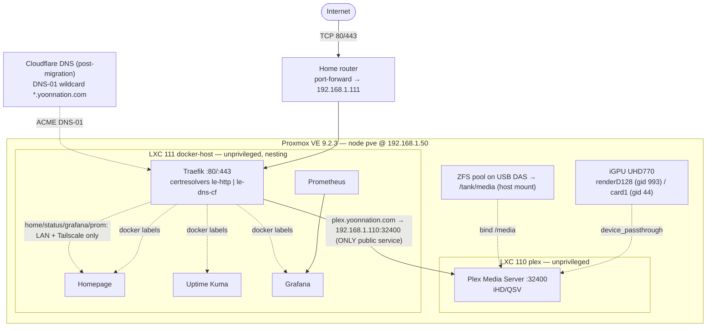
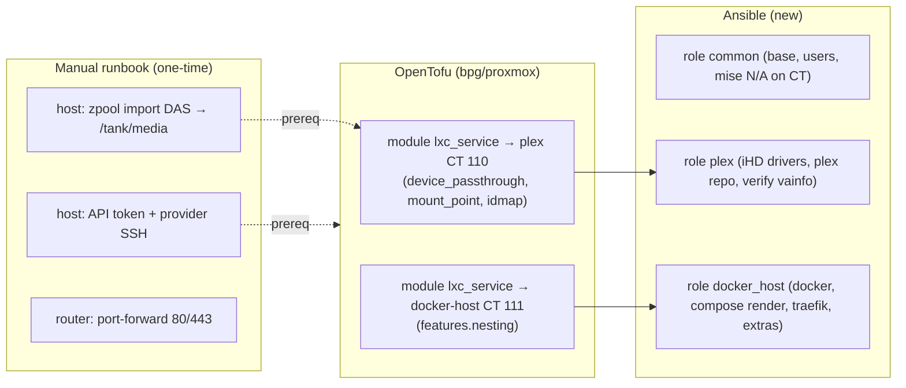

# Detailed Design — Reproducible Proxmox Homelab (Plex + Traefik)

_Project: `2026-06-19-proxmox-homelab` · Status: design for review · Date: 2026-06-19_

This document is standalone — it can be read without the other project files. It consolidates
the requirements, defines the architecture and components, and specifies how the homelab is
provisioned (OpenTofu), configured (Ansible), and validated.

---

## 1. Overview

Build a **reproducible, code-defined homelab** on an existing Proxmox VE 9.2.3 host that runs
**Plex** (hardware-transcoding via the Intel UHD 770 iGPU, media on a USB-attached ZFS DAS) and
**Traefik** (reverse proxy + TLS) fronting a small set of supporting services
(**Homepage, Uptime Kuma, Grafana, Prometheus**).

Two layers of automation:
- **OpenTofu** provisions the LXC containers on the existing Proxmox host (`bpg/proxmox`).
- **Ansible** configures everything inside them (GPU enablement, DAS mount wiring, Plex,
  Traefik, the Docker compose stack).

The one-time **data migration** (physically moving the DAS, importing its ZFS pool, verifying
media intact) is **manual and documented** — explicitly *not* automated — whereas all services
are rebuildable from code at any time.

**Scope boundary:** the repo automates only the services *on top of* the base Proxmox layer.
Host-level prerequisites (API token, SSH for the provider, the DAS/ZFS import) are captured as a
documented bootstrap runbook.

### Goals (definition of done — automation scope only)
1. `tofu apply` creates the Plex LXC + the Docker-host LXC from scratch against `pve`.
2. Ansible configures: `/dev/dri` usable in the Plex LXC, DAS bind-mounted, and Plex + Traefik +
   Homepage + Uptime Kuma + Grafana + Prometheus deployed from code.
3. Plex streams locally with **HW transcoding via QSV confirmed** (`vainfo` → `iHD`; Plex
   Dashboard → "Transcode (hw)"). _Plex Pass: confirmed available._
4. Traefik serves `plex.yoonnation.com` (and chosen dashboards) over HTTPS with valid Let's
   Encrypt certs via the router port-forward.
5. Tearing down and re-running the IaC rebuilds all services without manual fiddling (stateful
   data caveats aside); host prereqs are in the runbook.

### Non-goals (this iteration)
- Backups (separate task; many items already have remote backups). RAID0 risk accepted.
- Automating the media migration (manual runbook only).
- Advanced edge security (CrowdSec/Authelia) beyond basic auth middleware.
- Bare-metal Proxmox install / host base config (already done).

---

## 2. Detailed Requirements (consolidated)

### 2.1 Environment (validated live, 2026-06-19)
- **Host:** Proxmox VE **9.2.3** (Debian 13, kernel 7.0.x), node **`pve`** @ **192.168.1.50**.
- **CPU/GPU:** i5-13500 (14C/20T), **Intel UHD 770** iGPU — `/dev/dri/renderD128` (host
  **render GID 993**), `/dev/dri/card1` (host **video GID 44**). _Verify at apply time._
- **RAM:** 64 GB. **System disk:** NVMe 2 TB → `pve-root` ext4 + **`local-lvm`** (LVM-thin).
- **Storage:** `local` (dir → `vztmpl`, iso, backup), `local-lvm` (rootdir/images). No PVE ZFS.
- **Network:** bridge **`vmbr0`** 192.168.1.50/24, gw 192.168.1.1; **Tailscale** installed; SDN
  **`vnetdmz`** exists.
- **Existing guests:** VMs 100–103, templates 9000/9001/9100/9101. **No LXCs yet.** New LXCs use
  the **110–119** range.
- **Repo:** OpenTofu (`tofu/`) + `bpg/proxmox ~>0.104` + Packer + uv + pytest shape-tests; auth
  via env vars (currently direnv → migrating to **mise**). API token `root@pam!ansible-token`.
  **No Ansible yet.**

### 2.2 Functional & non-functional requirements
| # | Requirement |
|---|---|
| R1 | Full IaC: OpenTofu provisions, Ansible configures; git is source of truth. |
| R2 | Plex in an **unprivileged LXC** (privileged documented as fallback). |
| R3 | QSV HW transcoding working via `/dev/dri` passthrough (host render GID **993**, video 44). |
| R4 | Media on the existing **ZFS pool** (USB DAS, HW-RAID0 + single-vdev ZFS), host-imported and **bind-mounted** into the Plex LXC. |
| R5 | **Traefik** reverse proxy with Let's Encrypt; `plex.yoonnation.com` public. |
| R6 | TLS: **HTTP-01 now**, switchable to **Cloudflare DNS-01 wildcard** post-DNS-migration. |
| R7 | Extras: Homepage, Uptime Kuma, Grafana, Prometheus on a **Docker-host LXC** via compose. |
| R8 | Exposure: **Plex is the ONLY public service**; Homepage, Uptime Kuma, Grafana, Prometheus are all LAN/Tailscale-only. Per-router public/internal split is config-driven (services can be promoted later). |
| R9 | Secrets: **gitignored `mise.local.toml`** (env/Tofu/Packer) + **Ansible Vault** (in-playbook). |
| R10 | Dev env via **mise** (`[tools]` pins, `[env]`, `[tasks]`); remove direnv `.envrc`. |
| R11 | Reusable per-service pattern (generic LXC module instantiated per service). |
| R12 | New modules/roles ship with **pytest shape-tests** matching the repo convention. |
| R13 | Migration is a **manual, discovery-based runbook**; not part of "done". |
| R14 | Static IPs: host .50; Plex LXC .110; Docker-host LXC .111 (proposed). |

---

## 3. Architecture Overview



### Provisioning vs configuration responsibility


### Repository layout (extends existing repo conventions)
```
homelab/
├── mise.toml                     # tool pins (opentofu, packer, ansible via pipx, python), [env], [tasks]
├── mise.local.toml.example       # template for gitignored secrets (PROXMOX_VE_*, CF token, plex claim)
├── tofu/
│   ├── versions.tf               # bump bpg pin to >= 0.108.0 (still ~>0.104 line)
│   ├── providers.tf              # add ssh{} block (idmap needs SSH) + root@pam
│   ├── locals.tf                 # add service_ids { plex=110, docker_host=111 }, network, gids
│   ├── main.tf                   # NEW: instantiate lxc_service for plex + docker_host
│   ├── outputs.tf                # NEW: CT IPs/ids for the Ansible inventory
│   └── modules/
│       ├── dev_vm/               # (existing)
│       └── lxc_service/          # NEW generic LXC module
│           ├── main.tf · variables.tf · outputs.tf · versions.tf · README.md
├── ansible/                      # NEW
│   ├── ansible.cfg
│   ├── inventory/hosts.yml       # (can be generated from tofu outputs)
│   ├── group_vars/all.yml + vault.yml (Ansible Vault)
│   ├── site.yml
│   └── roles/{common,plex,docker_host}/...
│       └── docker_host/templates/{compose.yml.j2, traefik/*.j2}
├── packer/                       # (existing; LXC templates may be added later if needed)
├── scripts/                      # existing tests + NEW shape-tests for lxc_service/ansible
│   ├── test_lxc_service_module_shape.py
│   ├── test_ansible_layout_shape.py
│   └── test_mise_config_shape.py
└── docs/
    └── runbooks/
        ├── host-bootstrap.md     # API token, provider SSH user, port-forward
        └── das-zfs-migration.md  # the one-time discovery-based migration
```

---

## 4. Components and Interfaces

### 4.1 OpenTofu module `lxc_service` (generic, reused)
Single module that creates a `proxmox_virtual_environment_container`, parameterized so both
Plex and the Docker-host instantiate it. Key variables (defaults match host):

| Variable | Type | Default | Notes |
|---|---|---|---|
| `name` | string | — | hostname + display name |
| `vm_id` | number | — | from `local.service_ids` |
| `ip_cidr` | string | — | e.g. `192.168.1.110/24` |
| `gateway` | string | `192.168.1.1` | |
| `node` | string | `pve` | |
| `datastore_id` | string | `local-lvm` | rootfs |
| `bridge` | string | `vmbr0` | |
| `template_file_id` | string | `local:vztmpl/debian-13-standard_*` | |
| `os_type` | string | `debian` | |
| `cores` / `memory_mb` / `disk_gb` | number | `4 / 4096 / 16` | per-service override |
| `unprivileged` | bool | `true` | **fallback switch → false = privileged** |
| `nesting` | bool | `false` | docker-host sets `true` |
| `device_passthroughs` | list(object{path,gid,mode}) | `[]` | Plex: renderD128 gid 993, card1 gid 44 |
| `bind_mounts` | list(object{host_path,ct_path,read_only}) | `[]` | Plex: `/tank/media`→`/media` |
| `gid_maps` / `uid_maps` | list(object{container_id,host_id,size}) | computed | idmap for unprivileged GPU + media |
| `ssh_public_keys` | list(string) | — | provisioning access for Ansible |

Behavior:
- Emits `device_passthrough{}`, `mount_point{}`, `idmap{}` blocks from the list vars.
- For **unprivileged**, auto-builds idmap that punches host GID **993** and **44** through 1:1
  and offsets the rest by +100000 (helper in module locals; see §5.3).
- Outputs: `vm_id`, `ipv4_address`, `name` → consumed by `tofu/outputs.tf` → Ansible inventory.

**Interface contract (consumed by tests):** module dir contains `main.tf, variables.tf,
outputs.tf, versions.tf, README.md`; `versions.tf` pins `bpg/proxmox >= 0.108.0`; the resource
is `proxmox_virtual_environment_container`; `unprivileged` defaults true.

### 4.2 Provider configuration changes (`tofu/providers.tf`)
Add an `ssh {}` block (idmap requires SSH to the node) and ensure `root@pam` for bind mounts:
```hcl
provider "proxmox" {
  # endpoint/api_token/insecure from env (mise [env])
  ssh {
    agent    = true
    username = "root"      # PROXMOX_VE_SSH_USERNAME
  }
}
```
Env vars (now from **mise**, not direnv): `PROXMOX_VE_ENDPOINT`, `PROXMOX_VE_API_TOKEN`,
`PROXMOX_VE_INSECURE=true`, `PROXMOX_VE_SSH_USERNAME`.

### 4.3 Ansible roles
- **`common`** — base packages, timezone, unattended-upgrades, the service user, SSH hardening.
- **`plex`** — enable `non-free`, install `intel-media-va-driver-non-free vainfo intel-gpu-tools`;
  add Plex APT repo; install `plexmediaserver`; ensure the `plex` user is in render(993)/video(44)
  groups inside the CT; **post-deploy acceptance**: run `vainfo --device /dev/dri/renderD128` and
  assert driver `iHD` (fail the play otherwise). Plex claim handled via web wizard (token TTL ~4
  min); document setting "Custom server access URLs" = `https://plex.yoonnation.com:443`.
- **`docker_host`** — install Docker CE + compose plugin; render `compose.yml.j2` + Traefik config
  from templates; `docker compose up -d`; Traefik static/dynamic config with two certresolvers.

### 4.4 Traefik configuration (interfaces)
- **Entrypoints:** `web` (:80, redirect→websecure), `websecure` (:443). Optional `internal`
  entrypoint or IP-allowlist middleware for LAN/Tailscale-only routers.
- **Certresolvers:** `le-http` (HTTP-01, active now) and `le-dns-cf` (Cloudflare DNS-01 wildcard,
  post-migration). Selected per-router via a variable; default `le-http`.
  - ⚠️ **HTTP-01 only works for the public host** (Plex) — it needs public DNS + inbound :80.
    **Internal-only services (Homepage/Kuma/Grafana/Prometheus) cannot get HTTP-01 certs.** Their
    valid TLS therefore depends on the **DNS-01 wildcard `*.yoonnation.com`** (DNS-01 needs no
    inbound). Interim before the Cloudflare migration: internal services use Traefik's default
    self-signed cert (browser warning on LAN) — acceptable until DNS-01 is enabled.
- **Providers:** Docker provider (labels) for the in-compose extras; **file provider** for the
  external Plex service (Plex is not in Docker) routing `plex.yoonnation.com` →
  `http://192.168.1.110:32400`.
- **Middlewares:** `redirect-to-https`, `security-headers`, and `lan-allowlist` (CIDRs
  192.168.1.0/24 + Tailscale 100.64.0.0/10) applied to all **internal** routers (Homepage,
  Uptime Kuma, Grafana, Prometheus). Only the Plex router is on the public path. (A
  `basic-auth`/forward-auth middleware is defined but unused this iteration — ready if a service
  is later promoted to public.)

### 4.5 Router & DNS (manual prereqs, documented)
- Port-forward TCP 80/443 → `192.168.1.111` (docker-host LXC).
- DNS: **`plex.yoonnation.com` → public IP** (the only public host). Internal hostnames
  (`home`, `status`, `grafana`, `prometheus`) resolve only on LAN/Tailscale (split-horizon DNS
  or local DNS records); they are not given public A records.
- Post-migration: move zone to Cloudflare, create scoped API token (Zone:DNS:Edit) for DNS-01.

---

## 5. Data Models

### 5.1 `tofu/locals.tf` additions
```hcl
locals {
  service_ids = { plex = 110, docker_host = 111 }
  net = { gateway = "192.168.1.1", bridge = "vmbr0",
          plex_ip = "192.168.1.110/24", docker_ip = "192.168.1.111/24" }
  host_gids = { render = 993, video = 44 }   # VERIFIED on pve 2026-06-19
}
```

### 5.2 Plex CT instantiation (excerpt)
```hcl
module "plex" {
  source       = "./modules/lxc_service"
  name         = "plex"
  vm_id        = local.service_ids.plex
  ip_cidr      = local.net.plex_ip
  cores        = 6
  memory_mb    = 4096
  unprivileged = true
  device_passthroughs = [
    { path = "/dev/dri/renderD128", gid = local.host_gids.render, mode = "0660" },
    { path = "/dev/dri/card1",      gid = local.host_gids.video,  mode = "0660" },
  ]
  bind_mounts = [{ host_path = "/tank/media", ct_path = "/media", read_only = false }]
}
```

### 5.3 idmap model (unprivileged GPU + media access)
Default unpriv mapping: container 0..65535 → host 100000..165535. To let the in-CT service use
the GPU + media, punch host GIDs 44 and 993 straight through (UIDs stay fully offset; media dir
chowned to the mapped service uid OR a punched uid). Tiling (gaps-free) for GIDs:
```
g 0    100000 44       # 0..43  → host 100000..
g 44   44     1        # video  (host 44)
g 45   100045 948      # 45..992
g 993  993    1        # render (host 993)
g 994  100994 64542    # 994..65535
```
The module generates these from `host_gids`. _Validate ranges at apply; adjust if more GIDs need
passthrough._

### 5.4 Ansible inventory / group_vars (shape)
```yaml
# inventory/hosts.yml (can be rendered from tofu outputs)
all:
  children:
    plex:        { hosts: { plex:        { ansible_host: 192.168.1.110 } } }
    docker_host: { hosts: { docker-host: { ansible_host: 192.168.1.111 } } }
# group_vars/all.yml (non-secret)
domain: yoonnation.com
acme_resolver: le-http        # flip to le-dns-cf post-migration
public_services:  [plex]                                   # Plex is the only public service
internal_services: [homepage, uptime-kuma, grafana, prometheus]  # LAN + Tailscale only
# group_vars/vault.yml (Ansible Vault) — grafana_admin_password, cloudflare_dns_api_token, ...
```

### 5.5 Secrets layout
- **`mise.local.toml`** (gitignored): `[env]` `PROXMOX_VE_API_TOKEN`, `PROXMOX_VE_SSH_USERNAME`,
  `CLOUDFLARE_DNS_API_TOKEN` (for Traefik DNS-01 later). Template committed as
  `mise.local.toml.example`.
- **`mise.toml`** (committed): `[tools]` pins, `[env]` `PROXMOX_VE_ENDPOINT`,
  `PROXMOX_VE_INSECURE`, `[tasks]` (`plan`, `apply`, `play`, `fmt`, `test`).
- **Ansible Vault** (`group_vars/vault.yml`): in-playbook secrets (Grafana admin pw, app keys,
  Traefik dashboard basic-auth hash).

---

## 6. Error Handling

| Failure | Detection | Handling / mitigation |
|---|---|---|
| idmap not applied on create | CT can't open `/dev/dri`; `vainfo` fails | Pin **bpg >= 0.108.0** (create-time idmap fix); provider needs **SSH**; if persistent, **fall back to privileged** (`unprivileged=false`, no idmap) — documented switch. |
| Wrong render/video GID | `ls -n /dev/dri` mismatch | Tofu reads `local.host_gids` (993/44, verified); runbook step re-checks `getent group render video` before apply. |
| Bind mount denied | `tofu apply` error re: privileges | Bind mount requires **root@pam**; documented in provider setup. |
| QSV driver wrong (i965 vs iHD) | `vainfo` driver ≠ iHD | `plex` role installs `intel-media-va-driver-non-free`; sets `LIBVA_DRIVER_NAME=iHD` if needed; play **fails** on assertion. |
| ZFS pool won't import (foreign hostid) | `zpool import` shows ZFS-8000-EY | Runbook: `zpool import -f -d /dev/disk/by-id <pool>` (safe for moved disk). |
| USB reset suspends pool | I/O hang; `zpool status` SUSPENDED | `zpool clear`; import **by-id**; `autotrim=off`; documented operational note. |
| ACME cert fails (HTTP-01) | Traefik logs; no cert | Verify port-forward 80→111 + DNS A record; rate-limit aware; retry. Switch to DNS-01 once Cloudflare is ready. |
| Plex claim token expired | Server unclaimed | TTL ~4 min — use web wizard at `:32400/web`; documented (not automated). |
| Public dashboard exposed w/o auth | review/test | Internal routers carry `lan-allowlist`; public dashboards require `basic-auth`/forward-auth middleware; Prometheus never public. |
| Re-apply idempotency drift | `tofu plan` non-empty / `--check` diff | Modules + roles must be idempotent; CI shape-tests + `tofu validate` + `ansible --check`. |

---

## 7. Testing Strategy

Mirrors the repo's existing **pytest "shape-test"** + TDD approach; layered:

1. **Static/shape tests (pytest, fast, offline)** — assert structure/contracts without touching
   infra:
   - `test_lxc_service_module_shape.py`: module files exist; uses
     `proxmox_virtual_environment_container`; `unprivileged` default true; emits
     device_passthrough/mount_point/idmap; pins bpg ≥ 0.108.0.
   - `test_ansible_layout_shape.py`: roles `common/plex/docker_host` exist with `tasks/main.yml`;
     `site.yml` wires them; vault file referenced; plex role asserts `vainfo`.
   - `test_mise_config_shape.py`: `mise.toml` has `[tools]` pins + tasks; `mise.local.toml`
     gitignored; `.example` present; no plaintext secrets committed; **no `.envrc`** remains.
   - `test_traefik_config_shape.py`: two certresolvers; plex file-provider router; `public_services`
     == `[plex]` only; all other routers carry the `lan-allowlist` middleware.
2. **Validation** — `tofu fmt -check`, `tofu validate`; `ansible-lint`, `ansible-playbook
   --syntax-check` and `--check` (dry-run) against a target.
3. **Integration / acceptance (against `pve`)** — the "done" gates:
   - `tofu apply` creates CTs; `pct list` shows 110/111.
   - In Plex CT: `vainfo` → `iHD`; `ls -l /dev/dri` present; Plex Dashboard → "Transcode (hw)".
   - `curl -I https://plex.yoonnation.com` → 200 + valid LE cert; internal hosts blocked from WAN.
   - Reproducibility: `tofu destroy` + re-`apply` + re-play rebuilds cleanly.
4. **Migration verification (manual runbook)** — `zpool status` ONLINE; `zfs list`; media
   file/count spot-check ("raw data intact").

CI note: shape tests + validate/lint run in CI; integration/acceptance run on-host (documented),
since they need the real Proxmox + GPU + DAS.

---

## 8. Appendices

### A. Technology Choices (with rationale)
| Choice | Decision | Why / trade-off |
|---|---|---|
| Provisioner | **OpenTofu** | Already in repo; FOSS Terraform. |
| Proxmox provider | **bpg/proxmox ≥0.108 (~>0.104)** | Already in use; supports container device_passthrough, mount_point, idmap; ≥0.108 fixes create-time idmap. (telmate rejected — less maintained, weaker LXC support.) |
| Plex host | **Unprivileged LXC** | No perf overhead vs privileged; far simpler GPU+DAS sharing than a VM (no PCIe/USB passthrough). Privileged = documented fallback. VM rejected (fragile passthrough, host loses iGPU). |
| Config mgmt | **Ansible (new)** | Requirement; net-new layer beside Tofu/Packer. |
| Extras runtime | **Single Docker-host LXC + compose** | Fewer LXCs; Traefik Docker-provider auto-discovery; reproducible. (one-LXC-per-service rejected for iter1 — more overhead.) |
| TLS | **HTTP-01 now → Cloudflare DNS-01 wildcard** | HTTP-01 works today on Namecheap via port-forward; DNS-01 wildcard cleaner post-migration; two switchable resolvers avoid rearchitecture. |
| Secrets | **gitignored mise.local.toml + Ansible Vault** | Simple; matches existing env-var provider pattern via mise. (mise+SOPS+age = documented future upgrade for encrypted-in-git.) |
| Dev env | **mise** | Replacing direnv (project direction); pins tools, loads env, runs tasks. |

### B. Research Findings (summary; full detail in `research/`)
- bpg container resource fully supports our needs; bind mounts need root@pam, idmap needs
  provider SSH; pin ≥0.108 for reliable create-time idmap. (`iac-lxc-provisioning.md`)
- **Host render GID = 993, video = 44** (observed; generic guides' "104" is wrong here). QSV needs
  the **iHD** driver from `intel-media-va-driver-non-free`; verify via `vainfo`; Plex Pass
  required; `intel_gpu_top` monitoring fails in unpriv LXC on PVE9 (transcode unaffected).
  (`gpu-transcoding-and-plex.md`)
- ZFS-on-RAID0-over-USB imports like any single-vdev pool; use `-f` (foreign hostid) + by-id;
  `autotrim=off`; budget for USB-reset pool-suspend; bind dataset mountpoint into CT.
  (`zfs-das-migration.md`)
- mise replaces direnv; secrets via gitignored `mise.local.toml` (chosen) or mise+SOPS+age
  (future). (`secrets-and-mise.md`)
- Traefik: HTTP-01→DNS-01 switchable resolvers; expose only what's needed; Tailscale/`vnetdmz`
  available for internal isolation. (`traefik-and-exposure.md`)

### C. Alternative Approaches Considered
- **Plex in a VM with PCIe iGPU + USB passthrough** — rejected: fragile, host loses iGPU.
- **Privileged LXC** — viable fallback; chosen unprivileged (no perf cost, better isolation).
- **One LXC per service** — rejected iter1 (overhead) in favor of Docker-host consolidation.
- **mise+SOPS+age secrets** — deferred (experimental, age-only); chosen simpler gitignored path.
- **Cloudflare Tunnel instead of port-forward** — not chosen (user picked port-forward; better
  for Plex high-bitrate direct streaming). Tailscale remains for internal access.

### D. Design-review resolutions (2026-06-19 — all confirmed)
1. **Exposure:** Plex is the **only** public service; Homepage/Uptime Kuma/Grafana/Prometheus are
   LAN+Tailscale-only. (`public_services = [plex]`.)
2. **DAS host mountpoint = `/tank`** (`/tank/media` → CT `/media`). Pool name still discovered in
   the migration runbook; its mountpoint is set to `/tank`.
3. **No `vnetdmz` hardening** this iteration — docker-host LXC stays on `vmbr0`.
4. **Sizing accepted:** Plex 6c/4G, docker-host 4c/4G — kept as module variables (trivial to change).
