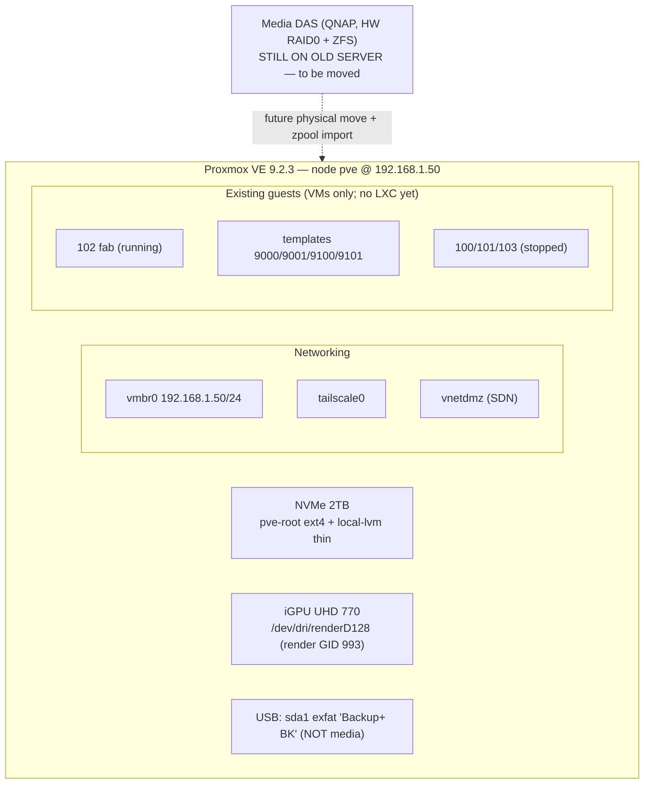

# Research: Existing Environment (validated via SSH + repo inspection)

_Source: live read-only SSH to `root@192.168.1.50` and inspection of the local `homelab`
repo on 2026-06-19. All facts below are observed, not assumed._

## 1. Proxmox host

| Item | Value |
|---|---|
| Node name | `pve` |
| PVE version | 9.2.3 (kernel `7.0.6-2-pve`, Debian 13 base) |
| CPU | 13th Gen Intel Core i5-13500 — 14 cores / 20 threads |
| Memory | 62 GiB total (~24 GiB in use by VM 102; ~38 GiB available) |
| Boot/system disk | NVMe Samsung 970 EVO Plus 2 TB |
| Root FS | `pve-root` 96 GB ext4 on LVM |
| Bulk storage | `pve-data` LVM-thin pool (~1.7 TB) on the same NVMe |

### Storage configuration (`/etc/pve/storage.cfg`)
- `local` (dir, `/var/lib/vz`) — content: **iso, vztmpl, backup, import** ← LXC templates land here
- `local-lvm` (lvmthin, vg `pve`, thinpool `data`) — content: **rootdir, images** ← supports LXC rootfs + VM disks

> **No ZFS storage is defined in Proxmox.** The host root is LVM-thin on NVMe. The media
> ZFS pool will be a *separately imported* pool once the DAS is attached (see §4), bind-mounted
> into the Plex LXC — **not** registered as PVE storage.

### Networking (`/etc/network/interfaces`)
- `vmbr0` — static `192.168.1.50/24`, gw `192.168.1.1`, bridge-port `nic0` ← primary LAN bridge
- `tailscale0` — **Tailscale is already installed** on the host (alternative remote-access path)
- `vnetdmz` — an **SDN "dmz" vnet** exists (purpose TBD; possible isolation network for exposed services)
- `tap102i0` — tap for running VM 102

### iGPU / transcoding (validated)
- PCI `00:02.0` Intel **AlderLake-S GT1 [8086:4680]** = UHD Graphics 770 (QSV capable)
- `/dev/dri/card1` → group **`video` (GID 44)**
- `/dev/dri/renderD128` → group **`render` (GID 993)**  ← **critical for LXC mapping**
- `by-path`: `pci-0000:00:02.0-render -> renderD128`

> The host `render` group GID is **993** and `video` is **44**. For an **unprivileged** LXC,
> the container's render/video group GIDs must be id-mapped to these host GIDs (or the device
> bind-mounted with an explicit `gid`). For a **privileged** LXC, GIDs match 1:1.

## 2. Existing guests (VMID usage)

```
100  win-11               (stopped, VM)
101  win-10               (stopped, VM)
102  fab                  (RUNNING, VM, 24 GiB)
103  abubu                (stopped, VM)
9000 tpl-cloud-ubuntu26   (template)
9001 tpl-cloud-fedora44   (template)
9100 pkr-ubuntu26         (template)
9101 pkr-fedora-workstation (template)
```
- **No LXC containers exist yet** (`pct list` empty).
- **Reserved/used VMIDs:** 100–103, 9000–9001, 9100–9101.
- **Free ranges for new LXCs:** e.g. **110–119** (services) is clear; pick a stable convention.

## 3. Existing IaC repo conventions (must follow)

The `homelab` repo already has an established, test-driven IaC pipeline. New Plex/Traefik work
should match it, not reinvent it.

| Area | Convention |
|---|---|
| IaC tool | **OpenTofu** (`tofu/`), `required_version >= 1.6.0` |
| Proxmox provider | **`bpg/proxmox` `~> 0.104.0`** |
| Provider auth | Env vars `PROXMOX_VE_ENDPOINT/USERNAME/API_TOKEN/INSECURE`. Uses an existing API token `root@pam!ansible-token`. **Currently** loaded via `.envrc`/direnv (gitignored) — **but the project is migrating direnv → `mise`** for env management, so new work should source these via `mise` (`mise.toml [env]` / gitignored `mise.local.toml`), not direnv. |
| Module pattern | One module per resource under `tofu/modules/<name>/` (`main.tf`, `variables.tf`, `outputs.tf`, `versions.tf`, `README.md`). Sensible defaults: `node="pve"`, `datastore_id="local-lvm"`, `bridge="vmbr0"`. |
| VM resource in use | `proxmox_virtual_environment_vm` (clone-from-template). For LXC we'll use the sibling `proxmox_virtual_environment_container`. |
| ID map | `tofu/locals.tf` holds an authoritative `template_ids` map; new stable IDs should be centralized similarly. |
| Image building | **Packer** (`packer/`) builds the templates that match host VMIDs 9100/9101. |
| Python tooling | **uv** (`pyproject.toml`, `uv.lock`), Python 3.14. |
| Tests | **pytest "shape" tests** in `scripts/test_*.py` assert HCL/module/artifact structure. New modules are expected to ship with analogous shape tests. |
| Docs | Each module has a `README.md`; heavy inline rationale comments referencing decisions. |

> **Gap:** there is **no Ansible** in the repo today. Templates bake their own credentials
> (no config-management layer). Introducing Ansible for service configuration (GPU enablement,
> DAS bind-mount, Plex/Traefik/extras) is **net-new** and must be integrated cleanly alongside
> the existing OpenTofu+Packer+pytest structure.

> **Decision pre-empted by evidence:** The "Terraform + Ansible" requirement (Q2) maps to
> **OpenTofu (existing) + Ansible (new)**. The Proxmox provider question (bpg vs telmate) is
> already settled: **bpg** is in use.

## 4. Migration reality check

- The **media DAS is NOT yet attached** to this host. Current USB device is a *separate*
  931 GB **exfat** drive labeled "Backup+ BK" (`sda1`) — not the media pool.
- **No ZFS pools are imported** (`zpool list` → none). Therefore the media pool's exact
  layout (vdev geometry, dataset names, capacity, RAID-0 confirmation, ashift, feature flags)
  **cannot be validated until the DAS is physically moved**. The migration runbook must be
  written defensively (discover pool name via `zpool import`, then `zpool import -f <name>`).

## 5. Current-state diagram



## Open items still needing research (external / not host-observable)
1. **bpg container device passthrough**: exact syntax in `~>0.104` for `/dev/dri` to an LXC
   (`device_passthrough` block) and bind `mount_point` for the DAS path.
2. **Unprivileged vs privileged LXC** for Plex given render GID 993 + ZFS bind-mount + QSV.
3. **ZFS-on-USB import** quirks on PVE 9 (by-id, `-f` due to foreign hostid, autostart).
4. **Secrets approach** (Q8): reconcile with existing `.envrc`/direnv pattern (SOPS+age vs
   Ansible Vault vs extend direnv).
5. **ACME strategy**: HTTP-01 over the port-forward now vs Cloudflare DNS-01 post-migration.
6. **Run model** (Q7b) + where Traefik runs; SDN `vnetdmz` possible role for exposed services.
