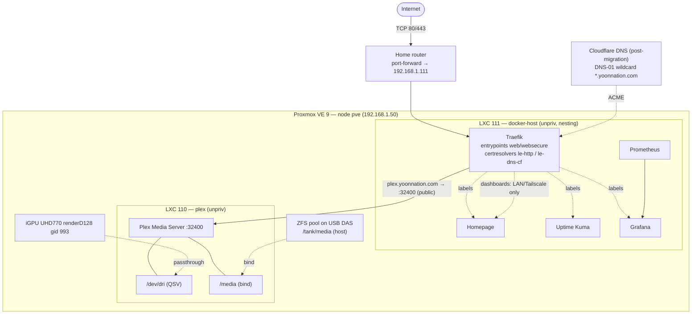
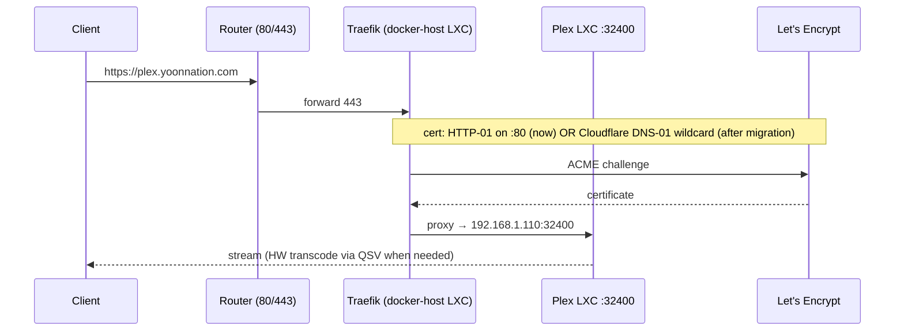

# Research: Traefik, ACME/TLS, exposure & run-model

_Synthesis of Traefik docs + the captured requirements (internet-exposed via router
port-forward, `plex.yoonnation.com`, Namecheap→Cloudflare DNS). Verified 2026-06-19._

## Run model recommendation (Q7b)

**Recommended: hybrid — dedicated Plex LXC + one "Docker-host" LXC for Traefik & extras.**

| Component | Where | Why |
|---|---|---|
| Plex | **own dedicated unprivileged LXC** (vmid 110) | Cleanest QSV (`/dev/dri` passthrough), DAS bind-mount, isolation from web-facing stack. Native `.deb` install. |
| Traefik + Homepage + Uptime Kuma + Grafana + Prometheus | **single Docker-host LXC** (vmid 111) running Docker + Compose | Matches "a few extras"; one compose stack is highly reproducible; Traefik's Docker provider auto-discovers the extras via labels. Fewer LXCs to manage; scales by adding compose services. |

This fits the repo's module precedent: a **generic `lxc_service` OpenTofu module** instantiated
twice (Plex CT with GPU passthrough; Docker-host CT with `nesting=true`). Ansible then has two
roles/playbooks: `plex` (native) and `docker_host` (Docker + compose render).

_Alternative (one-LXC-per-service) rejected for iter 1: more LXCs, more Tofu/Ansible, marginal
isolation benefit when the extras are low-risk and behind Traefik anyway._

## TLS / ACME strategy (Q4/Q4b)

- **Today (Namecheap DNS):** **HTTP-01** challenge works immediately — port-forward 80/443 to
  the Docker-host LXC, Traefik solves HTTP-01 on :80. No DNS-provider API needed. Namecheap
  DNS-01 is painful (API IP-allowlist + balance/domain minimums) — avoid.
- **After Cloudflare DNS migration:** switch to **Cloudflare DNS-01**, enabling **wildcard
  `*.yoonnation.com`** certs (one cert, no per-host HTTP-01, works even for non-exposed hosts).
- **Design for switchability:** define **two Traefik certresolvers** (`le-http` and
  `le-dns-cf`); select per-router via config. Start on `le-http`, flip to `le-dns-cf`
  post-migration by changing one variable — no rearchitecture.

## Exposure & security posture (internet-facing → expose the minimum)

> Only `plex.yoonnation.com` actually needs to be public. **Homepage, Grafana, Prometheus,
> Uptime Kuma must NOT be openly exposed** without auth — recommend restricting them to
> LAN/Tailscale (Traefik IP-allowlist middleware or a separate internal entrypoint), and only
> the Plex router on the public entrypoint.

- **Plex:** route `plex.yoonnation.com` (websecure entrypoint) → Plex LXC `192.168.1.110:32400`;
  set Plex "Custom server access URLs" to `https://plex.yoonnation.com:443`. (Plex also has its
  own 32400 remote-access path; using Traefik gives a clean hostname + central TLS.)
- **Router:** forward TCP 80/443 → Docker-host LXC IP (e.g. `192.168.1.111`).
- **Tailscale (already on host):** good path for reaching the *internal* dashboards securely
  without exposing them; consider a Tailscale entrypoint or `tailscale serve` later.
- **SDN `vnetdmz` (exists):** optional hardening — place the web-facing Docker-host LXC on the
  DMZ vnet to isolate it from the LAN. Note as an enhancement; decide in design.
- **Middlewares to include:** security headers, HTTPS redirect (web→websecure), and IP-allowlist
  for internal services. (CrowdSec/Authelia = future iteration, out of scope now.)

## Target architecture (proposed)

## Request/cert flow (HTTP-01 now → DNS-01 later)

## Open design decisions fed by this research
- Confirm hybrid run-model (Plex LXC + Docker-host LXC) — **recommended**.
- Confirm "expose only Plex publicly; dashboards LAN/Tailscale-only" stance with user.
- Whether to use the SDN `vnetdmz` for the web-facing LXC (enhancement).
- Traefik config style: Docker provider (labels) for extras + a file provider for the external
  Plex service (non-Docker). Both, normally.

## URLs
- Traefik ACME: https://doc.traefik.io/traefik/https/acme/
- Traefik Docker provider: https://doc.traefik.io/traefik/providers/docker/
- Cloudflare DNS-01 (lego): https://go-acme.github.io/lego/dns/cloudflare/
