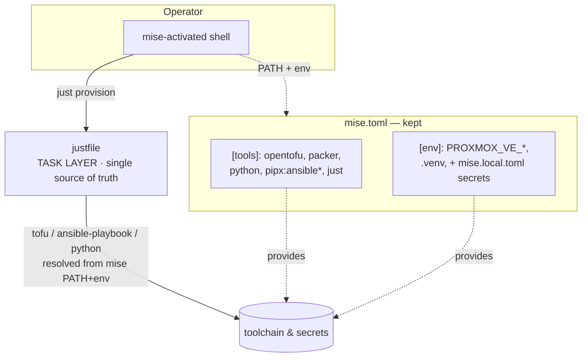

# Detailed Design — Migrate the Task Runner from mise to just

## Overview

The homelab repo currently uses **mise** for three jobs at once: pinning the
toolchain (opentofu, packer, python, the `pipx:ansible*` CLIs), injecting
environment + secrets (`PROXMOX_VE_*` from `mise.toml`, secrets from the
gitignored `mise.local.toml`), and **running tasks** (`mise run plan`, `apply`,
`play`, `gen-inventory`, `fmt`, `test`).

The pain point: mise tasks don't compose, so a full provision is four manual
runs — `plan`, `apply`, `gen-inventory`, `play`. This design moves the **task
layer** to a [`just`](https://just.systems) `justfile`, which supports recipe
dependencies and so lets a single `just provision` chain the whole pipeline.

The migration is **layered, not a replacement**: mise keeps the toolchain and
env/secret injection (the two jobs `just` cannot do); `just` becomes the single
source of truth for tasks. Recipes assume they run inside an active mise
environment, so they invoke `tofu` / `ansible-playbook` / the venv `python`
directly. `just` itself is pinned in `mise.toml [tools]`, so `mise install`
still bootstraps everything in one command.

The offline backpressure gate (`scripts/run_gate.py`) is task-runner-agnostic
and is unchanged; only how it is *invoked* (`just test`) and the shape-test that
asserts the task layer's structure move from mise to the justfile.

## Detailed Requirements

Consolidated from `idea-honing.md`:

- **R1 — Layered architecture.** `just` owns tasks. `mise.toml` keeps `[tools]`
  and `[env]`; its `[tasks.*]` blocks are removed. `mise run <task>` is gone;
  `just <recipe>` is the only task interface.
- **R2 — Composable recipes.** A single `just provision` runs the full
  pipeline. Composite recipes: `provision`, `infra`, `config`; plus
  `build-all`. (Plus `default`.)
- **R3 — Active-mise execution model.** Recipes call tools directly and rely on
  the operator's shell being mise-activated (or invoking `mise exec -- just …`).
  No `mise exec` wrapping inside recipes.
- **R4 — `just` pinned via mise.** `just` is added to `mise.toml [tools]` so
  `mise install` provisions it (version-pinned, one-command bootstrap).
- **R5 — Recipe set.** As in the table below (Components §).
- **R6 — `provision`/`infra` use `apply`'s own plan+approval.** Standalone
  `plan` is dropped from the composite chains (no double-plan): `infra = apply`,
  `provision = apply → gen-inventory → play`. `plan` remains a standalone recipe.
- **R7 — Auto-approve escape hatch.** `apply` is interactive by default but can
  be flipped to `tofu apply -auto-approve` for an unattended run via **either** a
  per-invocation recipe argument **or** an environment variable. This propagates
  through `provision`.
- **R8 — `build`/`bootstrap` are parameterized.** `build <os>` builds one
  template; `build-all` sweeps all three; `bootstrap <os>` runs the one-time
  cloud source-template step. `<os>` ∈ {ubuntu26, fedora, windows11} (bootstrap:
  {ubuntu26, fedora}).
- **R9 — `destroy` recipe.** `tofu destroy` (interactive) to round out the
  documented rebuild-from-code cycle.
- **R10 — Gate + shape-test migration.** `run_gate.py` unchanged. Add
  `scripts/test_justfile_shape.py` asserting the justfile's recipe shape and
  that `test` drives `run_gate.py`. Trim the task assertions out of
  `scripts/test_mise_config_shape.py` (keep its tools/env/secrets/no-`.envrc`
  checks). Both auto-join the gate via the existing `scripts/test_*.py` glob.
- **R11 — Live-docs sweep only.** Update operator-facing references from
  `mise run …` to `just …`: `README.md`, `docs/runbooks/{acceptance-validation,
  host-bootstrap,das-zfs-migration}.md`, `scripts/gen_inventory.py` (comment +
  the generated banner it writes into `ansible/inventory/hosts.yml`),
  `scripts/run_gate.py` docstring, `mise.toml` header comments. Leave the
  historical `.agents/scratchpad/implementation/proxmox-homelab/` records as-is.
- **R12 — Idempotent gate.** `just test` must exit 0 on a clean tree, and the
  shape tests must remain runnable both standalone (`python scripts/test_*.py`)
  and via the glob, per the repo's dual-mode shape-test convention.

## Architecture Overview



Before vs after:

| Concern | Before (mise) | After (this design) |
| --- | --- | --- |
| Toolchain pinning | `mise.toml [tools]` | `mise.toml [tools]` (+ `just`) |
| Env / secrets | `mise.toml [env]` + `mise.local.toml` | unchanged |
| Task definitions | `mise.toml [tasks.*]` | **`justfile`** |
| Task invocation | `mise run <task>` | `just <recipe>` |
| Composition | manual, sequential | `just provision` / `infra` / `config` |
| Gate engine | `scripts/run_gate.py` | unchanged |
| Task shape-test | `test_mise_config_shape.py` | **`test_justfile_shape.py`** (+ trimmed mise test) |

### `provision` execution flow


`just` runs prior dependencies left-to-right and aborts the whole chain on the
first non-zero exit, so a declined apply or a failed playbook stops `provision`
cleanly.

## Components and Interfaces

### C1. `justfile` (new, repo root)

The single source of truth for tasks. Uses recipe dependencies for composition,
the `[working-directory: '…']` recipe attribute for the `dir`-equivalent of the
old mise tasks (requires just ≥1.38, which we pin via mise), and an
arg-with-env-default for the auto-approve hatch.

Recipe set (R5):

| Recipe | Body (conceptual) | Working dir | Notes |
| --- | --- | --- | --- |
| `default` | `@just --list` | repo root | no-arg default; first recipe |
| `plan` | `tofu plan` | `tofu` | standalone look |
| `apply approve=AUTO` | `tofu apply [-auto-approve]` | `tofu` | R7 escape hatch |
| `gen-inventory` | `python scripts/gen_inventory.py` | repo root | |
| `play` | `ansible-playbook site.yml` | `ansible` | |
| `fmt` | `tofu fmt -recursive` | `tofu` | |
| `test` | `python scripts/run_gate.py` | repo root | gate engine unchanged |
| `destroy` | `tofu destroy` | `tofu` | interactive (R9) |
| `infra approve=AUTO` | deps: `(apply approve)` | — | Tofu half |
| `config` | deps: `gen-inventory play` | — | Ansible half |
| `provision approve=AUTO` | deps: `(apply approve) gen-inventory play` | — | full pipeline |
| `build os` | `scripts/build_template.sh {{os}}` | repo root | one template |
| `build-all` | `build ubuntu26` → `fedora` → `windows11` | — | sweep |
| `bootstrap os` | `scripts/bootstrap_cloud_template.sh {{os}}` | repo root | one-time |

Auto-approve hatch (R7), conceptual:

```just
# Env-var default for the auto-approve flag; empty = interactive.
AUTO := env_var_or_default("AUTO_APPROVE", "")

[working-directory: 'tofu']
apply approve=AUTO:
    tofu apply {{ if approve != "" { "-auto-approve" } else { "" } }}

# provision forwards its approve arg into the apply dependency, so both
#   AUTO_APPROVE=1 just provision      (env)
#   just provision approve=1           (arg)
# run unattended; bare `just provision` stays interactive.
provision approve=AUTO: (apply approve) gen-inventory play
```

`build-all` sweeps via dependencies on `build` with arguments:

```just
build-all: (build "ubuntu26") (build "fedora") (build "windows11")
```

**Interfaces preserved:** recipe *names* match the old task names
(`plan`/`apply`/`gen-inventory`/`play`/`fmt`/`test`) so muscle memory and docs
map 1:1 (`mise run X` → `just X`).

### C2. `mise.toml` (edited)

- **Add** `just` to `[tools]` (R4). Pinned to a concrete version that supports
  the `[working-directory]` attribute (≥1.38).
- **Remove** all `[tasks.*]` blocks (R1).
- **Keep** `[tools]` (tofu/packer/python/pipx:ansible*), `[env]`
  (`PROXMOX_VE_*`, `_.python.venv`), and the secret split with `mise.local.toml`.
- **Update** the header comments (R11): `mise run <task>` → `just <recipe>`;
  note that tasks now live in the justfile.

### C3. `scripts/test_justfile_shape.py` (new)

Follows the repo's dual-mode shape-test convention (module-level
`test_<name>() -> bool` printing `OK`/`FAIL`, a `main() -> int` summing
booleans, stdlib only, real gate = standalone exit code). Auto-joins
`run_gate.py` via the `scripts/test_*.py` glob.

Assertions:

- `justfile` exists at repo root.
- Defines every required recipe name: the leaf set + `provision`, `infra`,
  `config`, `build`, `build-all`, `bootstrap`, `destroy`, `default`.
- The `test` recipe drives `python scripts/run_gate.py` (the migrated anchor for
  the "test recipe is the full gate" guarantee — replaces the old
  `[tasks.test].run` anchor in `test_mise_config_shape.py`).
- `provision` composes apply + gen-inventory + play (dependency line mentions
  them); `infra`/`config` compose their halves.
- The auto-approve hatch is wired (`apply` reads an `AUTO_APPROVE`-style env
  default and/or an arg). 

Parsing approach: `just` has no stable public JSON schema we want to depend on
for *recipe bodies*, but `just --summary` / `just --list` enumerate recipe
names. The shape test reads the `justfile` text directly (stdlib `re`/line
parse) for names + key body anchors — consistent with how
`test_mise_config_shape.py` reads files rather than shelling out. (Shelling to
`just --summary` is an optional cross-check but not required, keeping the test
offline and `just`-binary-independent.)

### C4. `scripts/test_mise_config_shape.py` (edited)

- **Remove** `test_five_tasks_present` and `test_test_task_is_full_aggregate`
  (the `[tasks.test].run` gate-text machinery `_test_task_gate_text` moves,
  conceptually, to `test_justfile_shape.py`).
- **Update** `REQUIRED_TASKS` removal and the module docstring (it currently
  says "pins the tooling and the five tasks").
- **Add** an assertion that `[tasks]` is **absent/empty** in `mise.toml` (proves
  the migration happened, prevents drift back) and that `[tools]` now pins
  `just`.
- **Keep** `test_tools_pinned`, `test_nonsecret_env_present`,
  `test_local_example_tracked`, `test_local_secrets_gitignored`,
  `test_no_envrc_remains`, `test_no_plaintext_secrets_committed`,
  `test_acceptance_runbook_documents_reproducibility` (the last is **retargeted**
  from `mise run apply/gen-inventory/play` to `just apply/gen-inventory/play`).

### C5. `scripts/run_gate.py` (unchanged engine, doc touch only)

The gate logic stays identical (globs `scripts/test_*.py`, runs tofu
fmt-check/validate, ansible-lint --offline, syntax-check). Only its **docstring**
reference `mise run test` → `just test` (R11). The new `test_justfile_shape.py`
is auto-discovered by the existing glob; no enumeration to update.

### C6. `scripts/gen_inventory.py` (edited)

- Module docstring `Run via mise run gen-inventory` → `just gen-inventory`.
- The generated banner string it writes into `ansible/inventory/hosts.yml`:
  `(mise run gen-inventory)` → `(just gen-inventory)`. Regenerating (or a
  one-line edit) updates the committed `ansible/inventory/hosts.yml` header to
  match.

### C7. Docs (edited, R11)

- `README.md`: prerequisites/quickstart — add `just` (now pinned by mise),
  replace any `mise run` with `just`.
- `docs/runbooks/acceptance-validation.md`: `mise run test/apply/gen-inventory/
  play` → `just …` throughout, including the checklist. This is the file the
  retargeted `test_acceptance_runbook_documents_reproducibility` asserts on.
- `docs/runbooks/host-bootstrap.md`: `mise run plan` → `just plan`.
- `docs/runbooks/das-zfs-migration.md`: `mise run apply` → `just apply`.

## Data Models

No persistent data models. The "model" is the **recipe contract** — the set of
recipe names and their argument shapes — which the shape test encodes:

```
RecipeContract = {
  name: str,
  kind: "leaf" | "composite" | "parameterized",
  args: [ {name, default?} ],     # e.g. apply.approve default=AUTO
  drives?: str,                   # e.g. test → scripts/run_gate.py
  composes?: [recipe_name],       # e.g. provision → [apply, gen-inventory, play]
}
```

The auto-approve flag is a string env/arg (`AUTO_APPROVE`, empty = interactive),
not a typed boolean — matching `just`/shell semantics.

## Error Handling

- **Fail-fast composition.** `just` aborts a recipe (and its remaining
  dependencies) on the first non-zero exit. A declined `tofu apply`, a Tofu
  error, or a failed playbook stops `provision`/`infra`/`config` with a non-zero
  exit — no silent continuation.
- **Missing tools / inactive mise.** If the shell is not mise-activated, `tofu`/
  `ansible-playbook` resolve to system versions or are absent. Mitigation:
  README documents the active-mise assumption and the `mise exec -- just …`
  fallback; `just` itself being mise-pinned makes the activation story uniform.
- **Bad `<os>` argument.** `build`/`bootstrap` forward the arg to the existing
  scripts, which already validate and exit non-zero on an unknown OS (e.g.
  `build_template.sh` pre-flights). `just` surfaces that non-zero exit. No
  duplicate validation in the justfile (avoids drift with the scripts).
- **Auto-approve safety.** Default is interactive; `-auto-approve` only when the
  arg/env is explicitly set, so the unattended path is opt-in (R7).
- **Gate failures.** `just test` returns `run_gate.py`'s non-zero exit verbatim;
  shape tests print `FAIL: …` lines identifying the broken assertion.

## Testing Strategy

Test-driven, matching the repo's existing offline-gate discipline:

1. **`test_justfile_shape.py` (new)** — written alongside the justfile. Asserts
   recipe names, the `test`→`run_gate.py` anchor, composite composition, and the
   auto-approve wiring. Runs standalone and via the gate glob.
2. **`test_mise_config_shape.py` (edited)** — drop task assertions, add
   "no `[tasks]` / `just` pinned" assertions, retarget the runbook assertion to
   `just …`. Keep all tools/env/secrets checks green.
3. **Gate idempotency** — `just test` (→ `run_gate.py`) exits 0 on a clean tree;
   re-run is clean. The glob auto-discovers the new shape test (proven by the
   gate count increasing by one and still passing).
4. **Manual/live acceptance** (documented, not in the offline gate) — `just
   provision` performs apply → gen-inventory → play end-to-end; `AUTO_APPROVE=1
   just provision` and `just provision approve=1` run unattended; `just build
   <os>` / `build-all` / `bootstrap <os>` invoke the scripts; `just destroy`
   tears down. Captured in the acceptance-validation runbook.
5. **Regression** — the other ~15 existing `scripts/test_*.py` shape tests stay
   green (no behavioral change to tofu/ansible/packer layers).

Per TDD (and the SOP's no-test-only-steps rule), each implementation step writes
or updates its shape test alongside the change.

## Appendices

### A. Technology Choices

**`just` as the task runner.**
- *Pros:* purpose-built command runner; recipe **dependencies** give true
  composition (the core requirement); per-recipe args with defaults and
  `env_var_or_default` cleanly model the auto-approve hatch; `[working-directory]`
  attribute replaces mise's per-task `dir`; ubiquitous, single static binary,
  installable via mise; `just --list` gives a free `default`.
- *Cons:* does not manage toolchains or env injection (hence the layered model,
  not a replacement); `[working-directory]` needs a recent version (pinned via
  mise); recipe-body introspection has no stable machine schema, so the shape
  test parses text (same approach the existing mise shape test already uses).

**Keeping mise underneath (layered) vs full replacement.**
- *Chosen — layered:* smallest blast radius; preserves the working toolchain +
  secret-split design (DEC-001) that the rest of the repo and its shape tests
  depend on; one-command bootstrap retained by pinning `just` in mise.
- *Rejected — full replacement:* would require re-solving tool pinning (asdf/
  system packages) and secret injection (`.env`/shell hook), re-touching
  DEC-001, the provider-auth design, and many shape tests — large risk for no
  added composition benefit (`just` provides composition regardless of what
  pins tools).

**Auto-approve mechanism — arg + env (both).**
- `just` supports a recipe parameter whose default is `env_var_or_default(...)`,
  giving *both* `just provision approve=1` and `AUTO_APPROVE=1 just provision`
  from one definition. Forwarded into the `apply` dependency so `provision`
  inherits it. Chosen over a separate `apply-auto` recipe (which would duplicate
  the body and risk drift).

### B. Research Findings / Key Constraints

(No separate research phase was run — requirements were sufficient. Key facts
established from the existing repo:)
- `mise.toml` does triple duty (tools/env/tasks); only the task third moves.
- `scripts/run_gate.py` is the real gate engine and is task-runner-agnostic — it
  must not change behavior, only its invocation and one docstring line.
- The gate auto-discovers `scripts/test_*.py`, so a new shape test joins with no
  enumeration edit — but the *removed* task anchors in `test_mise_config_shape.py`
  must be replaced, not just deleted, to keep the "test recipe is the full gate"
  guarantee mutation-proof (it moves to `test_justfile_shape.py`).
- `test_acceptance_runbook_documents_reproducibility` ties the runbook's literal
  `mise run …` strings into the gate, so the runbook edit and that assertion must
  change together or the gate breaks.
- `gen_inventory.py` writes a `mise run gen-inventory` banner into a *committed*
  generated file, so the migration touches `ansible/inventory/hosts.yml` too.

### C. Alternative Approaches Considered

- **Keep mise aliases delegating to just** (Q4-B) — rejected: two task lists,
  drift risk, and the shape test would have to assert both.
- **Wrap every recipe in `mise exec`** (Q3-B) — rejected: verbose; the operator
  workflow is an activated shell; `mise exec -- just …` covers the bare-shell/CI
  case without polluting every recipe.
- **`plan → apply` inside the composites** (Q8-B) — rejected: double plan; apply's
  own plan+prompt is the review gate.
- **`build` builds all by default** (Q9-B) — rejected in favor of both an
  explicit `build <os>` and a `build-all` sweep (Q9-C).
