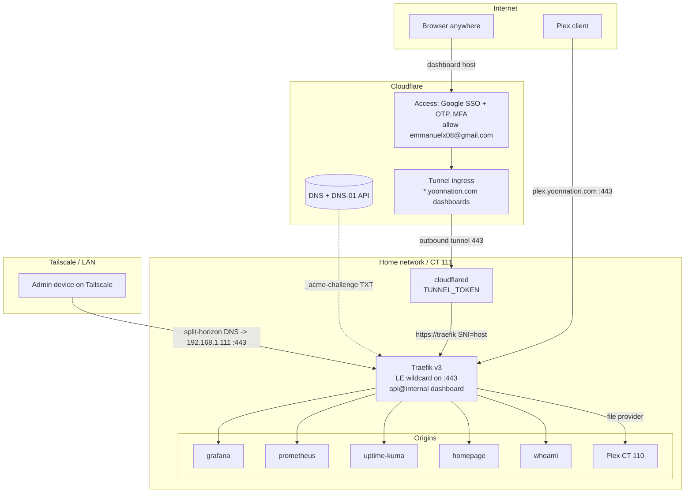

# Detailed Design — Traefik + Cloudflare (DNS-01 + Tunnel/Access) + Let's Encrypt

_Project: `2026-07-14-traefik-cloudflare-letsencrypt`. Standalone design; readable
without the other project files. Targets the `ansible/roles/docker_host` role and
the `yoonnation.com` zone._

## 1. Overview

Harden and complete the homelab's TLS/edge setup so that:

- Every service is served over a **browser-trusted Let's Encrypt wildcard cert**
  (`yoonnation.com` + `*.yoonnation.com`) issued via **Cloudflare DNS-01** and
  auto-renewed — no per-service certs, no port-80 challenge.
- **Internal dashboards** (Grafana, Prometheus, Uptime-Kuma, Homepage, whoami, and
  the **Traefik dashboard**) are reachable from any browser through a **Cloudflare
  Tunnel** fronted by **Cloudflare Access** (Google SSO, MFA, single-user policy),
  and *also* directly over **Tailscale/LAN** (dual-path).
- **Plex** stays public via the existing **80/443 port-forward** with the LE cert
  and its own auth — never through the Cloudflare proxy/tunnel (media ToS).
- Cloudflare is **not** an in-path reverse proxy for any origin data flow except the
  Tunnel; there is no "orange-cloud A-record to the home IP" anywhere.

Traefik remains the single reverse proxy and TLS terminator on the origin. Cloudflare
provides DNS, the ACME DNS-01 challenge, and the Tunnel+Access front door.

The design is **incremental over the current role**: the DNS-01 wildcard resolver,
the scoped Cloudflare DNS token, and the `security-headers`/`lan-allowlist`
middlewares already exist. The net-new pieces are the `cloudflared` service, the
Access configuration, the Traefik-dashboard router, the split-horizon dependency for
dual-path, and a staging/prod ACME toggle.

## 2. Detailed Requirements

Consolidated from `idea-honing.md`:

- **R1 — No Cloudflare proxy on data paths.** Cloudflare is used only as DNS +
  DNS-01 provider and as Tunnel+Access. No proxied (orange) A-records to the origin.
- **R2 — LE wildcard via DNS-01.** One cert for `yoonnation.com` + `*.yoonnation.com`
  through `le-dns-cf`, auto-renewing, in `acme.json`. `le-http` is **removed**.
- **R3 — Staging-first issuance.** Validate the full chain against LE **staging**,
  then flip to **prod** and confirm a browser-trusted cert. A single toggle controls
  the ACME CA server.
- **R4 — Dashboards via Tunnel + Access.** Grafana, Prometheus, Uptime-Kuma,
  Homepage, whoami, and `traefik.yoonnation.com` (Traefik `api@internal`) exposed
  through `cloudflared`; Cloudflare Access gates them with **Google SSO + email-OTP
  fallback, MFA**, allowing only `emmanuelx08@gmail.com`.
- **R5 — Dual-path dashboards.** Same hostnames also resolve to the origin over
  Tailscale/LAN for fast, Cloudflare-independent access. On-LAN access is trusted and
  bypasses Access. Split-horizon is provided by **Tailscale split-DNS**: a restricted
  nameserver / MagicDNS override resolves `*.yoonnation.com` to `192.168.1.111` for
  tailnet devices, while the outside world gets the proxied tunnel CNAME.
- **R6 — Plex public & direct.** `plex.yoonnation.com` = grey A-record → home IP,
  served by Traefik on the 80/443 port-forward with the LE wildcard and
  `security-headers` (no `lan-allowlist`). Never tunneled/proxied.
- **R7 — Traefik behind the tunnel.** `cloudflared` forwards to `https://traefik`
  with SNI = the requested host, so Traefik keeps host-routing and serves the LE
  wildcard end-to-end.
- **R8 — Remotely-managed tunnel.** Tunnel created in the Cloudflare dashboard;
  `cloudflared` runs with a `TUNNEL_TOKEN` secret; ingress + Access apps live in the
  Zero Trust dashboard.
- **R9 — Dashboard hardening.** Drop the uncommitted `api.insecure: true` and the
  `:8080` publish; serve the dashboard only through Traefik (`api@internal`).
- **R10 — Secrets in vault.** `vault_cloudflare_dns_api_token` (scoped
  `Zone:DNS:Edit` + `Zone:Zone:Read`) and `vault_cloudflare_tunnel_token`, rendered
  into the sibling `.env` (mode 0600); never committed.
- **R11 — Verification.** Extend `docs/runbooks/acceptance-validation.md` with
  concrete pass/fail checks for cert validity/renewal, tunnel health, Access
  allow/deny, Plex public reachability, and dashboard dual-path.
- **R12 — DNS management manual/out of scope.** Records are maintained by hand in the
  Cloudflare dashboard; this design *documents* the required records but does not
  automate them.

## 3. Architecture Overview



Three data paths, all terminating at Traefik with the LE wildcard:

1. **Dashboard (remote/browser):** browser → Cloudflare Access (auth) → Tunnel →
   `cloudflared` → `https://traefik` → service.
2. **Dashboard (direct):** admin on Tailscale/LAN → split-horizon DNS resolves the
   host to `192.168.1.111` → Traefik `:443` (gated by `lan-allowlist`) → service.
3. **Plex (public):** Plex client → home-IP:443 (port-forward) → Traefik file-provider
   router → Plex on CT 110.

ACME DNS-01 runs out-of-band: Traefik's `le-dns-cf` resolver writes/reads the
`_acme-challenge` TXT via the Cloudflare API using the scoped DNS token.

## 4. Components and Interfaces

### 4.1 Traefik static config — `templates/traefik.yml.j2`
- **Remove** the `le-http` resolver block and (from the working tree) `api.insecure`.
- **Keep** `api.dashboard: true` (routed via `api@internal`, no insecure port).
- `certificatesResolvers.le-dns-cf.acme`:
  - `dnsChallenge.provider: cloudflare`, resolvers `1.1.1.1:53` / `8.8.8.8:53`
    (unchanged).
  - **New:** `caServer: "{{ acme_ca_server }}"` so staging/prod is a variable
    (default prod; staging URL for R3). Omit/point to prod when the var is the prod
    endpoint.
- Entrypoints `web`(:80→redirect), `websecure`(:443), `metrics`(:8082) unchanged.

> **Cert-store lifecycle (critical):** `acme.json` is keyed by *resolver name*
> (`le-dns-cf`), which does **not** change when `caServer` flips staging→prod. Traefik
> will see the existing staging cert as "still valid" and **not re-issue**, silently
> serving an untrusted cert in prod. The role's `Restart traefik` handler does **not**
> fix this (it restarts but keeps `acme.json`; `tasks/main.yml` only `touch`es the file
> with `modification_time: preserve`). Therefore the staging→prod flip **must** stop
> Traefik, truncate/recreate `acme.json` (0600), then start — see §6 and Step 7.

> **Wildcard issuance robustness (critical):** proactive wildcard issuance must not
> depend on the `whoami` docker service being present/hit first. Declare the wildcard
> `tls.domains` (`main = {{ domain }}`, `sans = *.{{ domain }}`, gated on
> `acme_resolver == 'le-dns-cf'`) on a **stable file-provider router** — the
> `traefik-dashboard` router in §4.2 — so Traefik requests the wildcard at startup
> regardless of the docker stack. Otherwise any dashboard host hit before the wildcard
> exists triggers a **per-host** DNS-01 request (fine on staging; burns the prod
> rate limit on prod). Remove the `tls.domains` block from the `whoami` router to avoid
> duplicate declaration.

### 4.2 Traefik dynamic config — `templates/dynamic.yml.j2`
- **New middleware `internal-allowlist`** = `lan-allowlist` ranges (`192.168.1.0/24`,
  `100.64.0.0/10`) **plus** the Tailscale IPv6 ULA `fd7a:115c:a1e0::/48` **plus** a
  broad Docker private range `172.16.0.0/12` so the `cloudflared` hop is admitted on
  the dashboard routers regardless of the Docker-assigned subnet, while direct
  LAN/Tailscale (v4 **and** v6) still works. (Using `172.16.0.0/12` avoids pinning the
  compose network subnet — see §4.3 rationale. A separate middleware keeps Plex's
  intent clean.)
- **New router `traefik-dashboard`** (file provider): `Host(\`traefik.{{ domain }}\`)`,
  entrypoint `websecure`, service `api@internal`, middlewares
  `internal-allowlist@file` + `security-headers@file`, TLS via `{{ acme_resolver }}`
  **carrying the wildcard `tls.domains`** (`main = {{ domain }}`,
  `sans = *.{{ domain }}`, gated on `acme_resolver == 'le-dns-cf'`) so this stable
  file-provider router drives proactive wildcard issuance (see §4.1). Every other host
  free-rides on the wildcard already in `acme.json`.
- Plex router unchanged (public, `security-headers` only).

### 4.3 Compose — `templates/compose.yml.j2`
- **Remove** the `:8080` dashboard publish (from the working tree).
- **Do NOT pin the network subnet.** The compose file currently has no `networks:`
  block, so the default network already exists on the host; changing its IPAM would
  require a network **recreation** (`docker compose down` + `up`), which the role's
  `up -d`/`restart traefik` flow cannot do — the apply would error (`network … needs
  to be recreated`) or silently keep the old subnet, leaving `internal-allowlist`
  unable to match `cloudflared`. Instead, `internal-allowlist` admits the broad
  `172.16.0.0/12` Docker range (§4.2), so no pinning and no recreation are needed.
- **Add `cloudflared` service:**
  ```yaml
  cloudflared:
    image: {{ docker_host_cloudflared_image }}
    restart: unless-stopped
    command: tunnel --no-autoupdate run
    environment:
      - TUNNEL_TOKEN=${TUNNEL_TOKEN:-}
    depends_on: [traefik]
  ```
  No published ports (outbound-only). Reaches Traefik by service name on the shared
  network.
- Dashboard services (grafana/prometheus/uptime-kuma/homepage/whoami) swap their
  router middleware from `lan-allowlist@file` to `internal-allowlist@file` (+
  `security-headers@file`). Their Traefik router/TLS labels are otherwise unchanged;
  they keep serving on `websecure` with the wildcard.

### 4.4 Env — `templates/env.j2`
- **Add** `TUNNEL_TOKEN={{ vault_cloudflare_tunnel_token | default('') }}` next to
  the existing `CF_DNS_API_TOKEN`. File stays mode 0600.

### 4.5 Defaults / group_vars
- `defaults/main.yml`: **add** `docker_host_cloudflared_image: cloudflare/cloudflared:2026.7.1`
  (verified present on Docker Hub 2026-07-09, multi-arch amd64/arm64, current `latest`;
  satisfies the research ≥ 2026.6.0 requirement — `2026.6.0` also exists as a fallback).
  **Remove** the working-tree `docker_host_traefik_dashboard_port` (no longer published).
- `group_vars/all.yml`: **add** `acme_ca_server` (default = LE prod directory URL;
  staging URL documented) for R3. `acme_resolver: le-dns-cf` unchanged.

### 4.6 Cloudflare dashboard (manual, documented — R8/R12)
- **Tunnel:** create a remotely-managed tunnel; copy its token → vault
  (`vault_cloudflare_tunnel_token`). Add public hostnames (ingress) for each
  dashboard → service `https://traefik:443`, with `originRequest.originServerName`
  set to the hostname (and `noTLSVerify: true` **only during LE-staging**, removed at
  prod). Adding a public hostname auto-creates the proxied CNAME → `<id>.cfargotunnel.com`.
- **Access:** **one self-hosted Access application per dashboard hostname** (preferred
  over a `*.yoonnation.com` wildcard app — the wildcard is only safe because Plex is
  grey, and would break Plex if it were ever proxied). IdP = Google (+ one-time-PIN),
  policy = allow `emmanuelx08@gmail.com`, everyone else blocked; MFA enforced. **Create
  the Access app + policy *before* publishing the tunnel public-hostname** (§Step 4/5
  ordering) so the auth-less dashboards (Prometheus, Uptime-Kuma) are never briefly
  open to the internet.
- **DNS:** grey (DNS-only) `A plex → <home public IP>`. Scoped API token for DNS-01:
  `Zone:DNS:Edit` + `Zone:Zone:Read` on the `yoonnation.com` zone. **Note:** because
  Plex is grey, Cloudflare Access **cannot** gate it — Plex's security rests entirely
  on Plex's own auth (by design).

## 5. Data Models

### 5.1 New/changed variables
| Variable | Location | Value / purpose |
|---|---|---|
| `docker_host_cloudflared_image` | `defaults/main.yml` | `cloudflare/cloudflared:2026.7.1` |
| `acme_ca_server` | `group_vars/all.yml` | LE directory URL; prod default, staging for R3 |
| `vault_cloudflare_tunnel_token` | `group_vars/vault.yml` | tunnel token → `TUNNEL_TOKEN` |
| _removed_ `docker_host_traefik_dashboard_port` | `defaults/main.yml` | dashboard no longer published |

### 5.2 Secrets (vault → `.env`, 0600)
| Secret | Env var | Scope |
|---|---|---|
| `vault_cloudflare_dns_api_token` | `CF_DNS_API_TOKEN` | Zone:DNS:Edit + Zone:Zone:Read (DNS-01) |
| `vault_cloudflare_tunnel_token` | `TUNNEL_TOKEN` | tunnel run token (dashboard-scoped) |

### 5.3 DNS records (manual)
| Host | Type | Proxy | Target | Path |
|---|---|---|---|---|
| `plex` | A | grey (DNS-only) | home public IP | public/direct |
| `grafana`, `prometheus`, `uptime`, `homepage`, `whoami`, `traefik` | CNAME | orange (proxied, tunnel-required) | `<tunnel-id>.cfargotunnel.com` | Tunnel+Access |
| dashboards (internal view) | via split-horizon | — | `192.168.1.111` | direct Tailscale/LAN |

### 5.4 Access policy
- **Application:** self-hosted, each dashboard hostname.
- **IdP:** Google (primary) + one-time-PIN (fallback), MFA on.
- **Policy:** `Allow` where email == `emmanuelx08@gmail.com`; implicit deny otherwise.

## 6. Error Handling

| Failure | Cause | Mitigation |
|---|---|---|
| **Prod still serves untrusted cert after flip** | `acme.json` keyed by resolver name; staging cert reused when `caServer` flips; `Restart traefik` alone keeps the file | **Stop Traefik, truncate/recreate `acme.json` (0600), start** (Step 7). A plain restart is insufficient — the role's handler does not empty it. |
| **Per-host prod certs burn rate limit** | Host hit before the wildcard exists → per-host DNS-01 request | Declare wildcard `tls.domains` on the stable `traefik-dashboard` file-provider router for proactive startup issuance (§4.1/§4.2) |
| ACME rate-limit lockout | Too many prod issuances while debugging | Staging-first (R3); only go prod once staging is green |
| DNS-01 fails / "failed to find zone" | Token missing `Zone:Zone:Read` or wrong zone | Use the scoped two-permission token; verify with Traefik logs |
| `cloudflared` → Traefik TLS error | SNI mismatch or staging cert untrusted | Set `originServerName` = host; `noTLSVerify: true` **only during staging**, removed at prod flip (verify in acceptance) |
| Dashboards 403 via tunnel | `cloudflared` source not allow-listed | `internal-allowlist` admits `172.16.0.0/12` (covers any Docker subnet) — no pinning needed |
| Tailnet client 403 on direct path | Tailscale **IPv6** address not allow-listed | `internal-allowlist` includes `fd7a:115c:a1e0::/48` (plus `100.64.0.0/10` for v4) |
| **Dashboard exposed on WAN `:443`** | Plex port-forward opens `:443` for all Hosts; a direct `home-IP:443` hit with a dashboard Host bypasses Access | `internal-allowlist` is the load-bearing gate → WAN direct hit returns `403`; **acceptance must test this explicitly** |
| **Uptime-Kuma/Homepage false readings** | Monitors/widgets probing the Access-gated public URLs get a 302 login | Point monitors/widgets at internal service URLs (or `.111` + Host header), not the public hostnames |
| Direct dashboard host resolves to Cloudflare | No split-horizon; proxied CNAME wins | Tailscale split-DNS resolves `*.yoonnation.com` → `192.168.1.111` for tailnet devices (R5/§7) |
| Access bypass on LAN | Dual-path trusts LAN | Accepted per R5; tighten later with Access-JWT verification if needed |
| Plex redirect loop | (N/A) no Cloudflare proxy in Plex path | Grey A-record ensures direct origin TLS |
| Tunnel down | `cloudflared`/token/edge issue | Direct Tailscale path still serves dashboards (dual-path resilience) |

## 7. Testing Strategy

Staging-first (R3), then prod, with checks added to
`docs/runbooks/acceptance-validation.md` (R11):

1. **DNS-01 issuance (staging):** deploy with `acme_ca_server` = staging; confirm
   `acme.json` populates a `*.yoonnation.com` cert; Traefik logs show DNS-01 success.
2. **Tunnel health:** `cloudflared` container healthy; tunnel shows *Healthy* in the
   Zero Trust dashboard.
3. **Access gate:** unauthenticated request to a dashboard host → Cloudflare login;
   authenticated as `emmanuelx08@gmail.com` → dashboard loads; a different identity →
   denied.
4. **cloudflared→Traefik:** dashboard renders through the tunnel (staging: browser
   trusts CF edge cert regardless of origin staging cert).
5. **Direct dual-path (v4 + v6):** on Tailscale/LAN, dashboard host resolves to
   `192.168.1.111` and loads with a valid cert over both IPv4 and (if present) the
   Tailscale IPv6 address; `internal-allowlist` admits the client.
6. **WAN direct-hit is refused (security):** from off-network, a direct
   `https://<home-IP>:443` request with `Host: grafana.yoonnation.com` (bypassing
   Cloudflare) returns **403** from `internal-allowlist` — the load-bearing gate on the
   port-forwarded `:443`.
7. **Plex public:** `plex.yoonnation.com` reachable from the WAN with a valid cert;
   `security-headers` present; no `lan-allowlist` block.
8. **Monitoring not fooled by Access:** Uptime-Kuma monitors / Homepage widgets report
   real service status (probing internal URLs), not Cloudflare Access 302s.
9. **Flip to prod:** set `acme_ca_server` = prod, **stop Traefik → truncate/recreate
   `acme.json` → start**, redeploy; verify every host serves a **browser-trusted** LE
   cert and **no `noTLSVerify` remains on any tunnel ingress**.
10. **Renewal (limited check):** cannot be fully exercised without time passing —
    confirm via Traefik logs/cert dates that renewal is scheduled; treat as a
    config/log spot-check, not a live-renewal proof.

## 8. Appendices

### 8.1 Technology choices
- **DNS-01 over HTTP-01:** only DNS-01 issues wildcards and needs no inbound :80;
  works regardless of proxy/tunnel. `le-http` removed as redundant (Plex's public
  cert is covered by the wildcard).
- **Tunnel + Access over proxied A-records:** avoids exposing the home IP and the
  `lan-allowlist`/Cloudflare-IP conflict; Access gives SSO/MFA in front of dashboards
  that lack strong auth. (See `research/tunnel-vs-tailscale.md`.)
- **Remotely-managed tunnel:** single `TUNNEL_TOKEN` secret fits the existing vault→
  `.env` pattern; ingress/Access managed in-dashboard, consistent with keeping DNS
  manual.
- **Let's Encrypt over Cloudflare Origin CA:** user requirement; LE serves both the
  visitor-facing (direct/Plex) and origin roles, so Origin CA is unnecessary.
- **Plex direct, not tunneled:** Cloudflare ToS bars media streaming through the
  proxy/tunnel. (See `research/proxied-vs-dns-only.md`.)

### 8.2 Key research findings
- Proxying/tunneling Plex media violates Cloudflare ToS → Plex must stay direct.
- Proxied mode makes requests arrive from Cloudflare IPs, breaking LAN-IP
  allow-lists; the tunnel has the analogous effect (source = `cloudflared`), handled
  via `internal-allowlist` + pinned subnet.
- DNS-01 scoped token = `Zone:DNS:Edit` + `Zone:Zone:Read` (Global key not needed).
- `cloudflared` ≥ 2026.6.0 required (2026 removal of an older behavior).
- Dual-path on the same hostname requires split-horizon DNS (the proxied tunnel CNAME
  otherwise wins for LAN clients too).

### 8.3 Alternatives considered
- **Proxied + Full(Strict) A-records** — rejected: split-DNS + `trustedIPs` +
  `ipStrategy.depth` complexity, still exposes home IP via forward, Plex ToS.
- **Tailscale-only (no Cloudflare front door)** — rejected by the user's choice to
  adopt Tunnel+Access for browser/SSO access; retained as the direct path.
- **Locally-managed tunnel (config.yml + credentials.json)** — rejected in favor of
  the token model for simpler secret handling.

### 8.4 Resolved design dependencies
- **Split-horizon DNS (R5):** chosen mechanism is **Tailscale split-DNS** — a
  restricted nameserver / MagicDNS override resolving `*.yoonnation.com` →
  `192.168.1.111` for tailnet devices. Configured in the Tailscale admin console
  (manual, alongside the other out-of-scope DNS), documented in the runbook, and
  verified by acceptance step 5.
