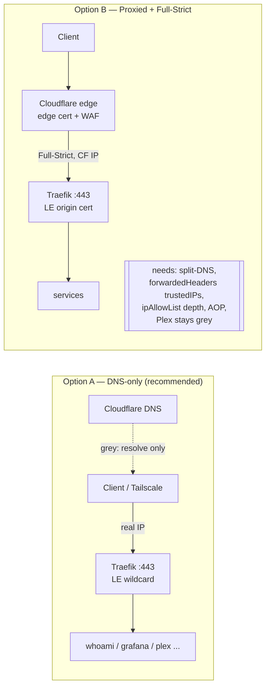

# Research: Cloudflare Proxied (orange) vs DNS-only (grey) for this homelab

_Scope: decide the target TLS/exposure architecture for `yoonnation.com` served by
Traefik v3 with Let's Encrypt. Findings cross-checked against the repo's
`docker_host` role and current Cloudflare/Traefik docs (July 2026)._

## TL;DR recommendation

**Go DNS-only (grey cloud) for this setup, keep the DNS-01 wildcard resolver
(`le-dns-cf`), and keep `lan-allowlist` + Tailscale as the access-control layer.**
Reasons, in priority order:

1. **The one public service is Plex, and proxying Plex media through Cloudflare
   violates Cloudflare's Terms of Service** (§2.8 — serving disproportionate
   non-HTML/video content through the proxy). Proxied is a non-starter for the
   Plex hostname specifically.
2. **`lan-allowlist` (192.168.0.0/24 + Tailscale CGNAT) is incompatible with
   proxied mode** unless you add split-horizon DNS + `forwardedHeaders.trustedIPs`
   + an `ipStrategy.depth` on every allow-list. Proxied makes every request
   arrive from a Cloudflare edge IP, so a LAN-IP allow-list blocks *everyone*
   (including you) by default.
3. DNS-01 gives you the wildcard cert **without** needing the proxy and **without**
   opening HTTP-01's port-80 path — so you keep every cert benefit either way.

Proxied mode is still *defensible* (hides your home IP, adds DDoS/WAF), but for a
Tailscale-first homelab whose only WAN service is Plex, it adds real complexity
and a ToS problem while duplicating protection Tailscale already provides. If you
later want the edge protection, the "Proxied done right" section below is the
migration path.

---

## Topic 1 — Security posture (origin-IP exposure, DDoS/WAF)

| | Proxied (orange) | DNS-only (grey) |
|---|---|---|
| Origin public IP | Hidden behind Cloudflare | **Exposed** in public DNS |
| DDoS / WAF / bot mgmt | Cloudflare edge absorbs | None (origin handles it) |
| Edge cache / TLS offload | Yes | No |
| Real client IP at origin | CF edge IP (needs restoration) | Real client IP natively |
| Plex media streaming | **Against Cloudflare ToS** | Fine |
| Non-standard ports (e.g. 32400) | Not proxiable | Fine |

For a homelab, the origin-IP-hiding and DDoS benefits are real but largely moot
here because internal services are reached over **Tailscale**, and the only WAN
service (Plex) can't be proxied anyway. See
[panelica: orange vs grey](https://www.panelica.com/blog/cloudflare-proxy-orange-cloud-vs-grey-cloud-when-to-use-each).

## Topic 2 — TLS interaction (SSL/TLS encryption mode)

Only relevant **if proxied**. Cloudflare's SSL/TLS mode governs the CF→origin
back-connection:

- **Flexible** — CF→origin over plain HTTP. Combined with Traefik's `web`→
  `websecure` redirect this yields an **infinite redirect loop**
  (`ERR_TOO_MANY_REDIRECTS`), and traffic origin-side is unencrypted. Never use.
  ([CF: too-many-redirects](https://developers.cloudflare.com/ssl/troubleshooting/too-many-redirects/),
  [CF: Flexible](https://developers.cloudflare.com/ssl/origin-configuration/ssl-modes/flexible/))
- **Full** — CF→origin over HTTPS but accepts **any** cert (incl. self-signed);
  no origin validation. ([CF: Full](https://developers.cloudflare.com/ssl/origin-configuration/ssl-modes/full/))
- **Full (Strict)** — CF→origin over HTTPS and **validates** the origin cert
  (must be unexpired, publicly-trusted CA **or** Cloudflare Origin CA, CN/SAN
  matches host). This is the only correct choice when proxied, and our LE wildcard
  satisfies it. ([CF: Full Strict](https://developers.cloudflare.com/ssl/origin-configuration/ssl-modes/full-strict/))

**If DNS-only, the SSL/TLS mode setting is irrelevant** — Cloudflare is not in the
data path, so the visitor sees the origin's LE cert directly.

## Topic 3 — Client-IP & the `lan-allowlist` conflict (the decisive one)

The repo gates every internal router with `lan-allowlist@file`
(`192.168.1.0/24`, `100.64.0.0/10`). Traefik's `IPAllowList` matches against
`RemoteAddr` (the TCP peer) unless told otherwise.

- **DNS-only:** the TCP peer *is* the real LAN/Tailscale client → allow-list works
  as written. ✅
- **Proxied:** the TCP peer is a **Cloudflare edge IP**, so the allow-list blocks
  every request. To fix it you must, on the `websecure` entrypoint, set
  `forwardedHeaders.trustedIPs` to the current Cloudflare IP ranges, and give each
  `ipAllowList` an `ipStrategy.depth`/`excludedIPs` so it reads the real client
  from `X-Forwarded-For`. You'd also need **split-horizon DNS** (LAN clients
  resolve `*.yoonnation.com` to the LAN IP, bypassing CF) or the internal
  dashboards become a CF round-trip. ([lrvt: IPStrategy + CDNs](https://blog.lrvt.de/solving-traefiks-ipstrategy-dilemma-while-using-cdns/),
  [Traefik forum: forwardedHeaders + allowlist](https://community.traefik.io/t/setting-up-both-forwardedheaders-and-ipwhitelist-or-how-to-trust-ip-and-whitelist-the-proxy-not-the-end-user/17423))

This is the single biggest reason DNS-only is simpler and more correct **for this
particular repo's design**.

## Topic 4 — ACME challenge behind Cloudflare

- **DNS-01 (`le-dns-cf`) is correct in both modes** and is the only way to get the
  `*.yoonnation.com` wildcard. It works when proxied because the challenge is a
  TXT record, unaffected by the HTTP proxy.
- **HTTP-01 (`le-http`) breaks when proxied** — Cloudflare intercepts :80/:443 so
  `/.well-known/acme-challenge/...` never reaches the origin. Even DNS-only, HTTP-01
  can't issue wildcards. Keep `le-http` only as a documented fallback, not the
  active resolver.
- **API-token scoping:** the Cloudflare token needs **Zone → DNS → Edit** (create/
  delete the `_acme-challenge` TXT) and **Zone → Zone → Read** (resolve the zone
  ID), scoped to the `yoonnation.com` zone. A modern scoped token is sufficient
  with Traefik/lego's `CF_DNS_API_TOKEN`; the old "Global API Key also required"
  advice is stale. ([CF community: token for Traefik](https://community.cloudflare.com/t/api-token-for-traefik-dns-challenge/132084),
  [dev.to: Traefik CF DNS challenge](https://dev.to/jhonoryza/traefik-cloudflare-dns-challenge-3b7m))

## Topic 5 — Cloudflare gotchas & optional hardening

- **Proxied ports:** proxy only covers HTTP {80, 8080, 8880, 2052, 2082, 2086,
  2095} and HTTPS {443, 2053, 2083, 2087, 2096, 8443}. Plex's `32400` is **not**
  proxiable directly; it only works proxied if fronted by Traefik on :443 — but
  see the ToS issue. ([CF: network ports](https://developers.cloudflare.com/fundamentals/reference/network-ports/))
- **Plex + proxy = ToS risk:** streaming media through the CF proxy breaches
  Cloudflare's ToS and risks suspension. Plex hostname should stay **grey** even in
  an otherwise-proxied zone.
- **Authenticated Origin Pulls (mTLS):** if you *do* go proxied, AOP is the strong
  way to stop origin-IP-bypass — the origin only accepts client-authenticated TLS
  from Cloudflare, which IP allow-listing alone can't guarantee (IP ranges drift).
  ([CF: AOP](https://developers.cloudflare.com/ssl/origin-configuration/authenticated-origin-pull/),
  [CF blog: AOP](https://blog.cloudflare.com/protecting-the-origin-with-tls-authenticated-origin-pulls/))
- **LE vs Cloudflare Origin CA:** user explicitly wants Let's Encrypt. LE works for
  both visitor-facing (DNS-only) and origin (Full-Strict) roles, so there's no need
  for Origin CA. Keep LE.

## Target architectures compared

## Decision needed (returns to idea-honing Q2)

- **Option A — DNS-only (recommended):** flip records to grey, keep `le-dns-cf`
  wildcard, keep `lan-allowlist`/Tailscale as-is. Minimal changes; everything the
  repo already does becomes correct.
- **Option B — Proxied + Full-Strict:** keep orange, but the design must add
  split-horizon DNS, Cloudflare-IP `trustedIPs`, `ipStrategy.depth` on allow-lists,
  set Cloudflare SSL/TLS = Full (Strict), move Plex to grey, and ideally enable AOP.
  More moving parts; more hardening if you want the public edge.
