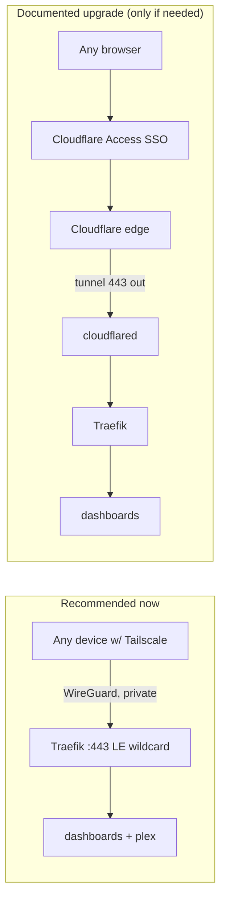

# Research: Cloudflare Tunnel + Access vs. existing Tailscale + lan-allowlist

_Scope: decide how the internal dashboards (grafana, prometheus, uptime, homepage,
whoami) should be reached, and whether to introduce Cloudflare Tunnel/Access.
Cross-checked against current docs (July 2026) and the repo's `lan-allowlist` +
Tailscale design._

## TL;DR recommendation

**Keep the existing Tailscale + `lan-allowlist` model; do NOT add Cloudflare
Tunnel as part of this task.** Your homelab is already Tailscale-first
(`lan-allowlist` includes `100.64.0.0/10`), which already delivers "reach my
dashboards securely from anywhere" with **zero public attack surface**. Cloudflare
Tunnel + Access only adds value if you specifically need **browser-only, SSO access
from devices that can't run Tailscale** (family members, a locked-down work laptop,
a borrowed machine). If that's not a real need, Tunnel adds a container, a Zero
Trust config, a redesign of the middleware model, and routes your dashboard traffic
through a third party — for little gain here.

Record Tunnel + Access as a **documented future upgrade** (it fits the "Hybrid /
upgrade path" framing from Q2), not part of the current correctness pass.

## What each is

- **Tailscale** — WireGuard mesh VPN. Devices with the Tailscale client connect
  peer-to-peer; the coordination server sees only metadata, not traffic. Nothing is
  published to the public internet. Already in use here.
- **Cloudflare Tunnel (`cloudflared`)** — an **outbound-only** daemon on the host
  opens a persistent connection to Cloudflare's edge; inbound requests arrive at
  Cloudflare and are pushed down the tunnel. No port-forward, origin IP never
  exposed. Pin to **cloudflared 2026.6.0+** (a 2026 build removed an older
  behavior). ([CF One: Tunnel](https://developers.cloudflare.com/cloudflare-one/networks/connectors/cloudflare-tunnel/),
  [Matt Dyson: Traefik + Tunnel](https://mattdyson.org/blog/2024/02/using-traefik-with-cloudflare-tunnels/))
- **Cloudflare Access (Zero Trust)** — an identity gate *in front of* a tunneled
  hostname: unauthenticated users get an SSO login (Google/GitHub/OTP) with MFA
  before the request reaches the origin. Stronger than basic-auth for services with
  weak/no built-in login. ([GnTech: Tunnel+Access](https://blog.gntech.me/posts/2026-05-14-cloudflare-tunnel-docker/))

## Comparison for this homelab

| Dimension | Tailscale + lan-allowlist (current) | Cloudflare Tunnel + Access |
|---|---|---|
| Public attack surface | **None** — nothing published | Public hostname behind CF Access auth |
| Access from non-Tailscale device | ✗ needs client installed | **✓ any browser + SSO login** |
| Home IP exposure | None (Tailscale); Plex via port-forward | **None** (outbound tunnel) |
| Traffic path / privacy | Peer-to-peer, CF sees nothing | All dashboard traffic through Cloudflare |
| Auth | IP allow-list (network-level) | Identity/SSO + MFA + device posture |
| New moving parts | None | `cloudflared` container, tunnel token (vault), Zero Trust app/policy config |
| Effect on LE/Traefik design | LE wildcard served directly; `lan-allowlist` as-is | Visitors see CF edge cert (LE redundant for tunneled hosts); **`lan-allowlist` must be dropped** for tunneled routes — cloudflared connects from the docker net, not a LAN IP, so Access replaces it |

Sources: [Tailscale vs CF Tunnel (breakingcube)](https://tech.breakingcube.com/2026/05/02/tailscale-vs-cloudflare-tunnel-zero-trust-comparison/),
[frankel.ch: Zero-Trust→Tailscale](https://blog.frankel.ch/cloudflare-zero-trust-tailscale/),
[XDA: Tunnels→Tailscale](https://www.xda-developers.com/switching-from-cloudflare-tunnels-tailscale-hated-it/).

## The decisive question

**Do you need browser-only, login-gated access to the dashboards from devices that
can't run Tailscale?**

- **No** → Tailscale already covers it. Keep the current model; this task stays a
  focused Traefik/TLS correctness pass. (Recommended.)
- **Yes** → Cloudflare Tunnel + Access is the right tool, but it's a distinct,
  larger project that also **reshapes the middleware model** (Access replaces
  `lan-allowlist` on tunneled routes) and makes the origin LE cert cosmetic for
  those hostnames. Best done as a follow-up, not folded into this pass.

## Interaction with the LE/Traefik task either way

Even if Tunnel is adopted later, the origin still benefits from the LE wildcard
(Plex, direct/Tailscale access, and Full-Strict if any route is ever proxied). So
the DNS-01 wildcard correctness work in this task is **not wasted** under any of the
three futures (grey / proxied A-records / Tunnel).

## Decision needed (returns to idea-honing Q3a)

1. **Keep Tailscale + lan-allowlist (recommended)** — no Cloudflare in the internal
   path; document Tunnel+Access as a future option.
2. **Adopt Cloudflare Tunnel + Access now** — expand scope: add cloudflared, Zero
   Trust config, and rework the middleware model for tunneled routes.
