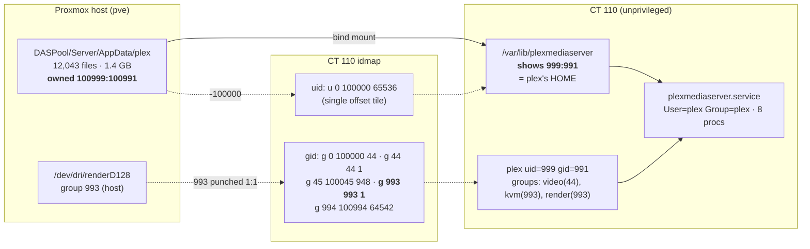
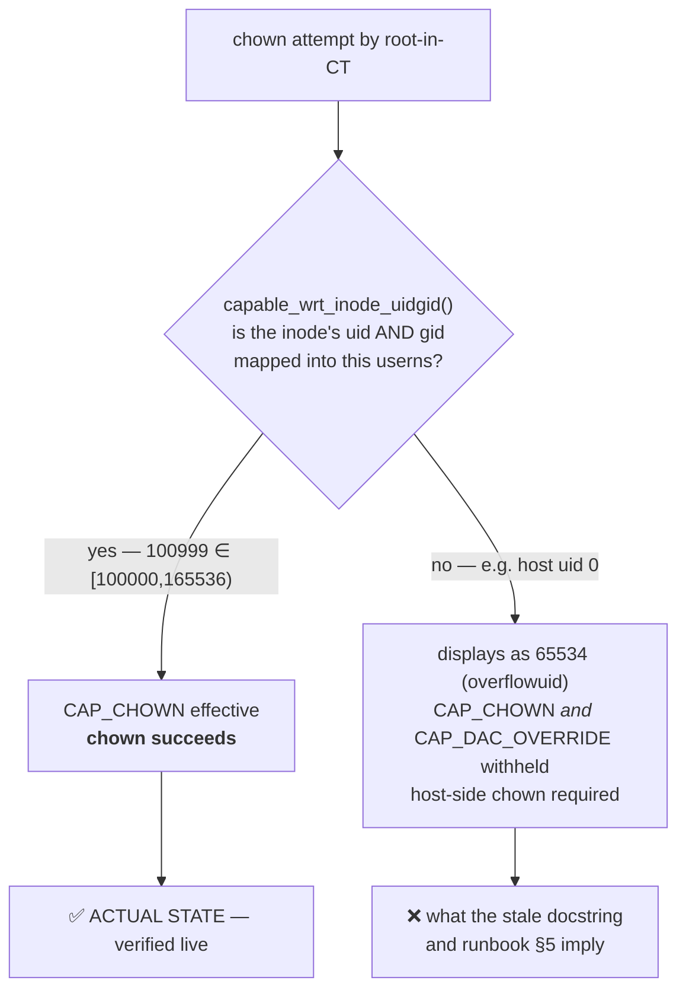
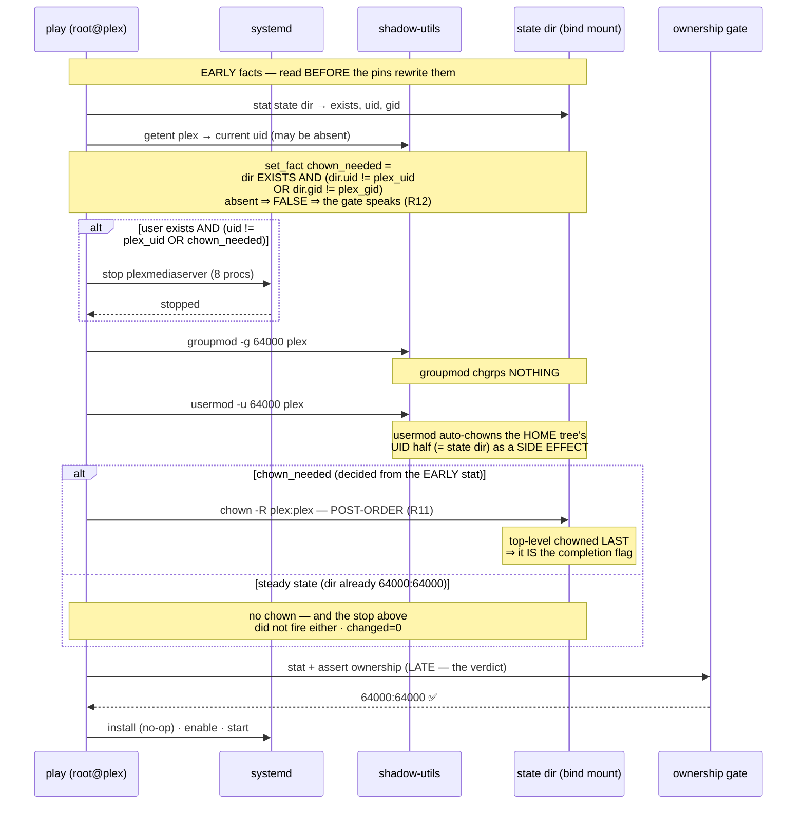

# Detailed Design — Deterministic Plex UID/GID Across CT Recreation

**Project:** `2026-07-15-plex-user-persistence`
**Status:** approved 2026-07-15; **§4.2/§6.1/§6.3/§7.1 revised 2026-07-15** on Q9 =
(A) self-healing after a Design Critic REJECT (see §11 Review Outcomes, §4.7)
**Target:** CT 110 (`plex`), `ansible/roles/plex`

---

## 1. Overview

The `plex` POSIX user inside CT 110 currently holds `uid=999, gid=991`. Those
values sit inside Debian's **dynamic system-allocation range** (`100-999`), which
`useradd --system` draws from, descending from 999. They were never chosen — they
are simply what the allocator happened to hand out when `plexmediaserver` was
installed first.

CT 110's Plex state directory is a bind mount from the host
(`DASPool/Server/AppData[/plex]` → `/var/lib/plexmediaserver`) carrying a 1.4 GB
library: `Preferences.xml`, the library database, watch history, playlists and
metadata across 12,043 files. Because the CT is unprivileged with a `+100000`
idmap offset, those files are host-owned `100999:100991`. **If a CT rebuild
re-allocates `plex` to a different uid, the rebuilt server cannot read its own
library.**

This design moves `plex` to `uid = gid = 64000`, inside Debian Policy §9.2.2's
**reserved band** (`60001-64999`) — above `UID_MAX=60000` so regular `useradd`
never reaches it, and far above `LAST_SYSTEM_UID=999` so `useradd --system` never
descends to it. No allocator in the container can emit `64000`. The pin becomes
collision-proof *by construction* rather than by luck.

### What this project is — and is not

This is a **hardening change to a healthy server**, not a repair.

Planning began from the premise that CT 110 was broken: the docstring of
`scripts/verify_plex_state_ownership_gate.py` states that the state dir carries
raw `65534` ownership and that "PMS stays failed". **Live verification on
2026-07-15 disproved this.** PMS is `active` and `enabled`, all 12,043 files are
uniformly `plex:plex`, and QSV transcoding works. That docstring is stale, and it
misled this planning session into a wrong architectural conclusion before the
error was caught (see §9.2).

Nothing is currently broken. The justification for acting anyway is empirical
rather than theoretical: **the collision this design prevents has already
happened in this container to a different group.** `getent` returns
`kvm:x:993:plex` *and* `render:x:993:plex` — two groups sharing GID 993, held
together by a deliberate `non_unique: true` workaround. The dynamic range does
not hold here. `999`/`991` have not collided *yet*.

---

## 2. Detailed Requirements

Consolidated from `idea-honing.md` (Q1–Q9). Each is traceable to a recorded
decision.

### 2.1 In scope

| # | Requirement | Source |
|---|---|---|
| R1 | The in-CT POSIX `plex` user and group MUST be deterministic across CT recreation. | Q1 |
| R2 | The pinned ids MUST be `uid = gid = 64000` — outside every range the allocator can emit. | Q4 |
| R3 | `plex_uid` and `plex_gid` MUST remain **two independent literal ints**. Neither may be derived from the other. | Q4, §9.3 |
| R4 | The state dir's ownership MUST be migrated to match the new ids, in the same operation. | Q7 |
| R5 | The migration MUST run **entirely in-CT** via the existing `root@plex` Ansible target. No `pve` host target, no new hypervisor access. | Q6 |
| R6 | The migration MUST be idempotent — a steady-state re-run performs no stop, no chown, and reports `changed=0`. | Q7, §6.3 |
| R7 | The stale docstring and expected ids in the ownership-gate tooling MUST be corrected. | Q8.1 |
| R8 | The `kvm`/`render` GID-993 collision MUST be documented as a known issue with its analysis. | Q8.2 |
| R9 | **The migration MUST be self-healing** — a plain `just play` re-run MUST complete an interrupted migration from any interrupted state, unattended. | Q9, §4.7 |
| R10 | Each guarded task MUST key on **what it actually guards**: the chown on the **state dir, both halves** (a uid-only test wedges identically); the stop on the **user**, widened by the chown predicate so PMS is never live while its state dir is rewritten. | Q9, §4.2 |
| R11 | **The recursive chown MUST be post-order** (top-level chowned *last*) — R9 rests on "top-level ownership IS the completion flag". `command: chown -R` satisfies this; `ansible.builtin.file: recurse=yes` does **not** and silently wedges R9. MUST be pinned wherever the module choice is recorded. | Q9, §4.2.2 |

### 2.2 Explicitly out of scope

| # | Excluded | Rationale | Source |
|---|---|---|---|
| X1 | The plex.tv **account/server identity** (claim token, machine identifier). | Separate failure mode; distinct project. | Q1 |
| X2 | **Fixing** the `kvm`/`render` GID-993 collision. | `render` cannot move — 993 is dictated by the host's `/dev/dri/renderD128` group and punched 1:1 through the idmap. Only `kvm` could move, and it is package-allocated. Risks live QSV transcoding to fix a cosmetic duplicate. | Q8.2 |
| X3 | Unifying `plex_idmap_base: 100000` with `local.idmap_uid_offset`. | Deferred. Design must not worsen the duplication. | Q3, Q8.4 |
| X4 | **ZFS snapshot** before the chown. | Operator declined twice — the second time on corrected premises, knowing the server is live and healthy. Residual risk bounded: ownership is uniform, so revert is a known one-liner. | Q5, Q7 |
| X5 | **Ownership manifest** before the chown. | Moot. Ownership is uniform (`12043 plex:plex`); the manifest is one fact, recorded in §5.3. | Q5, §9.1 |
| X6 | **Rebuild verification** (destroy/recreate to prove the pin). | Operator declined. Judged *more* defensible on corrected premises: a destroy/recreate against a live healthy server carries real risk. | Q5, Q7 |

### 2.3 Accepted risks

Recorded as informed operator decisions, not oversights.

- **AR1 — The pin ships unproven.** Nothing in this design demonstrates that the
  `plexmediaserver` package honours a pre-created `64000` user rather than
  overriding it. Its first real test will be a future unplanned rebuild.
  Mitigation available but declined; see §7.4 for the cheap follow-up that would
  close this.
- **AR2 — The chown is one-way.** No snapshot, no manifest. Realistic failure mode
  is "wrong ownership" (recoverable via §6.4), not data loss — `chown` does not
  destroy contents.
- **AR3 — Fallback is a full library rescan.** Operator accepts. Noted: a rescan
  restores libraries but **not** watch history, playlists, collections or
  ratings, which live in the library DB inside the state dir.

---

## 3. Architecture Overview

### 3.1 Where identity lives today



Two distinct mapping regimes are in play, and conflating them is the trap this
project already fell into once:

- **The uid map is one flat tile.** Any in-CT uid `N` ⇔ host `N + 100000`.
  Uniform, no exceptions.
- **The gid map is punched.** GIDs 44 (`video`) and 993 (`render`) pass through
  **1:1** so the CT sees the host's real device-node groups. Every other gid is
  offset by `+100000`. So `991 → 100991` holds *only because 991 lands in the
  `g 45 100045 948` offset tile*. It would not hold for 44 or 993.

`64000` lands in the `g 994 100994 64542` tail tile → host `164000`. The
`+100000` shift holds — same tile-dependent property as `991`, neither better nor
worse. **This is a property of the chosen value's tile, not a blanket
invariant** (X3 leaves this undefended; it is not made worse).

### 3.2 Target state

| | Before | After |
|---|---|---|
| in-CT `plex` uid | `999` (dynamic range) | **`64000`** (reserved band) |
| in-CT `plex` gid | `991` (dynamic range) | **`64000`** (reserved band) |
| host-side ownership | `100999:100991` | **`164000:164000`** |
| gid map tile used | `g 45 100045 948` | `g 994 100994 64542` |
| Can the allocator emit it? | **Yes** — `useradd --system` descends from 999 | **No** — above `UID_MAX=60000`, far above `LAST_SYSTEM_UID=999` |

### 3.3 Why in-CT chown works

Empirically verified (§9.1), and worth stating because the repo currently asserts
the opposite.



`docs/runbooks/plex-claim.md:130-132` states that unmapped ownership "shows up in
the CT as `65534:65534`… and in-CT `root` cannot chown it… A host-side `chown` is
the only repair." **That is true for the unmapped case, and the dir is not in it.**
The runbook describes a state CT 110 has already left. R5 is therefore
achievable: no `pve` target is needed.

---

## 4. Components and Interfaces

### 4.1 Files changed

| File | Change | Req |
|---|---|---|
| `ansible/roles/plex/defaults/main.yml` | `plex_uid: 999 → 64000`; `plex_gid: 991 → 64000`; rewrite the `uid != gid` comment (§4.4) | R2, R3 |
| `ansible/roles/plex/tasks/main.yml` | Insert the migration sequence (§4.2) before the existing ownership gate | R4, R5, R6 |
| `scripts/verify_plex_state_ownership_gate.py` | Retire or re-point — its premise is now false (§4.5) | R7 |
| `scripts/test_plex_state_ownership_shape.py` | Update prose only; assertions already pass (§4.6) | R7 |
| `docs/runbooks/plex-claim.md` | Correct §5's "host-side chown is the only repair"; document the migration + the known issue | R7, R8 |

No OpenTofu changes. The uid map already covers `64000`; the gid map's tail tile
already covers it. **The idmap is untouched, so the CT is not replaced.**

### 4.2 Task sequence

The existing role already pins gid then uid before the package install
(`tasks/main.yml:90`, `:97`). That ordering is correct and is retained. Two
concerns must be added around it:

1. **`usermod -u` refuses while the user owns running processes.** 8 live plex
   processes were observed (§9.1). PMS must be stopped first.
2. **The ownership gate at `:106-:133` asserts the state dir matches the pinned
   ids.** During the migration run the dir is still `999:991` while the pin is
   `64000` — so the chown must land *before* the gate, or the play fails on its
   own gate.

**There is no single migration predicate.** That is the substance of this section
and the resolution of the Design Critic's REJECT (§4.7). Two operations are
guarded, they have **different preconditions**, and collapsing them onto one
`getent`-uid test is what wedged the first draft:

| Op | Precondition it must guard | Therefore keys on |
|---|---|---|
| **Stop PMS** | F1 — `usermod` refuses while the user owns processes; and PMS must never be live while its state dir is rewritten underneath it | the **USER**, widened by the chown predicate |
| **`chown -R`** | R4 — the state dir's ownership is wrong | the **DIR, both halves** |

`getent` was never wrong *for the stop* — F1 is a fact about the user. It was only
ever wrong for the **chown**, whose target is the dir.



New tasks, inserted **before** the existing pin at `:90`:

- **`Stat the Plex state directory before the id pins`** — `ansible.builtin.stat`.
  **This must precede the pins, not merely the chown.** `usermod` rewrites the
  dir's uid as a *side effect* (§4.3), so a stat taken after the pins reads a fact
  the guarded operation has already rewritten — that is the original defect wearing
  a new hat. Tolerates absence. **Registers the stat result** (a `stat` registers a
  stat result; it cannot register a boolean — see the derivation below).
- **`Derive chown_needed`** — `ansible.builtin.set_fact`, immediately after the
  stat and **before the pins**. This is the **single site** where `chown_needed` is
  defined; both guarded tasks reference it by name.

  > **Why a named fact and not an inline expression per task** (DEC-007). Three
  > reasons, and the third is the load-bearing one:
  > 1. §4.2's contract is that the predicate is decided from facts read **before**
  >    the pins. A `set_fact` fixes *when* it is evaluated; a `vars:` on each task
  >    is evaluated lazily at task runtime.
  > 2. It is referenced twice (the chown's `when:`, and the stop's `when:` via the
  >    `or chown_needed` widening). Inlining it twice invites the two copies to
  >    drift, and a drifted copy is exactly the rejected defect.
  > 3. **It gives the derivation an address.** A regression test cannot assert
  >    anything about a predicate that has no single home — which is precisely why
  >    the provenance guard was unfalsifiable (§7.1, R13). Making the derivation
  >    addressable is what makes it testable.
- **`Read the current plex uid`** — `ansible.builtin.getent` (`database: passwd`,
  `key: plex`). Must tolerate absence: on a fresh rebuild the user does not exist
  yet. Feeds the stop predicate only.
- **`Stop Plex Media Server before an id migration`** — `ansible.builtin.service`,
  `state: stopped`, `when:` the user exists **and** (its uid ≠ `plex_uid`
  **or** `chown_needed`). Tolerates a missing unit (fresh CT, package not yet
  installed). The `or chown_needed` widening is what keeps PMS down while the
  chown rewrites the dir on a **recovery** re-run, where the uid half already
  reads `64000`.

Existing pins at `:90`/`:97` are unchanged. Then, before the gate:

- **`Migrate state dir ownership to the pinned ids`** — `chown -R
  {{ plex_uid }}:{{ plex_gid }} {{ plex_state_dir }}`, guarded by
  **`chown_needed`** — never by the `getent` register.

**Early = predicate, late = verdict.** The gate's own `stat` at `:106` stays where
it is, *after* the chown; it answers "did this run end correct?", which is a
different question from "is there work to do?". Conflating the two is this bug.

#### 4.2.0 `chown_needed` when the state dir is absent — R12

**Definition, complete:**

> `chown_needed` = **the dir exists** *and* (dir uid ≠ `plex_uid` *or* dir gid ≠ `plex_gid`)

The existence clause is **not defensive padding** — without it the predicate does
not merely mis-answer, it **errors**. `stat` on an absent path returns
`{exists: false}` with **no `uid`/`gid` keys at all**, and the bare comparison
raises:

> `Error while resolving value for 'msg': object of type 'dict' has no attribute 'uid'`

So the earlier text's *"tolerates absence"* was a requirement its own definition
made impossible to meet. The existence clause is what discharges it. Jinja `and`
short-circuits, so `exists and (uid != … or gid != …)` never evaluates the missing
attribute.

**Absent ⇒ FALSE ⇒ the gate at `:111` is the only voice on that state.** This is
*not* a new semantic invented here — it is the behaviour the role **already has**,
and R12 is "do not regress it":

1. The gate's `that:` lists `plex_state_stat.stat.exists` **first**, and `assert`
   short-circuits on the first false condition — it never reaches `.uid`. Observed,
   not argued: `{"assertion": "plex_state_stat.stat.exists", "evaluated_to": false}`.
2. Its `fail_msg` renders `{{ …stat.uid | default('missing') }}` → **`missing:missing`**.
   That `| default('missing')` is **deliberate authorship of the absent case**.

The gate already diagnoses an absent state dir precisely and actionably. The
migration machinery's job is to **stay out of its way**.

> ⚠️ **`| default(0)` is the wrong-answer attractor.** It is the reflex fix for the
> missing-attribute error, it type-checks, and it is wrong: `0 != 64000` →
> `chown_needed` **TRUE** → `chown -R` fires **on a path that does not exist** →
> the play dies on a cryptic `chown` error that **shadows the gate's excellent
> idmap diagnostic** at `:111` — the one message that would actually tell the
> operator the bind mount is missing. Reproduced:
> `logs/r12-absent-semantics-probe.sh` → `.log`.

**Reachability, stated honestly:** the mount point *is* configured in tofu
(`/var/lib/plexmediaserver` ← `/tank/Server/AppData/plex`), so on CT 110 the dir
always exists and this state is **not reachable in the normal path**. It is
specified anyway for the same reason the role already asserts `stat.exists` with a
first-class message: the project deems the state worth handling, and a predicate
that *errors* on it would convert a clear diagnostic into a confusing one.

### 4.2.1 Why both halves, not just the uid

"Key the predicate on the dir, not the user" is **necessary but not sufficient** —
a uid-only dir test wedges *identically* to the defect it replaces. At the
interrupted state (post-`usermod`, pre-`chown`, dir `64000:991`), measured in
`logs/q9-predicate-probe.log`:

| predicate | at the interrupted state | outcome |
|---|---|---|
| (a) `getent passwd` uid — first draft | **FALSE** | wedged (the REJECT) |
| (b) dir, **uid half only** | **FALSE** | **wedges identically** |
| (c) dir, **both halves** | **TRUE** | re-fires → recovers |

Because `usermod` auto-chowns the home tree's **uid** (0 of 12,154 files left at
`999`) while `groupmod` chgrps **nothing** (all 12,154 still gid `991`), the dir's
uid half already reads `64000` and a uid-only test latches false. §4.4's *"never
derive the gid from the uid"* governs **predicates**, not just chowns — this
project's own lesson, one layer up.

### 4.2.2 R11 — the chown MUST be post-order

R9 (self-healing re-run) rests **entirely** on one invariant:

> **The top-level dir's ownership IS the migration's completion flag.**

Nothing but the explicit chown writes the dir's **gid**, so the flag is only
raised when the walk finishes. That is what makes X5 (no manifest) survive: no
marker file is needed because the tree already carries its own completion state.

**This invariant is a property of GNU coreutils, not of "recursively chowning a
tree", and it does not transfer.** Proven by strace, not sampling: under
`chown -R` the top-level dir is `fchownat` call **12,154 of 12,154** — post-order,
chowned last. `ansible.builtin.file` with `recurse: yes` **inverts** it, raising
the completion flag at the **start** of the walk. The inversion is structural, and
that structure is what to check — `ensure_directory()` calls
`set_fs_attributes_if_different()` on the **top level**, and only *then*, guarded by
`if recurse:`, calls `recursive_set_attributes()` → `os.walk(b_path)` with **no
`topdown` argument**, which therefore defaults to `True` = pre-order:

| impl | interrupted mid-walk | predicate (c) | outcome |
|---|---|---|---|
| `command: chown -R` | top-level **still old**, at all 5 interrupt depths | **TRUE** | recovers |
| `file: recurse=yes` | top-level **already correct**, 9,134/9,723 un-chowned | **FALSE** | **WEDGED** |

Measured side by side in `logs/q9-traversal-order-probe.log`.

> **Do not re-cite `file.py` by line number.** Three successive drafts of this
> section have carried a *different* wrong line number, which is §9.2's own failure
> shape recurring inside the section that documents it — for the third time:
>
> | draft | cited for "top-level attrs set first" | actually |
> |---|---|---|
> | original | `file.py:683` | `msg=f"{path} already exists…"` — wrong |
> | review correction | `~:667` | an `except OSError` handler in the path-**creation** loop — **also wrong** |
> | **verified here** | **`:691`** | ✅ `set_fs_attributes_if_different(file_args, …)` |
>
> On the version installed today (`ansible-core 2.21.1`) the real structure is
> **`:691`** top-level attrs → **`:693`** `if recurse:` → **`:694`**
> `recursive_set_attributes()` → **`:343`** `os.walk(b_path)`, no `topdown` arg.
> The substance was right in every draft; only the coordinates rotted.
>
> **And they will rot again: `mise.toml:24` pins `"pipx:ansible-core" = "latest"`,
> not `2.21.1`.** The prior review reasoned about "the version this repo actually
> pins" — the repo pins **no** version, so 2.21.1 is merely what is installed today
> and the next `mise install` may move it. A line number is therefore **not a
> durable citation** here; the structural claim above is (`set_fs_attributes_if_different`
> before `if recurse:`; `os.walk` defaulting to `topdown=True`), and the executable
> check in §7.1 is what actually holds R11. **Cite the structure and the probe; the
> numbers are a convenience, correct as of 2.21.1 and expected to drift.**

So the module choice is a **correctness constraint, not a performance
preference** — the two implementations differ by *recoverable vs permanently
wedged*, not by speed. `plan.md:70-73` recorded it as a preference ("markedly
slower **for the same result**"); that prose is corrected, because left standing it
invites the swap that silently resurrects the rejected defect. **The requirement
must be pinned where the swap would happen** — at the task itself (§4.4-style
comment) **and** by a test that fails on a pre-order swap (§7.1), because a comment
alone is exactly what §9.2 proves does not hold.

### 4.3 The usermod/groupmod asymmetry

The single most surprising behaviour in this design, and the reason the explicit
chown is **not** redundant:

| Tool | Touches file ownership? | Scope |
|---|---|---|
| `usermod -u NEW plex` | **Yes, automatically** | Files owned by the *old uid* within the **home directory tree** |
| `groupmod -g NEW plex` | **No** | Nothing. Group ownership of files must be fixed manually. |

Critically, **plex's home directory *is* the state dir**:

```
plex:x:999:991::/var/lib/plexmediaserver:/usr/sbin/nologin
```

So `usermod -u 64000 plex` will silently walk and chown all 12,043 files — the
uid half of the migration happens as a *side effect* of the pin task. The gid half
does not. Relying on that implicit behaviour would leave the dir at `64000:991`
and the gate would fail correctly but confusingly.

**Design decision:** issue an explicit `chown -R plex:plex` regardless. It is
idempotent, it normalises both halves, and it makes the migration legible at the
task level instead of hiding it inside `usermod`'s home-tree traversal. The
redundancy is deliberate and must be commented as such, or a future reader will
"simplify" it away.

### 4.4 The `uid != gid` comment

`defaults/main.yml` carries an emphatic warning that `plex_uid` and `plex_gid`
"are allocated INDEPENDENTLY, so uid != gid — do not collapse them into one
value". Setting both to `64000` appears to contradict it. It does not.

The warning defends against **deriving one from the other** — the historical bug
where `plex-claim.md` §5 said `chown -R $((100000 + 999)):$((100000 + 999))`,
assuming `uid == gid` for values the allocator had picked independently. That
assumption broke the bind mount.

Once both ids are *deliberately chosen*, equality is a property we **enforce**,
not one we **assume**. The lesson that survives — and MUST be preserved in the
rewritten comment — is:

> Never derive the gid from the uid. They are two independent knobs that
> currently hold the same value. Any chown must name both halves explicitly.

This is not a rhetorical distinction: `test_plex_uid_and_gid_pinned_independently`
enforces exactly it (§4.6).

### 4.5 `verify_plex_state_ownership_gate.py` — retire or re-point

**This needs a decision at review time.** It is more than a stale docstring.

The harness is a fix-verification tool built around a **live broken CT**. Its
checks are:

- `CHECK1` — real gate + real live state → **assert the gate FAILS**
- `CHECK2` — expected ids overridden to `65534` → assert PASSES
- `CHECK3` — uid right, gid wrong → assert FAILS
- `CHECK4` — string-valued override → assert the message renders

`CHECK1` asserts the gate **fails** against the live dir. After this migration the
dir is `64000:64000` and the gate **passes** — so `CHECK1` inverts and the harness
reports failure precisely when the system is correct. `CHECK2`'s `65534` premise
is already false today.

It also hardcodes `chown -R 100999:100991` at lines 120 and 160, which becomes
`164000:164000`. (`CHECK4` overrides the ids to `999`/`991` itself and stays
self-consistent — that one is fine.)

Mitigating context: the file is `verify_*.py`, not `test_*.py`, so it is **not**
in the `just test` glob — it is a manual debug harness whose stated purpose was to
prove one specific historical fix. That purpose is discharged.

**DECIDED AT REVIEW: retire it.** Its premise is gone, it is not in CI, and it is
the direct cause of this project's wrong turn (§9.2). A stale harness asserting a
false world is worse than no harness. The durable coverage lives in
`test_plex_state_ownership_shape.py` (in the glob) plus the role's own runtime
gate.

_Alternatives considered: re-point `CHECK1`/`CHECK2` at a synthetic fixture
(costs a fixture plus ongoing upkeep for checks whose fix is discharged); fix
only the docstring and hardcoded ids (rejected — `CHECK1` would still invert
post-migration and report failure exactly when the system is correct)._

### 4.6 `test_plex_state_ownership_shape.py` — prose only

**The assertions already pass under `uid = gid = 64000`.** Verified by reading
the implementation rather than the docstring:

```python
ok = uid is not None and gid is not None
independent = ok and not re.search(r"^plex_gid:\s*.*plex_uid", text, re.MULTILINE)
```

It asserts both keys are literal ints and that `plex_gid` is not *defined in terms
of* `plex_uid`. It never asserts `uid != gid` numerically — the comment even says
it deliberately avoids pinning exact values. `plex_uid: 64000` / `plex_gid: 64000`
as two separate literals satisfies it, and the test still catches a future
`plex_gid: "{{ plex_uid }}"` collapse. **The invariant it defends is exactly the
one §4.4 preserves.**

Only prose needs updating: the module docstring narrates the `999`/`991` world and
says "uid != gid is real here".

### 4.7 What the design review changed (2026-07-15)

The Design Critic **REJECTED** the first draft on one defect, reproduced in a
container. It is recorded here because the rejected shape is the one a fresh reader
will naturally re-propose, and because the fix is smaller than the reasoning behind
it.

**The defect:** the migration predicate tested a **proxy**, not the thing it
guards. `getent passwd plex` uid ≠ `plex_uid` governed both the stop and the chown
— but the condition it must actually guard is the **state dir's ownership**. Those
two facts are written by *different operations at different times*, so the guard
reads false while the migration is undone. `usermod` commits `/etc/passwd` first,
then walks the home tree: sampled mid-flight, `passwd_uid=64000` while **8,525 of
16,082 entries were still un-chowned**. Re-running from that state skipped both the
stop and the chown — **permanently wedged, every time**. The window is not an
instant; it is the entire 12,043-file / 1.4 GB walk.

**What Q9 settled** (operator fork, answered on the announced timeout default):
**(A) self-healing** — a plain `just play` re-run MUST complete an interrupted
migration, unattended (R9). (B) was attended hand-repair via §6.4. (A) won because
X4 leaves §6.4 as the only fallback, so the documented recovery is load-bearing and
ought to be the automated one; it prices out at one read-only `stat` and one `or`.

**Two things the rejection's own framing missed** — each is a "necessary but not
sufficient" one layer out from the last, which is the shape this fault line keeps
taking:

1. "Key on the dir, not the user" is **not sufficient** — a uid-only dir test wedges
   identically (§4.2.1).
2. "Key on the dir, both halves" is **not sufficient** — it silently depends on the
   chown being **post-order** (§4.2.2, R11).

**Verified sound, do not re-probe** (each was independently attacked and held):
§4.3's usermod/groupmod asymmetry, §4.6's "assertions pass unchanged", §6.2/F3's
*detection* claim, §3.3's in-CT chown, §5.3's uniformity, A.1's `64000`.

**Not re-litigated:** Q8.1 (superseded), AR1 (known + accepted), X4 (re-decided at
Q7). R9–R11 are independent of all three — X4 only explains *why* the recovery path
is load-bearing; it is not reopened.

---

## 5. Data Models

### 5.1 Identity

| Symbol | Type | Before | After | Defined in |
|---|---|---|---|---|
| `plex_uid` | literal int | `999` | `64000` | `roles/plex/defaults/main.yml` |
| `plex_gid` | literal int | `991` | `64000` | `roles/plex/defaults/main.yml` |
| `plex_idmap_base` | literal int | `100000` | unchanged | `roles/plex/defaults/main.yml` (duplicates `local.idmap_uid_offset`; X3) |
| `plex_state_dir` | path | `/var/lib/plexmediaserver` | unchanged | ” |
| `plex_state_host_path` | path | `/tank/Server/AppData/plex` | unchanged | ” |
| `plex_render_gid` | literal int | `993` | unchanged (X2) | ” |
| `plex_video_gid` | literal int | `44` | unchanged | ” |

### 5.2 Allocation ranges (verified live, §9.1)

| Range | Allocated by | `64000` safe? |
|---|---|---|
| `0-99` | base packages, statically | reserved |
| `100-999` | `useradd --system`, **descending from 999** | ← `999`/`991` live here today |
| `1000-60000` | `useradd`, ascending (`UID_MIN 1000`, `UID_MAX 60000`) | below target |
| **`60001-64999`** | **nobody — Debian Policy §9.2.2 reserved** | ✅ **target** |
| `65534` | `nobody` / `overflowuid` | above target |

### 5.3 Ownership invariant (the manifest X5 made unnecessary)

Verified 2026-07-15 — `find /var/lib/plexmediaserver -xdev -printf "%u:%g\n" | sort | uniq -c`:

```
  12043 plex:plex
```

**Uniform. Exactly one owner across the entire tree**, and `find / -xdev -uid 999`
outside the mount returns only the mount point itself — no strays. This is what
makes X4/X5 tolerable and §6.4's revert a one-liner.

---

## 6. Error Handling

### 6.1 Failure modes

| # | Failure | Detection | Handling |
|---|---|---|---|
| F1 | `usermod` refuses — plex owns running processes | `usermod: user plex is currently used by process N` | Stop task precedes the pin (§4.2). If it still fires, a non-PMS process holds the uid — fail loudly, do not force. |
| F2 | Play interrupted between `usermod` and `chown` | Gate fails: dir **`64000:991`** (not `999:991` — `usermod` has already auto-chowned the uid half, §4.3), pin `64000` | **Re-run the play.** `chown_needed` sees the **gid** half still wrong → re-fires; the stop's `or chown_needed` widening keeps PMS down while it does. Safe because the gate refuses to start PMS on mismatched ownership. **Requires the §4.2 predicate** — the rejected `getent`-uid one reads FALSE here and wedges. |
| F3 | `chown -R` partially completes | Gate fails on the top-level dir — **post-order (R11) is why**: the top level is chowned last, so a partial walk always leaves it red | Re-run. `chown -R` is idempotent, and `chown_needed` re-fires because the top-level gid is still unwritten. |
| F4 | Gate fails after a correct migration | Gate message names expected vs actual | Indicates the chown did not reach the mount — check `findmnt`, not the ids. |
| F5 | Package overrides the pinned uid on install | **Undetected — see AR1** | No coverage by design (X6). §7.4 is the cheap fix. |
| F6 | `64000` occupied on a future rebuild | `groupmod`/`usermod` error | Cannot occur: no allocator emits the reserved band (§5.2). This is the point of R2. |

### 6.2 The gate is the safety net

The existing assert at `tasks/main.yml:111` is load-bearing for **F2/F3**: it
runs *before* the install/start, so a half-migrated dir stops the play instead of
starting PMS against a library it cannot read. This design **strengthens** its
role — it is now the only automated check standing between a botched migration
and a running server. Its expected values follow `plex_uid`/`plex_gid`
automatically; no hardcoding to update.

### 6.3 Idempotency

Two predicates, derived from facts gathered **before** the pins (§4.2), with
`chown_needed` defined once by a `set_fact` (§4.2, DEC-007):

- **`chown_needed`** = dir **exists** **and** (dir uid ≠ `plex_uid` **or** dir gid ≠
  `plex_gid`) — governs the chown. Absent ⇒ FALSE (§4.2.0, R12).
- **stop** = user exists **and** (its uid ≠ `plex_uid` **or** `chown_needed`).

| State | `chown_needed` | stop | Result |
|---|---|---|---|
| Fresh rebuild (user absent, dir already `64000:64000` via the idmap) | FALSE | FALSE | pins create at `64000`; gate passes; **no chown, no `getent` dependency at all** |
| Steady state (migrated, `64000:64000`) | FALSE | FALSE | **no stop, no chown**, `changed=0` (R6) |
| Migration run (`999:991`) | TRUE | TRUE | fires **once** |
| **Interrupted recovery (`64000:991`)** | **TRUE** | **TRUE** | **re-fires and completes — R9** |
| **State dir absent** (bind mount missing; not reachable on CT 110 — §4.2.0) | **FALSE** | user-uid only | **no chown on a nonexistent path**; the gate at `:111` fails with its idmap diagnostic — **R12** |

The last row is the one the first draft got wrong, and it is why R6 and R9 are not
in tension: **R6 is about the steady state, R9 is about the interrupted state, and
only a both-halves dir predicate distinguishes them.** A uid-keyed predicate
collapses rows 2 and 4 into "FALSE" and calls a wedged server steady.

A play that stops PMS on every run would be unacceptable; these predicates are
what make R6 hold. Verified: `logs/q9-predicate-probe.log` probe 5 (steady state —
both predicates FALSE, 0 stragglers) and probe 6 (fresh rebuild — decides FALSE
with no `getent` at all).

### 6.4 Revert

No snapshot (X4), but §5.3's uniform ownership makes this exact and complete:

```bash
systemctl stop plexmediaserver
usermod -u 999 plex && groupmod -g 991 plex
chown -R 999:991 /var/lib/plexmediaserver
systemctl start plexmediaserver
```

Plus reverting `plex_uid`/`plex_gid` in `defaults/main.yml`, or the next play
re-migrates. All in-CT. **The revert is only this simple because ownership is
uniform** — it would not be safe if the tree had mixed owners.

---

## 7. Testing Strategy

### 7.1 Repo-side (in the `just test` glob)

`test_plex_state_ownership_shape.py` already covers the durable invariants and
**passes unchanged** under the new ids (§4.6):

- `test_plex_uid_and_gid_pinned_independently` — two literal ints, neither derived
  from the other. Directly defends §4.4.
- `test_uid_gid_pinned_before_package_install` — pins precede the
  `plexmediaserver` apt task.

New shape coverage to add:

- The **early `stat` precedes the pin tasks** (§4.2 — a stat after the pins reads a
  fact `usermod` has already rewritten).
- The **stop task precedes the pin tasks** (F1).
- The **chown precedes the ownership gate** (F2 — this ordering is what makes the
  migration run survive its own gate).
- Both new tasks carry their migration predicate (R6).

These are static shape assertions in the existing style — they read the real role
file rather than restating it.

**Shape-checking is not sufficient here, and this is a requirement, not a
nicety.** "The predicate is present on both tasks" is exactly what the **rejected**
design passes: it had a predicate on both tasks and was still permanently wedged.
A test that cannot distinguish the rejected design from the accepted one does not
guard R9. Precedent, in this project, at this exact fault line:
`test_runbook_has_no_uid_equals_gid_chown` went **vacuously green over its own
defect** (memory `mem-1784124801-dc35`, §9.2's failure shape).

So R9/R10/R11 require **behavioural** coverage — evaluate the role's real
expression through ansible-core's own Jinja2, against the §6.3 state table:

| Fixture state | `chown_needed` MUST be |
|---|---|
| `999:991` — migration run | TRUE |
| **`64000:991` — interrupted recovery** | **TRUE** ← the rejected design returns FALSE here |
| `64000:64000` — steady state | FALSE (R6) |
| **dir absent** (`{exists: false}`, no `uid`/`gid` keys) | **FALSE**, and **MUST NOT raise** — R12 |

The absent fixture asserts two things, and the second is the point: not merely that
the value is FALSE, but that evaluating it **does not error**. `| default(0)` —
the attractor in §4.2.0 — fails this row TRUE. A bare `uid != …` raises on it.

**How the harness resolves the predicate — this is a required part of the method,
not an implementation detail.** The role's real `when:` on the chown is the bare
name **`chown_needed`**; evaluating *that* string against a fixture proves nothing.
So the harness must:

1. **Read the `set_fact` expression** that defines `chown_needed` from the role file
   (§4.2's single derivation site — this is what DEC-007 buys), never a Python
   restatement of it. A restated predicate tests the test.
2. **Evaluate that expression** through ansible-core's Jinja2 against the fixture's
   `stat` result, binding `plex_uid`/`plex_gid` from `defaults/main.yml`.
3. **Bind the result to the name** and evaluate the two tasks' real `when:`
   expressions against it, so the wiring (`or chown_needed` on the stop) is covered
   too, not just the derivation.

Step 1 is what makes the whole strategy work: **the predicate has exactly one
address, so the test can read it.** Without DEC-007 there is nothing to read.

Plus three guards that catch the specific ways this regresses:

- **Anti-vacuity** — the fixtures must prove the expression actually discriminates,
  not that it is trivially truthy/falsy (the `mem-1784124801-dc35` failure). The
  table above discriminates on its own (rows 1/2 TRUE vs 3/4 FALSE); this guard
  asserts that property explicitly so it cannot be lost by a fixture edit.
- **Provenance — keyed on the DERIVATION, not on the `when:` string (R13).** The
  assertion is: **the `set_fact` expression defining `chown_needed` references the
  `stat` register and MUST NOT reference the `getent` register.**

  > **Why the obvious form of this guard is a no-op.** The earlier draft said *"the
  > chown's `when:` MUST NOT name the `getent` register"*. But §4.2/§6.3 require
  > `chown_needed` to be **named and reused**, so the chown's `when:` is necessarily
  > the bare token `chown_needed` — which cannot contain the string `getent` **no
  > matter how it is derived**. Reproduced: the guard returns PASS for the accepted
  > design *and* for the rejected getent-keyed one that wedges. **A bare name carries
  > no provenance.** It was §9.2's failure shape recurring inside the guard written
  > to prevent §9.2 — the third recurrence in this document (§4.2.2 is the fourth).
  > Re-keying it onto the `set_fact` works because the derivation now has an address.

  > **What this guard is worth, stated plainly, so it is not mistaken for the thing
  > holding R9.** It adds **no coverage** the state table lacks: the fixture demands
  > `chown_needed` TRUE at `64000:991`, and the getent-keyed predicate returns FALSE
  > there (§4.2.1 row (a)) — **the table already fails the rejected design.** This
  > guard's only product is a *precise failure message* ("the derivation was re-keyed
  > onto `getent`") instead of a diagnostic one ("row 2 returned FALSE"). It is kept
  > for that and only that. **R9 is held by the table, not by this.**

- **R11 post-order** — the chown MUST be the `command:`/`shell:` `chown -R` form and
  MUST NOT be `ansible.builtin.file` with `recurse: yes`. §4.2.2 proves the swap
  silently wedges R9 while leaving every other test green — including all the shape
  assertions above. **This test is the only thing standing between R9 and a
  well-intentioned module swap**, since ansible-lint does not flag it (§7.5), and it
  is the durable form of the claim §4.2.2's line numbers cannot carry.

### 7.2 Live verification (manual, in-CT)

After the migration play:

```bash
id plex                                             # → uid=64000(plex) gid=64000(plex)
stat -c "%u %g" /var/lib/plexmediaserver            # → 64000 64000
find /var/lib/plexmediaserver -xdev ! -uid 64000 | head   # → empty
systemctl is-active plexmediaserver                 # → active
vainfo --display drm --device /dev/dri/renderD128 | grep iHD  # QSV still works
```

Host-side confirmation (read-only, optional):

```bash
stat -c "%u %g" /tank/Server/AppData/plex           # → 164000 164000
```

Plus a functional check the shell cannot make: **open the Plex UI and confirm
libraries, watch history and playlists are intact.** The chown preserves the DB;
this verifies the server reads it.

### 7.3 Re-run for idempotency (R6)

Immediately re-run `just play`. Expect `changed=0` for the stop, pin and chown
tasks. This is the only automated evidence that the predicate works — worth
treating as required, not optional.

### 7.4 The gap this strategy does not close

Per **AR1/X6/F5**, nothing here proves the `plexmediaserver` package honours a
pre-created `64000` user rather than overriding it — the failure the whole project
exists to prevent. A rebuild test was declined (X6), and that call is reasonable
on the corrected facts: destroy/recreate against a live healthy server carries
real risk.

**Recommended follow-up, not scoped here** — a post-install gate asserting the
package did not override the pin:

```yaml
- name: Assert the package honoured the pinned plex ids
  ansible.builtin.assert:
    that:
      - plex_passwd_after.uid | int == plex_uid | int
      - plex_passwd_after.gid | int == plex_gid | int
```

It is ~6 lines, runs on every play, needs no rebuild, and converts AR1 from
"unproven" to "proven on every run". Offered for a future pass — the operator
declined the middle-ground gate at Q5 and this design does not re-litigate it.

### 7.5 Checked and dropped — ansible-lint will not enforce R11

Recorded so it is not re-raised. R11 forbids `ansible.builtin.file: recurse=yes`
in favour of `command: chown -R`, which runs against the grain of guardrail 1001
(lint is law) and of ansible's general "use a module, not `command:`" instinct. The
suspicion was that `ansible-lint` would push a Builder off `command:` and silently
wedge R9.

**Unfounded.** `command-instead-of-module`'s `_modules` table has no `chown` entry
(it covers `chkconfig`/`curl`/`git`/`mount`/`sed`/`systemctl`/…), and this repo has
no `.ansible-lint` config. The current gate is green with the `command:` form
(`ansible-lint --offline production` 0/0).

**So the risk is the *prose*, not the toolchain** — which is why R11's enforcement
lives in a test (§7.1) and a task comment (§4.2.2), not in a lint rule. Nothing in
the toolchain will catch the swap.

---

## 8. Appendix A — Technology Choices

### A.1 Why `64000`

| Option | Pros | Cons | Verdict |
|---|---|---|---|
| **`64000` (Policy §9.2.2 reserved)** | Collision-proof **by construction**; verified free; above `UID_MAX 60000`, far above `LAST_SYSTEM_UID 999`; lands in the gid tail tile so `+100000` holds | Unfamiliar number; needs the full chown | ✅ **chosen** |
| `3000` | Readable, conventional | Inside `UID_MIN..UID_MAX` — regular `useradd` could reach it. Safe in practice, not by construction | rejected |
| Keep `999`/`991` + fix ordering | No chown; zero risk to a working server | Pins inside the range the allocator draws from. `kvm`/`render` at 993 proves this fails here | rejected |
| Distinct ids (`64000:64001`) | Preserves the literal `uid != gid` property | Preserves the *symptom*, not the *lesson* (§4.4). The real invariant is enforced by the shape test | rejected |

### A.2 Why in-CT, not a `pve` Ansible target

The idmap translates in-CT `64000` → host `164000` for free, so no hypervisor
access is needed. A `pve` target would mean teaching `gen_inventory.py` to emit a
host that is not a tofu-managed CT, plus hypervisor SSH credentials and a play
that can chown on the host — a large blast-radius capability bought for a
one-time command. Rejected.

**This was initially designed the wrong way round**, on the stale claim that
host-side chown was the only repair. The operator challenged it; the live check
proved the operator right (§9.2).

### A.3 Why no OpenTofu change

`64000` fits the existing maps: uid tile `u 0 100000 65536` covers `0-65535`; gid
tail tile `g 994 100994 64542` covers `994-65535`. Both yield `+100000`. Since the
idmap is untouched, **the CT is not replaced** — relevant because
`plex-claim.md:100` records that on the pinned bpg provider even *adding a mount
point* forces CT replacement (bpg/terraform-provider-proxmox#2507).

---

## 9. Appendix B — Research Findings

Full detail: `research/live-state-2026-07-15.md`.

### 9.1 Live state of CT 110 (verified 2026-07-15)

| Probe | Result | Bearing |
|---|---|---|
| `systemctl is-active plexmediaserver` | **active**, enabled | Server is healthy — **not** crash-looping |
| `stat -c "%u %g %a" {state_dir}` | `999 991 755` | **Not** `65534`. Mapped, not orphaned |
| `find … \| uniq -c` | `12043 plex:plex` | Uniform → X5 moot, §6.4 revert exact |
| `du -sh` | `1.4G` (docstring says 1.2G) | Consistent with a server that has been *running* |
| in-CT `chown 64000:64000` | **SUCCEEDED** | Proves R5. Refutes runbook §5 |
| `getent passwd 64000` / `group 64000` | **FREE** | No collision at the target |
| `UID_MAX` / `GID_MAX` | `60000` / `60000` | **Empirically proves A.1** |
| `find / -xdev -uid 999` outside mount | `1` (the mount point) | No strays |
| `getent passwd plex` | home = **`/var/lib/plexmediaserver`** | Drives §4.3 — usermod auto-chowns the home tree |
| `ps -u plex` | **8** procs (PMS, Transcoder, Scanner, Tuner) | Drives F1. Server actively in use |
| `getent group 993` / `render` | `kvm:x:993:plex` **and** `render:x:993:plex` | Live proof of the collision class (§9.3) |
| `ls -ln /dev/dri` | `card1` grp 44; `renderD128` grp 993 | QSV works; 993 is host-dictated (X2) |

### 9.2 The stale-docstring incident

`verify_plex_state_ownership_gate.py`'s docstring asserts raw `65534` ownership,
a failed PMS, and a "destructive" host-side chown on a live 1.2 GB library. **All
false as of 2026-07-15.** It describes a historical state, since remediated.

Consequences worth recording, because they are the strongest argument in §4.5:

1. It was taken as a description of the present, producing a **wrong conclusion**
   (host-side chown required → a `pve` Ansible target) that survived until the
   operator challenged it and a live check settled it.
2. Two requirements answers (Q2, Q5) were made on its false premise. Q2's
   "remediation" half was **void** — nothing to remediate. Q5's "a full rescan is
   fine / don't snapshot" was accepted for a service the operator believed was
   **already dead**; it is alive with a real library DB. Both were re-decided on
   corrected facts (Q7).
3. A check described as read-only contained a live `chown`, predicted to fail. It
   **succeeded**, mutating live state. Prior ownership was recovered only because
   a `stat` in the same command ran first — luck, not design. Restored within the
   minute. **A command that can write is not a read-only check, whatever the
   predicted outcome.**

### 9.3 The `kvm`/`render` GID-993 collision (X2 — documented, not fixed)

```
kvm:x:993:plex
render:x:993:plex
```

Two groups on one GID; `id plex` reports `993` twice. This is
`non_unique: true` at `tasks/main.yml:145` firing for real — the role forces
`render` onto 993 because the package-allocated `kvm` took it first. The task's
own comment predicted precisely this.

Why it is not fixed here: **`render` cannot move.** `/dev/dri/renderD128` is
group-owned by host GID 993 and the idmap punches 993 through **1:1**, so the CT
must see `993` for QSV to work. 993 is dictated by hardware passthrough, not
chosen. Only `kvm` could move, and it is package-allocated — a different problem
with a different shape. It currently works; `non_unique` holds it deliberately.
Fixing it would risk live transcoding to resolve a cosmetic duplicate.

**Its evidentiary value is the point.** This is the dynamic-range collision class,
already realised in this container. It is the empirical basis for R2 — without it,
this project would be hardening against a purely theoretical failure on a healthy
server.

---

## 10. Appendix C — Alternative Approaches

| Approach | Why rejected |
|---|---|
| **Do nothing** | Defensible — nothing is broken and the pin already exists. Rejected because `kvm`/`render` at 993 shows the range genuinely fails here, and `64000` closes the class permanently for one restart. |
| **Docs-only** (fix the stale docstring, keep `999`/`991`) | Zero risk. Rejected: leaves the pin racing an allocator that has already won once in this CT. |
| **Delete the state dir, let PMS rebuild it as `64000`** | Considered under Q5's "a full rescan is fine": new files inherit the process uid, so no chown at all. Rejected — it discards the library DB (watch history, playlists, collections) for a migration that preserves it. |
| **Host-side chown via a `pve` Ansible target** | Rejected (A.2). Was the initial design; premise disproved. |
| **Throwaway parallel CT against a ZFS clone** | Highest-fidelity proof without touching 110. Rejected as disproportionate: a clone, a spare `vm_id`, and two cutovers. |
| **Targeted `tofu apply -replace` to prove the rebuild** | Recommended while CT 110 was believed broken (nothing to lose). Withdrawn once it was known healthy — now carries real risk against a live server (X6, AR1). |

---

## 11. Review Outcomes

### 11.0 Third review — REJECTED on test strategy, then revised (2026-07-15)

The mechanism was **not** in dispute: the Critic independently re-verified the
two-predicate split, R11's post-order inversion, the idmap math for `64000`, and
§6.3's sequencing, and attacked-but-held §4.2.1, §4.3, §6.4, §7.5. The REJECT
landed **entirely in the test strategy**, and the Inquisitor asked **no Q10** —
both findings were mechanism, so neither was an operator-policy fork.

**One root cause, three symptoms (R14 → R13 → R12).** §4.2 said the `stat`
*"Registers `chown_needed`"* — conflating a `stat`'s **register** with the
**derived predicate**, and never saying where the derivation lived. Everything
followed from that:

1. **R14 (the root)** — a `stat` registers a stat result, not a boolean. Fixed, and
   the design now names the derivation site: a `set_fact`, once, before the pins
   (DEC-007).
2. **R13** — because the predicate had no address, the Provenance guard could only
   assert on the chown's `when:` — which the design's own reuse requirement forces
   to be the bare token `chown_needed`. **The guard could never fail**; it returned
   PASS for the rejected design. Re-keyed onto the `set_fact`. *This is only fixable
   because R14 is fixed* — the guard needed something to point at.
3. **R12** — "tolerates absence" was a requirement the definition made
   **impossible**: `stat` on an absent path has no `uid` key, so the comparison
   *errors*. Now defined explicitly (absent ⇒ FALSE, §4.2.0), with the `:111`
   diagnostic preserved as the only voice on that state and `| default(0)` flagged
   as the attractor.

**Found during this revision, not handed over** — the review's own correction to
§4.2.2's stale `file.py` refs (`~:667`) was **itself wrong**; the real line is
`:691`. More usefully: `mise.toml:24` pins `ansible-core` to **`latest`**, so the
prior review's premise — *"the version this repo actually pins"* — is false and
**any** line number will drift. §4.2.2 now cites the *structure* and the probe, and
the numbers are marked as convenience-only.

**The pattern, named because it keeps winning.** §9.2's stale-docstring incident —
documentation confidently asserting a world that no longer exists — has now
recurred **four times inside this project's own design**: §6.1 F2 vs §4.3
(contradicting each other in one file), `plan.md:70-73` (a correctness constraint
filed as a performance preference), the Provenance guard (vacuously green over the
defect it existed to catch — the *same* shape as `mem-1784124801-dc35`, which §7.1
cites as the precedent to avoid), and §4.2.2's line refs (wrong, then wrong again
in the correction). **The lesson is not "be careful."** It is the one this revision
acts on: *a claim that cannot be executed will rot, and prose asserting it is worth
less than nothing because it is believed.* Hence R11 is pinned by a **test**, not a
comment; the predicate is pinned by a **fixture**, not a `when:`-string grep; and
§4.2.2 now cites a **structure and a probe**, not coordinates.

### 11.1 Second review — REJECTED, then revised (2026-07-15)

The Design Critic **rejected** the first draft: the migration predicate keyed on
`getent passwd plex` uid, a **proxy** for the dir's ownership, so it latched false
across the entire 12,043-file migration window and a re-run from an interrupted
state was a **no-op — permanently wedged**. Reproduced in `debian:bookworm`.

Resolved by **Q9 = (A) self-healing** (R9–R11) and the §4.2 rewrite: **two
predicates, not one** — the chown keys on the dir (both halves), the stop keys on
the user (widened by the chown predicate), both read from facts gathered *before*
the pins. Full record in §4.7; evidence in `logs/q9-predicate-probe.log` and
`logs/q9-traversal-order-probe.log`.

**Three corrections made regardless of Q9's answer**, because each was wrong under
either fork:

1. **§6.1 F2's detection column** said the interrupted dir reports `999:991`. It
   reports **`64000:991`** — §4.3's `usermod` auto-chown had already been established
   *in this same document*. The two sections contradicted each other, and the
   contradiction is what made the defect read as handled.
2. **`plan.md:176-179`** told the operator *"do not hand-fix: re-run the play"* —
   the one action that provably could not work, while PMS is stopped and someone is
   watching. Now true, but **only because the predicate is fixed**, and it now says
   *why* (the top level is chowned last).
3. **`plan.md:70-73`** recorded `command: chown -R` vs `file: recurse=yes` as a
   **performance** preference — *"markedly slower for the same result"*. Not the same
   result: **recoverable vs wedged** (§4.2.2). The prose invited the swap that
   silently breaks R9.

All three are the **§9.2 stale-docstring failure recurring** — documentation that
had drifted from the system it describes, asserting a false world confidently
enough to be believed. That is the failure this project exists to eliminate, and it
reappeared inside the project's own design.

### 11.2 First review — approved (2026-07-15)

Design **approved** 2026-07-15. The two open questions were decided:

1. **§4.5 — `verify_plex_state_ownership_gate.py`: RETIRE.** Deleted in Step 3.
2. **§7.4 — post-install assert: NOT SCOPED.** Operator stands by the Q5 call.
   **AR1 therefore stands as the project's one known, accepted gap**: nothing
   proves the `plexmediaserver` package honours a pre-created `64000` user rather
   than overriding it, and with the rebuild test out (X6) there is no coverage of
   F5. Recorded in `summary.md` as the primary follow-up candidate. This design
   does not re-litigate it.

Remaining operational constraint, not a design question:

3. **Timing.** 8 plex processes were live at planning time, including a
   Transcoder — someone is likely watching. The migration stops PMS. **Run Step 2
   in a quiet window.**
