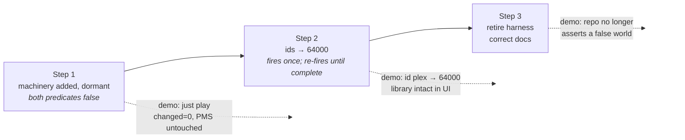

# Implementation Plan — Deterministic Plex UID/GID

**Project:** `2026-07-15-plex-user-persistence`
**Design:** `../design/detailed-design.md` (approved 2026-07-15)
**Context assumed available during implementation:** `rough-idea.md`,
`idea-honing.md`, `research/live-state-2026-07-15.md`, `design/detailed-design.md`

---

## Checklist

- [ ] **Step 1** — Add the migration machinery to the role, inert (ids stay `999`/`991`)
- [ ] **Step 2** — Arm it: flip to `64000` and execute the live migration
- [ ] **Step 3** — Retire the stale harness and correct the docs

---

## Sequencing rationale

The steps are ordered so that **the role never enters a state where `just play`
would break.**

The naive order — flip the ids first, then add the machinery — is unsafe. With
`plex_uid: 64000` but no stop task, the pin at `tasks/main.yml:97` runs
`usermod -u 64000 plex` against a user that owns 8 live processes, which
`usermod` refuses (design F1). And even if it succeeded, the ownership gate at
`:111` would fail the play, because the state dir would still be `999:991`
(design §4.2). Anyone running `just play` between steps gets a broken play.

Inverting that — machinery first, dormant; ids second — means Step 1's predicates
never fire. With the ids still `999`/`991` and the dir still `999:991`:
`plex_chown_needed` = (`999 != 999`) or (`991 != 991`) → **false**; the stop = user
exists and (`999 != 999` or false) → **false**. The play stays green and PMS is
untouched. Step 1 proves the machinery is **inert** before Step 2 arms it. That is
the whole point of the split: the risky change is one line, and everything around
it is already proven.



---

## Step 1: Add the migration machinery to the role, inert

**Objective.** Teach `ansible/roles/plex/tasks/main.yml` how to perform an id
migration — read the state dir's ownership and the current uid, stop PMS when a
migration is due, and chown the state dir before the ownership gate — while leaving
`plex_uid: 999` / `plex_gid: 991` unchanged so none of it fires. The play must
remain green and PMS undisturbed.

**Implementation guidance.**

> **Two predicates, not one** (design §4.2, R10). The stop and the chown guard
> *different preconditions*: the stop's is about the **USER** (F1 — `usermod`
> refuses while the user owns processes), the chown's is about the **DIR** (R4).
> The rejected design (§4.7) collapsed both onto one `getent`-uid test, so it read
> "done" from the user while the dir was still half-migrated → **permanently
> wedged**.
>
> **Read this precisely — "two predicates" is about composition, not about how many
> `set_fact`s you write.** The two conditions are *distinct*, but they are **not
> independent**: the stop is **composed from** the chown's predicate.
>
> | | condition | 
> |---|---|
> | chown | `plex_chown_needed` |
> | stop | user exists **and** (user uid ≠ `plex_uid` **or** `plex_chown_needed`) |
>
> So `plex_chown_needed` **is** defined once (DEC-007) and **is** referenced by both
> tasks — that is correct and required. What was rejected is making one fact the
> **entire** condition for both, i.e. `when: plex_chown_needed` on the stop *instead of*
> the widened expression, or keying the chown off the user. **Reuse by composition:
> required. Substitution: the rejected defect.**
>
> The `or plex_chown_needed` widening is load-bearing, not tidiness — see the stop task
> below.

- Insert before the existing group pin at `:90`:
  - **Stat the Plex state directory before the id pins** — `ansible.builtin.stat`
    on `{{ plex_state_dir }}`. **This must precede the pins, not merely the
    chown**: `usermod` auto-chowns the home tree's uid half as a side effect
    (design §4.3), so a stat taken *after* the pins reads a fact the guarded
    operation has already rewritten. It registers a **stat result** — not a
    boolean.
  - **Derive `plex_chown_needed` in a `set_fact`, immediately after the stat and before
    the pins** (design §4.2, DEC-007). **One `set_fact` is the single definition
    site** — both guarded tasks reference it *by name*; do not inline the
    expression per-task. This is not style: the derivation needs an **address** so
    the §7.1 provenance test can read it, and two inlined copies drift.

    > **The `plex_` prefix is mandatory, not a naming preference (C-1).**
    > `ansible-lint --profile production` — which `scripts/run_gate.py:67` runs, and
    > `ansible/.ansible-lint` carries **no `skip_list`** — rejects the bare name as
    > **fatal**: *"var-naming[no-role-prefix]: Variables names from within roles
    > should use `plex_` as a prefix. (set_fact: chown_needed)"*. The design, this
    > plan and all four design reviews originally said the bare `chown_needed`;
    > **every one of them was unlintable**, and nobody noticed for ~9 iterations
    > because **Step 1's is the first `set_fact` anywhere in `ansible/roles/`**. The
    > existing stat register `plex_state_stat` (`:109`) already carries the prefix.
    > Reproduced both ways, production profile: bare → `Failed: 2 failure(s)`;
    > prefixed + `changed_when` → `Passed`.
    >
    > **Do NOT resolve this with a `skip_list`.** R11's whole thesis is that lint
    > will not save you; weakening lint to admit Step 1 trades a live guard for a
    > naming preference. The rename is the cheap half of this finding — **it ripples
    > into §7.1's provenance assertion**, which names the derived fact.

    **`plex_chown_needed`** = dir **exists** **and** (dir uid ≠ `plex_uid` **or** dir gid
    ≠ `plex_gid`).
    - **Both halves** — a uid-only test wedges identically to the rejected design
      (§4.2.1), because `usermod` fixes the uid half and `groupmod` chgrps nothing.
    - **The `exists` clause is required, not defensive** (design §4.2.0, R12). Without
      it the predicate does not mis-answer, it **raises**: `stat` on an absent path
      has no `uid` key → *"object of type 'dict' has no attribute 'uid'"*. Jinja
      `and` short-circuits, so `exists and (…)` is safe.
    - **Absent ⇒ FALSE.** Do **not** reach for `| default(0)` — it type-checks and
      it is wrong: `0 != 64000` → TRUE → `chown -R` on a nonexistent path → a
      cryptic error that **shadows the gate's idmap diagnostic** at `:111`, the one
      message that would tell the operator the bind mount is missing. The gate
      already handles this state deliberately (its `that:` leads with `stat.exists`
      and short-circuits; its `fail_msg` renders `missing:missing`). **Stay out of
      its way.**
  - **Read the current plex uid** — `ansible.builtin.getent` (`database: passwd`,
    `key: {{ plex_service_user }}`). Must tolerate the user being absent: on a
    fresh rebuild it does not exist yet. Feeds the **stop predicate only**.
  - **Stop Plex Media Server before an id migration** —
    `ansible.builtin.service`, `state: stopped`, guarded by: the user exists
    **and** (its uid ≠ `plex_uid` **or** `plex_chown_needed`). The `or plex_chown_needed`
    widening is not decoration — on a **recovery** re-run the uid already reads
    `64000`, and without it PMS would be live while the chown rewrites its state
    dir underneath it. Must tolerate a missing unit (fresh CT, package not yet
    installed).
- Insert after the uid pin at `:97` and **before** the `stat` at `:106`:
  - **Migrate state dir ownership to the pinned ids** —
    `chown -R {{ plex_uid }}:{{ plex_gid }} {{ plex_state_dir }}`, guarded by
    `plex_chown_needed` (**never** by the `getent` register). **`command:` is
    REQUIRED, not preferred** — R11. `ansible.builtin.file` with `recurse: yes`
    is **not** the same result: it sets the top-level dir's attrs **first**, and
    only then, under `if recurse:`, walks via `os.walk()` with no `topdown` arg
    (= pre-order), so an interrupted run
    leaves the top level already correct with the tree beneath it un-chowned →
    `plex_chown_needed` reads FALSE → the re-run skips → **permanently wedged**. GNU
    `chown -R` is **post-order** (top level is `fchownat` call 12,154 of
    12,154), which is the entire basis of R9's recovery guarantee. Measured both
    ways: `logs/q9-traversal-order-probe.log`. It is also faster, but **speed is
    not why** — comment the task with the post-order requirement, because
    `ansible-lint` will not catch the swap (design §7.5) and the next reader will
    otherwise "modernise" it off `command:`.
  - **The chown MUST carry `changed_when:` (C-1).** `ansible.builtin.command` is
    not idempotent by declaration, so production lint fails it fatally
    (`no-changed-when`) — and this is the role's **own** stated invariant at
    `tasks/main.yml:3-4`: *"every task is idempotent: declared `state`, or a guarded
    command (changed_when)"*. Step 1's chown is exactly "a guarded command". The
    **value is the Builder's call**; note that `changed_when: true` is semantically
    honest (the task only runs when the predicate says a change is due) and
    **disturbs neither demo**: in Step 1 the predicate is false → the task is
    *skipped*, and skipped ≠ changed, so Step 1's `changed=0` holds; in Step 2 it
    runs once (`changed=1`) then skips.
- **Comment the explicit chown with *why* it is not redundant** (design §4.3):
  `usermod -u` already auto-chowns the home tree, and plex's home *is* the state
  dir — but `groupmod -g` touches no files at all, so without this the dir lands
  at `64000:991`. Uncommented, this reads as belt-and-braces and a future reader
  will delete it.
- **Comment the early `stat` as deliberate, not duplication.** The role already
  stats `plex_state_dir` at `:106` — that one is the **gate's**. Step 1 adds a
  *second*, **early** stat before the pins (design §4.2: *early = predicate, late =
  verdict*). Two stats is correct and intentional; uncommented, a reviewer reads it
  as an oversight and collapses them — which silently reintroduces the original
  defect, since a stat after the pins reads a fact `usermod` already rewrote.
- **Narrow the gate `fail_msg`'s "This role CANNOT repair it" (`:125-127`) — docs
  only, no behaviour change.** Step 1 makes that sentence **half-false**: the role now
  *does* repair ownership drift, via the new chown — it cannot repair ids **outside
  the CT's idmap**. Scope the claim to the unmapped case it actually describes (e.g.
  *"this role cannot repair ids outside the CT's idmap — the migration chown above
  only handles in-map ids"*). **Why here and not Step 3:** design §4.1 scopes
  `tasks/main.yml` to Step 1 and the runbook to Step 3, and Step 3 corrects the
  *identical* claim in `plex-claim.md` §5 — so without this bullet the repo fixes the
  runbook and leaves the same sentence in the role, which is the copy a Builder reads
  first. The claim itself is **true and verified by execution** — this narrows its
  scope, it does not weaken it. Ties to the C-3 defer below: this `fail_msg` *is* the
  diagnostic C-3 concerns.
- Do not touch `defaults/main.yml` in this step.

> ### Planner decision — C-3 (chown shadows the gate's diagnostic in the `65534` state): **DEFERRED, deliberately**
>
> **The finding is real and I am not disputing it.** In the *unmapped* state the dir
> reports `65534:65534`, so `plex_chown_needed` is **TRUE**, and F2 forces the chown
> **before** the gate. The chown dies **EPERM** (Explorer reproduced this rootlessly in
> CT 110's exact shape) and the play fails on `chown: … Operation not permitted`
> **instead of reaching the gate's `fail_msg` at `:118-129`** — the paragraph that names
> the exact host-side `chown -R 164000:164000 …` and explains why in-CT root cannot do
> it. That is the same failure §4.2.0 already names for `| default(0)` (*"shadows the
> gate's idmap diagnostic … stay out of its way"*), one case wider than R12 caught it —
> and it is the case that **actually happened here** (DEBUG.md).
>
> **Decision: do not fix it in Step 1. Document it in Step 3.** Reasons, strongest first:
>
> 1. **It is unreachable in Step 1 by construction.** At `999`/`991` both predicates are
>    FALSE — the machinery is inert. A fix added here would be code **Step 1's own demo
>    cannot exercise**, justified by prose alone. That is precisely the pattern §11.0
>    says rots, and this project has now spent three design passes proving it.
> 2. **Both candidate fixes carry real trade-offs — this is a design question, not a typo.**
>    Narrowing the predicate to exclude the unmapped state hardcodes `65534`, which is
>    the *configurable* `/proc/sys/kernel/overflowuid`, and adds fixture rows to the one
>    predicate four reviews just finished stabilising. Reaching for `failed_when: false`
>    is worse: it converts *every* chown error into silence, and the gate stats **only
>    the top level** — so it would trade a diagnostic improvement for a real hole.
>    (**Epistemic note:** items 1, 3 and 4 are executed or structural facts; this item's
>    `failed_when` hazard is **reasoning I did not probe** — flagged as such deliberately,
>    per §11.0. It argues for *deferring* the fix, never for shipping one.)
> 3. **The cost is diagnostic quality only.** Not destructive, no silent-wrong-state, no
>    data risk — the play fails **loudly** either way. The operator loses a good error
>    message, not the system.
> 4. **It is not reachable on CT 110 today** — the dir is healthy and uniform (12,043
>    `plex:plex`) and the mount point is tofu-managed. This is a **future rebuild/restore**
>    scenario.
>
> **This is an explicit defer, not an undocumented one** — the Explorer's condition
> (*"an undocumented defer is how §9.2 recurs"*) is met by this block, by the Step 3
> bullet below, and by the "Known gap at completion" entry. **Revisit trigger:** the
> first time a rebuild or restore lands the state dir in the unmapped state, or if
> anyone proposes widening `plex_chown_needed`. Rationale and the rejected options are
> recorded in `.ralph/agent/decisions.md`.

**Test requirements.** Extend `scripts/test_plex_state_ownership_shape.py` in its
existing style — assertions that read the real role file rather than restating
it, anchored on modules and wired values, not task names alone:

- The early `stat` **precedes** both pin tasks (design §4.2 — a stat after the
  pins reads a fact `usermod` has already rewritten).
- The stop task **precedes** both pin tasks (guards F1).
- The chown task **precedes** the `stat`/`assert` gate (guards F2 — this ordering
  is what lets the migration run survive its own gate).
- Both new tasks carry their predicate (guards R6 — without it the play would stop
  PMS on every run).

**Shape assertions are NOT sufficient — this is a requirement** (design §7.1). Every
bullet above **passes against the rejected design**, which had a predicate on both
tasks and was still permanently wedged. A test that cannot tell the rejected design
from this one does not guard R9. This project has already been burned at exactly
this fault line: `test_runbook_has_no_uid_equals_gid_chown` went **vacuously green
over the very defect it existed to catch** (`mem-1784124801-dc35`).

So also add **behavioural** coverage — evaluate the role's real `when:` expressions
through ansible-core's own Jinja2 (do not restate the condition in Python; read it
from the role file), against the design §6.3 state table:

| Fixture dir state | `plex_chown_needed` MUST be | Why it matters |
|---|---|---|
| `999:991` | **TRUE** | migration fires |
| **`64000:991`** | **TRUE** | **the recovery case — the rejected design returns FALSE here** |
| `64000:64000` | **FALSE** | R6, `changed=0` |
| **dir absent** (`{exists: false}`) | **FALSE**, and **MUST NOT raise** | R12 — `\| default(0)` fails this TRUE; a bare `uid !=` raises on it |

**Resolving the predicate** (design §7.1): the chown's real `when:` is the bare name
`plex_chown_needed`, so evaluating *that* proves nothing. Read the **`set_fact`
expression** from the role file (never restate it in Python — a restated predicate
tests the test), evaluate it through ansible-core's Jinja2 against the fixture's
stat result with `plex_uid`/`plex_gid` bound from `defaults/main.yml`, then bind the
result to the name and evaluate both tasks' real `when:` — so the `or plex_chown_needed`
wiring on the stop is covered too.

> ### ⚠️ C-2 — the harness cannot `import ansible`, and the obvious fix is a vacuous skip
>
> **This is a gate-blocking toolchain fact, not a design change.** §7.1 above says
> *"evaluate through ansible-core's own Jinja2"*. As written that **cannot run inside
> `just test`**:
>
> `scripts/run_gate.py:56` runs every `scripts/test_*.py` as `[sys.executable, path]`
> — the repo `.venv` python — **not** `mise exec -- python`. ansible-core is a **pipx**
> install (`mise.toml:24`) and pipx venvs are **isolated**: only their CLIs reach PATH.
> Verified under the exact gate invocation → `ModuleNotFoundError: No module named
> 'ansible'`. The design phase's probes only ever worked because they were hand-run
> under the pipx interpreter; **nothing in the design phase ever ran inside `just test`.**
>
> **1. The harness MUST NOT skip.** `scripts/test_build_template_runner.py:52-57`
> establishes `OK (skip): not installed → return True` as repo idiom. It is the
> two-line, in-convention, gate-greening move a Builder will reach for the instant the
> import raises — and it would make §7.1 **green while proving nothing about R9**: the
> **fifth** recurrence of the §9.2 / `mem-1784124801-dc35` pattern, *inside the very
> test written to end it*.
>
> The argument that kills the skip is **measurable, not principled**: ansible-core is
> **pinned** (`mise.toml:24`) and the gate **already hard-depends on it two steps
> later** (`run_gate.py:67-68`). Any environment lacking it **already fails
> `just test`**. A skip therefore buys **zero** portability, so the harness may
> **hard-FAIL** at no cost. (Unlike `shellcheck`/`shfmt`, which are genuinely absent
> from `[tools]` and are optional linters — that is why the idiom exists and why it
> does not transfer.) **Comment why it does not skip**, or a reader will "fix" the
> inconsistency.
>
> **2. Mechanism — re-exec under the discovered interpreter.** Proven feasible
> (`research/probes/probe_reexec.py`): on `ImportError`, discover ansible's interpreter
> and `subprocess.run([py, __file__])`, propagate the exit code, guard against loops
> with an env var. Keeps the file in `run_gate.py:54`'s glob and the dual-mode
> convention intact. **Mechanism only — the Builder owns the design.**
>
> **3. Discover the interpreter; NEVER hardcode it.** `mise.toml:24` pins `latest`, so
> the `2.21.1` path component **rotates** — and this box already carries a second
> (2.20.5) copy. Hardcoding is §4.2.2's de-numbering mistake in filesystem form. Ask
> the toolchain: parse `mise exec -- ansible --version` for its
> `python version = ... (<path>)` line.
>
> **4. The guard MUST key on `ansible.template`, NOT on bare `import ansible`**
> (`mem-1784136246-4919`; independently re-confirmed this pass). `ansible` is a
> **PEP-420 namespace package trap**: whenever the repo root is on `sys.path`,
> `import ansible` **succeeds** — resolving to the repo's own `ansible/` *config
> directory* (`__file__=None`, `__path__=['<repo>/ansible']`) — and only then fails,
> confusingly, on `ansible.template`. A re-exec keyed on bare `import ansible` would
> therefore **not fire** under a repo-root `sys.path`, which is §9.2's shape one more
> time: *a check that passes over the very condition it guards.* Key it on the symbol
> §7.1 actually needs (`from ansible.template import Templar, trust_as_template`).
>
> **5. Bonus — PyYAML is available after re-exec.** The stdlib-only rule
> (`mem-1782133401-4307`) exists *because* the gate pythons lack PyYAML; the re-exec'd
> interpreter **has 6.0.3**, so the §7.1 harness may parse the role YAML properly
> instead of regexing the `set_fact` expression out. The four **shape** assertions
> stay stdlib + regex.
>
> **6. Builder — read these before writing the harness:** `mem-1784135461-a8eb` (the
> `trust_as_template` trap: an untrusted expression **silently returns the raw string**
> — truthy and constant on *every* fixture row, no exception), **plus its API
> correction** `mem-1784136261-1371` (`Templar.template()` takes **no `variables=`
> kwarg**; variables bind at construction), plus `mem-1784136246-4919`.

Plus three guards on how this regresses:

- **Anti-vacuity** — prove the expression *discriminates*; a predicate that is
  trivially always-TRUE passes the table above while breaking R6.
- **Provenance — assert on the `set_fact`, NOT on the chown's `when:`** (design
  §7.1, R13). The assertion is: **the `set_fact` expression defining `plex_chown_needed`
  references the `stat` register and MUST NOT reference the `getent` register.**

  > ⚠️ The obvious form — *"the chown's `when:` must not name the `getent`
  > register"* — is **vacuous, and was rejected for it**. The design requires
  > `plex_chown_needed` to be named and reused, so the chown's `when:` is the bare token
  > `plex_chown_needed`, which cannot contain `getent` **however it was derived**. That
  > guard returns PASS for the rejected design too. **A bare name carries no
  > provenance.** Assert on the derivation, which DEC-007 gives an address.
  >
  > **This guard adds no coverage** — the `64000:991` fixture row already fails the
  > getent-keyed design. It buys a *precise failure message*, nothing more. **R9 is
  > held by the fixture table, not by this.** Do not let it read as the safety net.
- **R11 post-order** — the chown MUST be the `command:` `chown -R` form and MUST NOT
  be `ansible.builtin.file` with `recurse: yes`. **This test is the only thing
  standing between R9 and a well-intentioned module swap**: the swap leaves every
  other assertion here green, and `ansible-lint` does not flag it (design §7.5).

Write these before or alongside the tasks; they must fail against the current
role and pass once it is edited.

**Wiring — conventions this file already sets** (verified in-file; full detail in
`.ralph/specs/plex-user-persistence/research/existing-patterns.md`):

- **Every new `test_*` function MUST be appended to `main()`'s `checks` list**
  (`test_plex_state_ownership_shape.py:313-323`) — `run_gate.py:54`'s glob picks up
  **files, not functions**. A new check that is written but never listed is **green by
  omission**: §9.2's shape again, and the cheapest possible way to reintroduce it here.
- Dual-mode style: `test_<name>() -> bool` printing `OK` / `FAIL:`, **no `assert`**;
  `main()` sums them; `sys.exit(main())` (`mem-1781927772-78e4`). The file currently
  has **7** checks.
- **Reuse the existing `_task_index()` (`:69-72`)** for the four ordering assertions —
  it already returns the offset of a `- name:` header, which is exactly what they need.
- Anchor regexes on **module + wired value**, never task names alone
  (`mem-1781892715-142d`).
- **Non-vacuity is already this file's convention, not a §7.1 invention** (`:300-304`:
  *"a parser that silently matches nothing is precisely how the predecessor guard
  stayed green over the defect line"*). Follow it.

**Integration.** Slots into the existing role between the apt/repo setup and the
ownership gate. The gate at `:111`, the install at `:134` and the start at `:195`
are untouched and keep their current semantics.

**Demo.** Run `just test` — green, including the four new ordering assertions **and
the behavioural fixture table actually executing** (not skipping — see C-2). Then
run `just play` against the live CT 110: it converges with **`changed=0` for the
stop, pin and chown tasks**, PMS stays `active` throughout, and `id plex` still
reports `uid=999(plex) gid=991(plex)`. The migration machinery is present,
correct, and provably dormant — the live server has not noticed it exists.

**Step 1 is not done until all four are shown** (the first two are new, and exist
because a green gate is exactly what this project keeps being fooled by):

1. **The behavioural harness RAN — it did not skip.** Its output must show the four
   fixture rows resolving to real booleans. *"`just test` is green"* is **not**
   evidence: a skip is green, and that is C-2's whole trap.
2. **The fixture table can FAIL.** Temporarily key the `set_fact` off the `getent`
   register (the rejected design) and watch the **`64000:991` recovery row go red**;
   restore it. Same input, opposite outcome — the method `mem-1784124801-dc35` was
   written in blood for. **Do not skip this because the design was approved**: four
   reviews approved a predicate whose *name* could not lint.
3. `just play` converges `changed=0` on the stop/pin/chown tasks, PMS `active`
   throughout, `id plex` still `uid=999(plex) gid=991(plex)`.
4. `ansible-lint --profile production` passes — the C-1 fixes are in.

---

## Step 2: Arm it — flip to `64000` and execute the live migration

**Objective.** Change the pinned ids to `uid = gid = 64000` and let the machinery
from Step 1 carry out the migration on CT 110: stop PMS, re-id the user and
group, chown 12,043 files, pass the ownership gate, restart. End state is a
healthy Plex server whose identity no allocator can collide with.

**⚠ Run this in a quiet window.** Step 2 stops PMS. At planning time 8 plex
processes were live including a `Plex Transcoder` — someone was watching
(design §11.3).

**Implementation guidance.**

- In `ansible/roles/plex/defaults/main.yml`: `plex_uid: 999 → 64000`,
  `plex_gid: 991 → 64000`.
- **Rewrite the `uid != gid` comment; do not delete it** (design §4.4). The values
  are now equal, but the lesson it encodes is untouched and still load-bearing:
  *never derive the gid from the uid — they are two independent knobs that
  currently happen to hold the same value, and any chown must name both halves
  explicitly.* This is the exact invariant
  `test_plex_uid_and_gid_pinned_independently` enforces.
- Leave `plex_idmap_base: 100000` alone (X3). `64000` lands in the
  `g 994 100994 64542` tail tile, so the `+100000` shift still holds.
- No OpenTofu change. Both idmap tiles already cover `64000`, so **the CT is not
  replaced** — important, because on the pinned bpg provider even adding a mount
  point forces CT replacement.
- Expect the play to take noticeably longer than usual on this one run:
  `usermod -u` walks the home tree (= the state dir) chowning as it goes, then the
  explicit `chown -R` normalises the gid half.

**Test requirements.**

- `just test` stays green. `test_plex_uid_and_gid_pinned_independently` passes
  **unchanged** — it asserts two independent literal ints, never numeric
  inequality (design §4.6). If it fails, the ids were collapsed into one knob
  (e.g. `plex_gid: "{{ plex_uid }}"`); that is the test doing its job, not a
  false positive.
- Step 1's ordering assertions still pass.
- **Idempotency is part of this step, not a later one:** immediately re-run
  `just play` and confirm `changed=0` for the stop, pin and chown tasks. This is
  the live evidence the predicate works, and it is what proves the play will not
  stop PMS on every future run (R6).
- **`changed=0` on re-run means R6, not R9.** Do not read it as proof the
  migration is self-healing — a *wedged* predicate reports `changed=0` too, and
  looks identical from here. That is precisely how the rejected design passed
  inspection (design §4.7). **R9 is proven by Step 1's behavioural fixtures**
  (the `64000:991` recovery row), not by this re-run. If the re-run shows
  `changed=0` **while the gate fails**, you are wedged, not steady — stop and
  recover by hand via design §6.4.
- Live verification, in-CT:
  ```bash
  id plex                                                   # uid=64000(plex) gid=64000(plex)
  stat -c "%u %g" /var/lib/plexmediaserver                  # 64000 64000
  find /var/lib/plexmediaserver -xdev ! -uid 64000 | head   # empty
  find /var/lib/plexmediaserver -xdev ! -gid 64000 | head   # empty — catches the groupmod asymmetry
  systemctl is-active plexmediaserver                       # active
  vainfo --display drm --device /dev/dri/renderD128 | grep iHD   # QSV survived
  ```
- Host-side confirmation (read-only): `stat -c "%u %g" /tank/Server/AppData/plex`
  → `164000 164000`.
- **A functional check no shell command can make: open the Plex UI and confirm
  libraries, watch history and playlists are intact.** The chown preserves the
  library DB; this verifies the server actually reads it. Do not mark this step
  done on `systemctl is-active` alone — an empty library on a running server is
  exactly the failure mode that matters here.

**If it goes wrong** (design §6.4) — the revert is exact because ownership is
uniform:

```bash
systemctl stop plexmediaserver
usermod -u 999 plex && groupmod -g 991 plex
chown -R 999:991 /var/lib/plexmediaserver
systemctl start plexmediaserver
```

...and revert `plex_uid`/`plex_gid` in `defaults/main.yml`, or the next play
re-migrates. If the play dies *between* `usermod` and the chown — or **anywhere
inside the chown's 12,043-file walk**, which is the slow part of the run and so the
likeliest place to lose an SSH session — do not panic and do not hand-fix: **re-run
the play** (R9).

**Why that works** (design §4.2.2, §6.3): the chown predicate keys on the **state
dir, both halves**, and `chown -R` is **post-order** — it chowns the top-level dir
**last**. So an interrupted walk always leaves the top level still carrying the old
gid, the predicate re-fires, and the chown completes. The interrupted dir reports
`64000:991` (`usermod` has already auto-chowned the uid half — design §4.3); the
**gid** half is what the predicate catches. Meanwhile the gate refuses to start PMS
against mismatched ownership (F2), so a half-migrated tree never gets a running
server pointed at it.

> ⚠️ **This guarantee is Step 1 machinery, and it is conditional.** It holds only
> with the §4.2 predicate as designed. The **rejected** first draft keyed on
> `getent passwd plex` uid, and from an interrupted state a re-run was a **no-op —
> the server stayed wedged, permanently** (§4.7). If you are recovering and the
> re-run reports `changed=0` while the gate still fails, **stop**: the predicate
> regressed. Recover by hand via §6.4 and treat the predicate as the bug.

**Integration.** Uses Step 1's machinery unchanged — this step adds no tasks, only
flips two values. Everything downstream (install, render/video groups, systemd
override, VA-API gate) is untouched and validated by the existing acceptance
tasks at `:205`/`:212`.

**Demo.** CT 110 runs Plex as `uid=64000(plex) gid=64000(plex)`, host-side
`164000:164000`, with the full 1.4 GB library — watch history, playlists and all —
intact and serving in the UI, and hardware transcoding still working. Re-running
`just play` reports `changed=0`. **The `plex` identity can no longer collide with
anything the allocator hands out**, which is the outcome the project was opened
for.

---

## Step 3: Retire the stale harness and correct the docs

**Objective.** Remove the repo's assertions of a world that no longer exists, so
the next person to read it — or the next agent — is not misled the way this
planning session was.

**Implementation guidance.**

- **Delete `scripts/verify_plex_state_ownership_gate.py`** (design §4.5, decided
  at review). Its premise is a live broken CT; `CHECK1` asserts the gate *fails*
  against the live dir, which after Step 2 inverts — it would report failure
  precisely when the system is correct. It is not in the `just test` glob
  (`verify_*.py`, not `test_*.py`), its fix is discharged, and its stale docstring
  is the direct cause of this project's wrong turn (design §9.2). Durable coverage
  remains in `test_plex_state_ownership_shape.py` and the role's own runtime gate.
- **`scripts/test_plex_state_ownership_shape.py` — prose only.** The assertions
  pass unchanged (design §4.6). The module docstring narrates the `999`/`991`
  world and says "uid != gid is real here"; rewrite it to describe the `64000`
  pin and the invariant actually enforced (independent knobs, not unequal
  values). **Do not weaken the assertions to match the new prose** — they are
  correct as written.
- **`docs/runbooks/plex-claim.md`:**
  - §5 states that unmapped ownership "shows up in the CT as `65534:65534`… and
    in-CT `root` cannot chown it… A host-side `chown` is the only repair." Correct
    this. It is true *only* for the unmapped case, and CT 110 has left that state.
    In-CT chown is verified working (design §3.3). Keep the unmapped case
    documented — it is real, and the `capable_wrt_inode_uidgid()` reasoning is
    worth preserving — but stop presenting it as the current state.
  - Its `chown -R $((100000 + plex_uid)):$((100000 + plex_gid))` is already
    correctly parameterised and needs no change; verify it renders `164000:164000`.
  - Document the migration and the new ids.
  - **Land the C-3 defer here** (Planner decision, Step 1). This bullet is already
    scoped to the unmapped case, so it is C-3's natural home — **no new predicate
    surface, no new fixture rows, zero correctness risk.** Add to §5, next to the
    existing unmapped-case text: with Step 1's machinery in place, an unmapped state
    dir now surfaces as **`chown: … Operation not permitted` from the migration task**,
    *before* the role's ownership gate can print its diagnostic. Say plainly that the
    EPERM **is** the unmapped signature, and that the repair is the host-side
    `chown -R 164000:164000 /tank/Server/AppData/plex` **this section already
    documents**. That converts a shadowed diagnostic into a documented one — which is
    the whole of C-3's cost (diagnostic quality), discharged in prose because prose is
    all it costs.
- **Record the `kvm`/`render` GID-993 known issue** (R8, X2) where a future reader
  will find it — the runbook, or the role's defaults near `plex_render_gid`.
  Include the analysis, not just the symptom: `render` cannot move because 993 is
  dictated by the host's `/dev/dri/renderD128` group and punched 1:1 through the
  idmap; only `kvm` could move and it is package-allocated; `non_unique: true`
  holds it deliberately. **Note its evidentiary role** — it is the live proof that
  motivated the `64000` decision, and without that note a future reader will see
  only a cosmetic duplicate and may "clean it up" straight through the GPU
  passthrough.

**Test requirements.**

- `just test` green — with `verify_plex_state_ownership_gate.py` gone, confirm
  nothing referenced it (`grep -rn verify_plex_state_ownership_gate .` → only
  historical planning docs, which are records and stay as-is).
- Grep the repo for surviving stale claims — `65534`, `100999`, `100991`,
  `crash-looping`, "host-side chown is the only repair" — and confirm each
  remaining hit is either a correctly-scoped description of the *unmapped* case or
  a historical planning record, not an assertion about the present.
- No new test scripts. This step deletes and corrects; the invariants it touches
  are already covered by Steps 1–2.

**Integration.** Closes out R7/R8. The role's behaviour is unchanged — Step 2
already delivered the working outcome; this step aligns the repo's account of
reality with it.

**Demo.** `just test` green with the stale harness gone. `grep -rn "65534\|100999" scripts/ docs/`
returns no claim that CT 110 is broken. `docs/runbooks/plex-claim.md` describes
the in-CT migration, the `164000:164000` host-side ownership, and the
`kvm`/`render` known issue with its rationale. **The repo now tells the truth
about the system it manages** — which is what made Step 1 and Step 2 safe to plan
in the first place, and what was missing when this project started.

---

## Known gaps at completion

### 1. The package-override question

Carried forward deliberately, not an oversight — design AR1/F5/X6, operator
decision at Q5 reaffirmed at review:

> Nothing in this plan proves the `plexmediaserver` package honours a pre-created
> `64000` user rather than overriding it on install. The rebuild test that would
> demonstrate it is out of scope (X6), and the 6-line post-install assert that
> would close it cheaply was declined (§7.4). **The pin's first real test will be
> a future unplanned rebuild.**

The exposure is materially smaller than it was before this work: the risk was
"`999`/`991` may collide with an allocator that has already won once in this
container" (evidenced live by `kvm`/`render` at 993), and after Step 2 the pinned
value is collision-proof by construction. What remains unproven is narrower — a
package override, not an allocator collision.

`design/detailed-design.md` §7.4 carries the ready-made follow-up if it is ever
wanted.

### 2. C-3 — the unmapped (`65534`) state loses the gate's diagnostic

**Deferred by Planner decision, 2026-07-15** (full rationale + rejected options at
Step 1's C-3 block and `.ralph/agent/decisions.md`). With Step 1's machinery armed,
an unmapped state dir makes `plex_chown_needed` TRUE, so the chown runs before the
gate, dies **EPERM**, and the play fails on `chown: … Operation not permitted`
instead of the gate's actionable host-side-chown paragraph (`tasks/main.yml:118-129`).

**Bounded:** not destructive, no data risk, the play still fails **loudly**; the cost
is **diagnostic quality only**, in a state **not reachable on CT 110 today** (dir
healthy and uniform, mount tofu-managed). Discharged in prose by Step 3's runbook
bullet, which documents the EPERM *as* the unmapped signature and points at the
host-side repair it already carries.

**Revisit trigger:** the first rebuild/restore that lands the state dir unmapped — or
any proposal to widen `plex_chown_needed`. **F2 blocks the obvious fix** (the chown
must precede the gate), so this is a genuine trade-off, not a typo left lying around.
