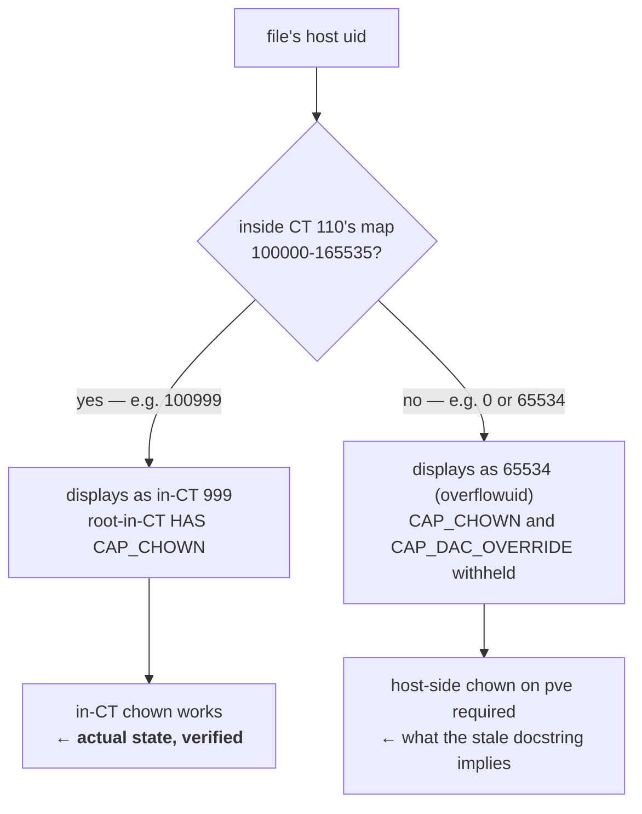

# Live state of CT 110 — verified 2026-07-15

Read-only probes against `plex` (192.168.1.110) via
`ansible plex -i ansible/inventory/hosts.yml -m raw`. Captured during
requirements clarification to settle Q6 (can the chown run in-CT?).

**Headline: CT 110 is healthy. The gate harness's docstring is stale.**

## Findings

| Probe | Result |
|---|---|
| `stat -c "%u %g %a" /var/lib/plexmediaserver` | `999 991 755` |
| `systemctl is-active plexmediaserver` | `active` |
| `systemctl is-enabled plexmediaserver` | `enabled` |
| `findmnt -no SOURCE,TARGET,FSTYPE` | `DASPool/Server/AppData[/plex]  /var/lib/plexmediaserver  zfs` |
| `find … -printf "%u:%g\n" \| sort \| uniq -c` | `12043  plex:plex` — **uniform, no other owner** |
| `du -sh` / file count | `1.4G` / `12046` entries |
| `id plex` | `uid=999(plex) gid=991(plex) groups=991(plex),44(video),993(kvm),993(kvm)` |
| `getent group 993` | `kvm:x:993:plex` |
| `getent group render` | `render:x:993:plex` |
| `getent group video` | `video:x:44:plex` |
| `ls -ln /dev/dri` | `card1` grp `44`; `renderD128` grp `993` |
| in-CT `chown 64000:64000 /var/lib/plexmediaserver` | **SUCCEEDED** (then reverted to `999:991`) |

## What this overturns

`scripts/verify_plex_state_ownership_gate.py`'s docstring asserts the state dir
carries raw `65534` ownership with "PMS stays failed" and that the corrective
chown "is destructive on a live 1.2GB library". **None of that is currently
true.** The docstring describes a historical state that has since been
remediated (the size has since grown 1.2G → 1.4G, consistent with a server that
has been running and scanning, not one that has been down).

Anything reasoning from that docstring — including the argument that remediation
requires host-side (`pve`) access — is reasoning from stale facts.

## Why in-CT chown works

CT 110's uid map is a single tile `u 0 100000 65536`, covering host ids
`100000-165535`. The state dir's owner (`999:991` in-CT → `100999:100991`
host-side) is **inside** that map, so `capable_wrt_inode_uidgid()` grants
root-in-CT effective `CAP_CHOWN` over it. Verified empirically, not just
argued.

The blocked case would be a file whose host owner falls *outside* the map: it
displays as `65534` (`/proc/sys/kernel/overflowuid`), and the kernel withholds
both `CAP_CHOWN` and `CAP_DAC_OVERRIDE` for it. That is the state the docstring
describes — and the dir is no longer in it.



## Live evidence for the dynamic-range collision class

`kvm` and `render` **both hold GID 993**:

```
kvm:x:993:plex
render:x:993:plex
```

This is `non_unique: true` in `roles/plex/tasks/main.yml:145` firing for real —
the role forced `render` onto 993 because the package-allocated `kvm` had
already taken it. The task's own comment predicted exactly this.

It works only because `/dev/dri/renderD128` is group-owned by 993 and plex is a
member of a group holding 993 — but *which* named group owns the node is now
ambiguous, and `id plex` reports `993` twice.

This is the strongest available evidence that pinning service ids inside
Debian's dynamic system range (`100-999`) is unsound in this container. It is
not a hypothetical; it has already happened here. Directly supports Q4's move to
`64000` (Debian Policy §9.2.2 reserved band, `60001-64999` — no allocator emits
it).

## Implications for the migration

- Ownership is **uniform** (`12043 plex:plex`), so no ownership manifest is
  needed. Revert is exactly `chown -R 999:991 /var/lib/plexmediaserver`.
- The whole migration is in-CT and role-automatable — no `pve` target, no new
  hypervisor access in the Ansible path.
- 12,043 files at 1.4G is a fast recursive chown (metadata-only on ZFS).
- PMS must be stopped across the usermod/chown to avoid writing under the old
  uid mid-migration.
