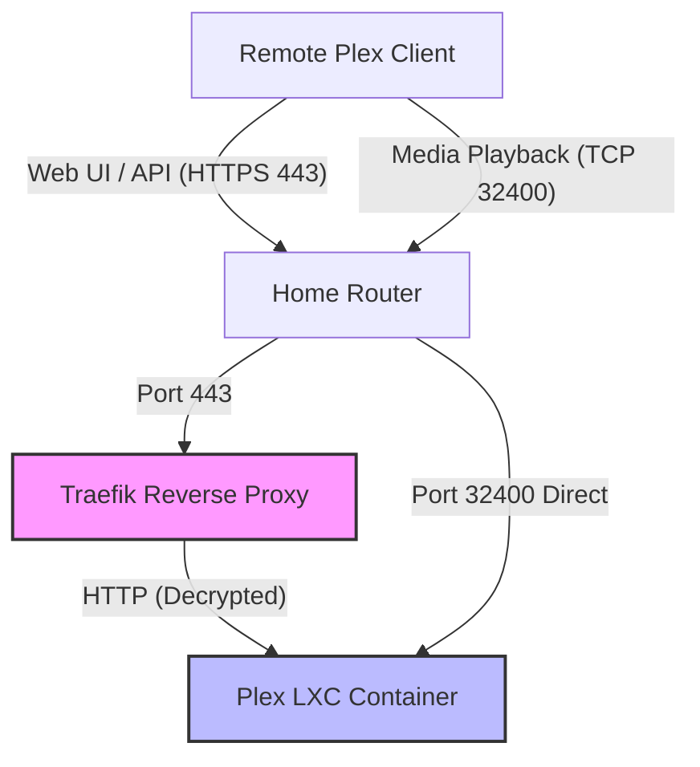

# Detailed Design: Plex Remote Optimization

## Overview
This design outlines the plan to optimize the initial loading times and remote connection performance of the Plex server. Currently, the server suffers from slow UI/library loading times when the app is first opened, despite having direct port forwarding (32400) for media playback and SSD/NVMe-backed storage. The goal is to optimize the routing of API/UI traffic through Traefik, which is currently identified as the primary bottleneck.

## Detailed Requirements
- **Storage**: Plex database and metadata are stored on an SSD/NVMe drive in an LXC container.
- **Port Forwarding**: Port 32400 is already forwarded for direct media playback connections.
- **DNS/Proxy**: The custom domain `plex.yoonnation.com` is configured as DNS-only (grey cloud) on Cloudflare.
- **Routing bottleneck**: Traffic for `plex.yoonnation.com` routes through Traefik (port 443).
- **Goal**: Optimize the initial loading of the library/app interface and ensure API requests are fast and responsive.

## Architecture Overview
The current architecture routes API/web UI requests through a Traefik reverse proxy, while media playback utilizes a direct connection via port forwarding.

## Components and Interfaces
- **Traefik Reverse Proxy**: Handles incoming HTTPS traffic for `plex.yoonnation.com`. Terminates SSL and forwards HTTP traffic to the Plex container. Needs optimization to reduce latency.
- **Plex Container (LXC)**: Hosts the Plex Media Server. Requires its network settings to accurately reflect the Traefik proxy and direct port.
- **Cloudflare DNS**: Resolves `plex.yoonnation.com` to the home IP without proxying (grey cloud).

## Data Models
*(In the context of this network optimization project, this refers to the Traefik configuration model)*
- **Traefik Routers**: Define the entry points and host rules for `plex.yoonnation.com`.
- **Traefik Services**: Define the backend (Plex LXC) and load balancer settings.
- **Traefik Middlewares**: Any custom headers or buffering settings applied to the Plex route.

## Error Handling
- **Proxy Fallback**: If Traefik misroutes traffic, Plex may fall back to the bandwidth-limited Plex Relay. Traefik configurations will be tested to ensure direct API access.
- **SSL Termination Failure**: Ensure Traefik correctly acquires and renews Let's Encrypt certificates for the domain so clients do not encounter SSL warnings.

## Testing Strategy
1. **Latency Measurement**: Use browser developer tools (Network tab) or `curl` to measure the Time to First Byte (TTFB) and total load time of Plex API endpoints via `plex.yoonnation.com`.
2. **Direct Comparison**: Compare the API load times through Traefik against direct IP access on port 32400.
3. **Plex Dashboard**: Monitor the Plex dashboard to verify that external clients are recognized as "Direct" connections and not "Indirect/Relay".

## Appendices

### Technology Choices
- **Traefik vs. Direct Access**: Retaining Traefik for web UI access allows for a clean `https://plex.yoonnation.com` URL without specifying ports, while keeping port 32400 forwarded ensures media streaming performance is unaffected.

### Research Findings
- **Cloudflare Constraints**: Using Cloudflare's proxy (orange cloud) for Plex violates their free tier TOS (no high-bandwidth video streaming) and causes throttling. Grey cloud is the correct approach.
- **Traefik Limitations**: Running Plex behind Traefik can introduce CPU bottlenecks due to SSL/TLS termination overhead. Heavy middlewares can interfere with Plex headers. The solution is to optimize the Traefik rules specifically for Plex (e.g., bypassing unnecessary middlewares and ensuring standard proxy headers are passed correctly).

### Alternative Approaches
- **Bypass Traefik Entirely**: Users could connect directly via `http://<IP>:32400` or the official `app.plex.tv` web client, completely bypassing the local Traefik instance for API requests.
- **Tailscale**: Implement Tailscale for remote access, bypassing both port forwarding and Traefik, creating a secure P2P mesh network.
