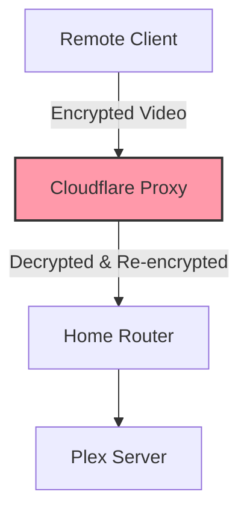

# Cloudflare and Plex

## Overview
Using Cloudflare as a proxy (orange cloud) for Plex traffic is a common cause of slow remote connections and buffering.

## Key Findings
- **Terms of Service Violation**: Cloudflare's free tier prohibits high-bandwidth video streaming. Proxied Plex traffic can lead to account suspension or severe throttling.
- **Proxy Overhead & Latency**: Cloudflare decrypts, inspects, and re-encrypts all traffic. This adds significant latency and processing overhead.
- **Hairpinning / Suboptimal Routing**: Traffic may route to a distant Cloudflare Point-of-Presence (PoP) before reaching the server.

## Architectural Diagram

## Recommendations
1. **DNS-Only (Grey Cloud)**: Ensure the DNS record for your Plex subdomain is set to "DNS Only" in Cloudflare to bypass the proxy.
2. **Direct Port Forwarding**: Open port `32400` directly, which is the most performant method.
3. **Tailscale / VPN**: Use a mesh VPN like Tailscale to bypass CGNAT and avoid third-party proxies.
