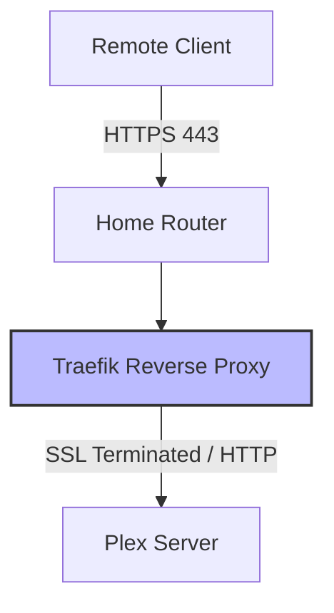

# Traefik Reverse Proxy Limitations with Plex

## Overview
Running Plex behind a reverse proxy like Traefik can introduce performance bottlenecks due to the overhead of handling high-bandwidth streaming connections.

## Key Findings
- **SSL/TLS Termination Overhead**: Traefik handles the encryption and decryption of traffic. For high-bitrate video streams, this requires significant CPU power and can become a bottleneck if the server hardware is constrained.
- **Streaming Connection Handling**: Proxies are typically optimized for many small HTTP requests. Sustained, high-throughput data flows can cause CPU spikes or buffer exhaustion in the proxy layer.
- **Middleware Interference**: Heavy middleware (like authentication or custom headers) in Traefik can interfere with Plex's native streaming protocols.
- **Relay Fallback Risk**: If the proxy misroutes or blocks certain traffic, Plex may silently fall back to its bandwidth-limited "Relay" service (~2 Mbps for free, ~8 Mbps for Plex Pass), leading to awful performance.

## Architectural Diagram

## Recommendations
1. **Bypass Proxy for Plex**: The most reliable and performant method is to bypass Traefik entirely and forward port `32400` directly to Plex. Plex handles its own certificates and connections efficiently natively.
2. **Minimize Middleware**: If using Traefik is strictly required, ensure the Plex route has no heavy middleware attached.
3. **Monitor Proxy Resources**: Keep an eye on Traefik container CPU/Memory usage during a stream to confirm if it is the bottleneck.
