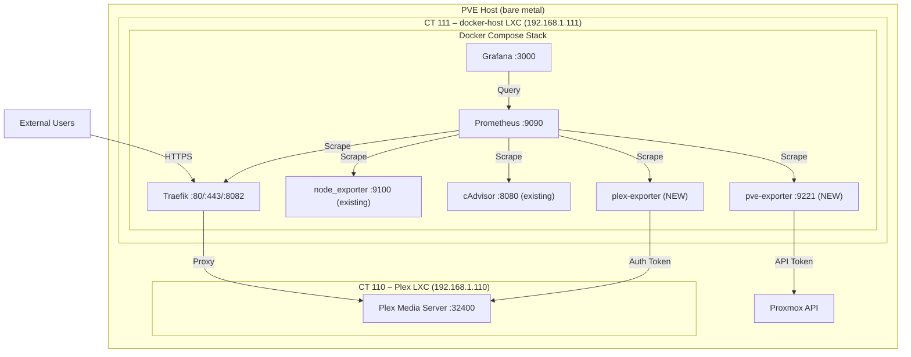

# Plex Monitoring Setup — Detailed Design

## Overview

This document outlines the design for extending the existing monitoring stack to diagnose sporadic Plex connection issues occurring both locally and remotely. The homelab already has Prometheus, Grafana, Traefik metrics, node_exporter, and cAdvisor running inside the Docker Compose stack on CT 111 (`docker-host`, `192.168.1.111`). This project adds **two new exporters** (Plex and Proxmox PVE) and makes one minor configuration change (Traefik histogram buckets) to achieve full-stack visibility.

## Detailed Requirements

- Track Plex stream states (playing, paused, buffering) and transcoder performance.
- Monitor the Proxmox PVE host and Plex LXC container (CT 110) resource utilization from the hypervisor level.
- Tune the existing Traefik metrics to use custom histogram buckets for meaningful latency tracking.
- Consolidate all new metrics into the existing Prometheus and Grafana stack on CT 111.

## Existing Infrastructure

The following components are **already deployed and operational** and require no changes beyond what is specified in this design:

| Component | Where it runs | What it provides |
|---|---|---|
| Traefik (v3.7.5) | Docker on CT 111 | Reverse proxy; Prometheus metrics on `:8082` with entry-point and service labels |
| Prometheus (v3.12.0) | Docker on CT 111 | Scrapes Traefik, node_exporter, cAdvisor, and itself |
| Grafana (13.1.0) | Docker on CT 111 | Provisioned with Prometheus datasource and a dashboard directory |
| node_exporter (v1.11.1) | Docker on CT 111 | Host-level metrics for CT 111 (`--path.rootfs=/host`, `pid: host`) |
| cAdvisor (v0.55.1) | Docker on CT 111 | Container-level CPU/memory/network for all Docker services |
| Plex Media Server | Native on CT 110 | Routed via Traefik file-provider at `http://192.168.1.110:32400` |

## Architecture Overview

## Components and Interfaces

### Existing (no changes needed)

1. **Traefik Prometheus Metrics** — already exposing `traefik_entrypoint_requests_total`, `traefik_service_requests_total`, and request duration histograms on the internal `:8082` entrypoint. One minor change: add custom histogram `buckets`.
2. **node_exporter** — already reporting CT 111 host metrics (CPU, memory, disk, network, file descriptors).
3. **cAdvisor** — already reporting per-container resource metrics for every Docker service.

### New

4. **Plex Media Server Exporter (`plex-media-server-exporter`)**
   - **Role:** Extracts application-level metrics from Plex via its API.
   - **Interface:** Communicates with Plex at `http://192.168.1.110:32400` using a Plex Authentication Token. Exposes metrics on an HTTP endpoint inside the Compose network.
   - **Data Provided:** Stream states (playing, paused, buffering), transcoder load, active sessions, media downloads.
   - **Deployment:** New service in `compose.yml.j2`, scrape-only (no Traefik labels), following the pattern of `node-exporter` and `cadvisor`.

5. **Proxmox PVE Exporter (`prometheus-pve-exporter`)**
   - **Role:** Extracts hypervisor and container metrics from the Proxmox API.
   - **Interface:** Communicates with the PVE host API using a dedicated API token with the `PVEAuditor` role. Exposes a scrape endpoint on `:9221`.
   - **Data Provided:** CPU, memory, disk I/O, and network I/O for the PVE node and all LXC containers (including CT 110 Plex and CT 111 docker-host).
   - **Deployment:** New service in `compose.yml.j2`, scrape-only, reaching the PVE API over the LAN (same `vmbr0` bridge).

## Data Models

Metrics are collected as time-series data in Prometheus:

| Type | Metric | Source |
|---|---|---|
| Histogram | `traefik_entrypoint_request_duration_seconds_bucket` | Traefik (existing) |
| Counter | `traefik_entrypoint_requests_total` | Traefik (existing) |
| Counter | `traefik_service_requests_total` | Traefik (existing) |
| Gauge | `pve_cpu_usage_ratio`, `pve_memory_usage_bytes` | PVE exporter (new) |
| Counter | `pve_network_transmit_bytes`, `pve_network_receive_bytes` | PVE exporter (new) |
| Counter | `pve_disk_read_bytes`, `pve_disk_write_bytes` | PVE exporter (new) |
| Gauge | Plex active streams, buffering state, transcoder status | Plex exporter (new) |
| Gauge | `node_filefd_allocated`, `node_memory_MemAvailable_bytes` | node_exporter (existing) |

## Error Handling

- **Exporter Failures:** Prometheus's `up` metric tracks whether each scrape target is reachable. If any of the new exporters (PVE, Plex) go offline, this will be visible in the Targets page and can trigger alerts.
- **API Limits:** The `prometheus-pve-exporter` must not use `--collector.config` to avoid overloading the Proxmox API with per-guest config queries.
- **Plex Token Expiry:** The Plex Authentication Token should be monitored — if it expires or is revoked, the exporter will fail silently and the `up` metric will drop to 0.

## Testing Strategy

- **Metric Verification:** After deploying each new exporter, query Prometheus directly (`Status → Targets`) to verify the new targets are `UP` and returning metrics.
- **End-to-End Validation:** Start a Plex stream on a client device and verify that the Plex exporter's metrics update to reflect the active session.
- **Dashboard Validation:** Confirm that new Grafana dashboard panels populate with data and that LXC container drop-downs correctly filter to CT 110 (Plex).

## Appendices

### Appendix A: Technology Choices

- **Plex Exporter:** `axsuul/plex-media-server-exporter` selected over `jsclayton/prometheus-plex-exporter` for its granular stream buffering metrics. Maintenance status and LXC compatibility should be verified before final deployment.
- **Proxmox Exporter:** `prometheus-pve-exporter` is the standard community exporter for Proxmox VE. It collects LXC metrics from the API without needing agents inside containers.

### Appendix B: Key Constraints

- **Secrets management:** Both new exporters require authentication tokens (Plex Auth Token, Proxmox API Token). These must be stored in the Ansible Vault (`group_vars/all/vault.yml`) and injected via the `.env` file, following the existing pattern for `CF_DNS_API_TOKEN`, `GF_SECURITY_ADMIN_PASSWORD`, and `TUNNEL_TOKEN`.
- **Network:** Both exporters run on CT 111 and reach their targets over the LAN (`vmbr0` bridge, `192.168.1.0/24`). No firewall or routing changes are needed.

### Appendix C: Alternative Approaches Considered

- **node_exporter inside the Plex LXC (CT 110):** Would provide per-process metrics (transcoder CPU), filesystem I/O detail, and TCP socket statistics that the PVE exporter cannot. Rejected for now to keep scope minimal — the PVE exporter provides sufficient container-level metrics for initial triage. Can be revisited if PVE-level metrics prove insufficient for diagnosing specific issues.
