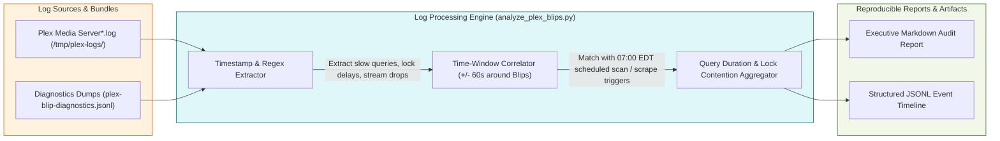

# Design: Offline Reproducible Log Analysis Pipeline (`analyze_plex_blips.py`)

## Overview & Responsibility
While the watchdog captures real-time thread states and file lock holders during active lockups, operational debugging requires an offline, reproducible log analysis tool. This component (`analyze_plex_blips.py`) processes historical log archives (e.g., `/tmp/plex-logs/` or live production log directories), extracts quantitative telemetry on slow queries and transaction stalls, correlates them with scheduled library scans or Prometheus scrape collisions, and outputs structured executive summaries and timeline data.

## Log Ingestion & Correlation Pipeline

## Technical Architecture & Design Specs
1. **Command-Line Interface & Execution Flexibility**:
   * Designed as a robust Python 3 CLI tool that can be executed directly on the developer's workstation, within a CI/CD test harness, or inside an operational Docker analysis container.
   * **CLI Flags**:
     * `--log-dir <dir>`: Absolute path to target directory containing `Plex Media Server*.log` files (supports uncompressed and `.log.gz` rotated bundles).
     * `--start-time <datetime>` / `--end-time <datetime>`: Optional RFC-3339 or ISO-8601 time bounds to isolate specific incidents (e.g., focusing on `06:55:00` to `07:05:00`).
     * `--output-format <markdown|jsonl|both>`: Selects output serialization style.
     * `--threshold-ms <int>`: Minimum latency threshold for flagging slow read queries or transaction lock delays (defaults to `500` ms).
2. **Parsing Engine & Feature Extraction**:
   * Automatically parses standard Plex multi-thread timestamps (`Mmm DD, YYYY HH:MM:SS.mmm [ThreadID]`).
   * Classifies events into specific operational taxonomy:
     * `TX_STALL`: SQLite transaction start delays (`Took too long ... to start a transaction`).
     * `SLOW_QUERY`: Library read delays (`SLOW QUERY: It took ... ms to retrieve`).
     * `SCHEDULED_TASK`: Top-of-hour library maintenance (`It's been 3600 seconds, so we're starting scheduled library update`).
     * `STREAM_DROP`: Timeout of streaming resources (`Shutting down idle session ... idle time is 180 seconds; Killing job ... Plex Transcoder`).
     * `EXPORTER_SCRAPE`: Massive multi-section media aggregation queries (`GET /library/sections/<key>/all`).
3. **Correlation Algorithm & Root-Cause Synthesis**:
   * Groups extracted anomalous events within rolling 60-second correlation windows.
   * When a `STREAM_DROP` or `TX_STALL` cluster occurs, the analyzer looks backward within a 120-second window to identify the precipitating trigger (e.g., linking a 34-second stall on `GET /library/sections/3/all` directly to a concurrent `SCHEDULED_TASK` scan on Section 1 / Korean Shows).
4. **Reproducible Reporting**:
   * Generates clean, GitHub-flavored Markdown tables detailing total lock delay duration, maximum query latency, impacted streaming clients, and correlated triggers.
   * Can be automated via a simple repository rule or `just analyze-logs` command to regularly audit production logs for regression testing.
