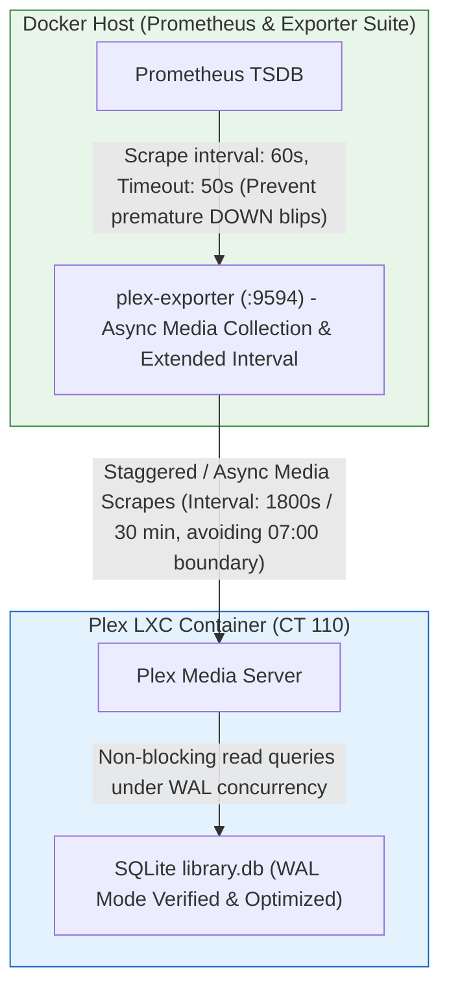

# Design: Enhanced Observability & Root-Cause Remediation Strategy

## Overview & Remediation Goals
While diagnostic watchdogs and log parsers provide visibility, our deep dive into the repository revealed actionable misconfigurations driving the sporadic 07:00 EDT heartbeat blips. Specifically, **synchronous library media scraping from `plex-exporter` every 5 minutes collides directly with Plex's scheduled hourly database tasks**, locking SQLite (`com.plexapp.plugins.library.db`) for over 34 seconds and breaking Prometheus scrape timeouts. This document outlines enhanced observability practices and targeted infrastructure remediations to permanently prevent these database stalls.

## Remediated Observability & Scrape Architecture

## Remediation Plan & Configuration Changes
1. **Remediating the Exporter Scrape Collision ([ansible/roles/docker_host/templates/prometheus.yml.j2](file:///home/user/Work/homelab/ansible/roles/docker_host/templates/prometheus.yml.j2))**:
   * **The Problem**: `plex-exporter` runs `collect_media_metrics` synchronously every 300 seconds (5 minutes). At exactly 07:00:00 EDT, this 5-minute schedule coincides with Plex's scheduled hourly library update (`07:00:05`), causing queries to block for ~34.4 seconds and breaking the 30s Prometheus scrape timeout (`scrape_timeout: 30s`).
   * **The Remediation**:
     1. **Increase Media Collection Interval**: Modify the Docker container environment for `plex-exporter` in `compose.yml.j2` to set `METRICS_MEDIA_COLLECTING_INTERVAL_SECONDS` to `1800` (30 minutes) or `3600` with an initial jitter offset, drastically reducing SQLite lock frequency and preventing guaranteed collisions with top-of-hour scheduled scans.
     2. **Adjust Scrape Timeout Balance**: In `prometheus.yml.j2`, bump `scrape_interval: 60s` and `scrape_timeout: 50s`. This ensures that even if a media collection query temporarily waits on a 30-second database lock, Prometheus will complete the scrape rather than marking the service DOWN and throwing a false heartbeat blip in Grafana.
2. **SQLite Database Health & Concurrency Verification**:
   * **WAL Mode Inspection**: By default, SQLite database locking under rollback journals halts all readers during an exclusive writer lock. Our in-container watchdog and remediation playbook will inspect `com.plexapp.plugins.library.db` to verify that Write-Ahead Logging (WAL) mode (`PRAGMA journal_mode=WAL;`) is active and properly optimized, allowing read queries (like heartbeat checks and media scrapes) to proceed concurrently with background library updates.
   * **Scheduled Maintenance Optimization**: Add an automated Ansible check or operational playbook to execute periodic SQLite database integrity audits and optimizations (`VACUUM; REINDEX; ANALYZE;`) during off-peak windows (e.g., 03:00 AM) to defrag database pages and minimize transaction lock hold times.
3. **Enhanced Grafana Alerting & Telemetry Correlation**:
   * Update Grafana dashboard definitions to plot `pve-exporter` LXC container CPU and IO wait metrics directly alongside `plex-exporter` scrape durations and custom watchdog event metrics, providing instant visual confirmation that library scans no longer disrupt streaming performance.
