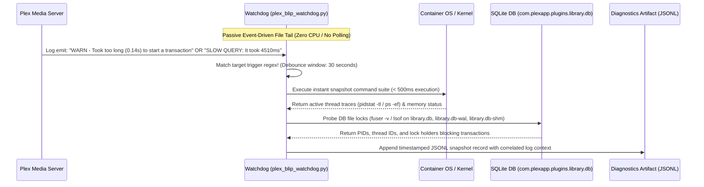

# Design: Automated Diagnostic Watchdog Component (`plex_blip_watchdog.py`)

## Overview & Responsibility
The Automated Diagnostic Watchdog is a lightweight, zero-overhead background service designed to run inside LXC `CT 110`. Its sole responsibility is to passively monitor `Plex Media Server.log` in real-time, instantly detect the onset of SQLite database transaction lock stalls or query delays, and execute a comprehensive diagnostic snapshot of active process locks, open files, and thread states before transient contention subsides.

## Watchdog Event Detection & Capture Workflow



## Technical Specification & Design Principles
1. **Zero-Overhead Passive Monitoring**:
   * Built in pure Python 3 using standard library asynchronous I/O and non-blocking file tailing (`os.open`, `select.poll`, or `inotify` bindings via standard file stream monitoring).
   * ZERO continuous polling loops: the process rests in an idle kernel wait state until new byte streams are appended to `/var/lib/plexmediaserver/Library/Application Support/Plex Media Server/Logs/Plex Media Server.log`.
2. **Trigger Regex Conditions** (with verified log line examples):
   * **Database Transaction Stall**: `r"Took too long \(([0-9.]+) seconds\) to start a transaction"`
     * Example: `Aug 04, 2026 06:58:11.899 [...] WARN - Took too long (0.120000 seconds) to start a transaction on .../StatisticsBandwidth.cpp:110`
   * **Slow Query Detection**: `r"SLOW QUERY: It took ([0-9.]+) ms to retrieve"`
     * Example: `Aug 04, 2026 06:58:49.160 [...] WARN - [Req#57d3a] SLOW QUERY: It took 4360.000000 ms to retrieve 0 items.`
   * **Connectivity & Relay Collapse**: `r"We appear to have lost Internet connectivity|Failed to retrieve relay host key"`
     * Example: `Aug 04, 2026 07:00:10.756 [...] ERROR - [EventSourceClient/...] Relay: Failed to retrieve relay host key from plex.tv`
   * **Debounce & Rate-Limiting**: A mandatory 30-second cooldown window prevents snapshot spamming during sustained multi-minute lockup episodes.
3. **Diagnostic Snapshot Action Suite** (prerequisites: `sysstat`, `lsof`, `procps` installed via Ansible before deployment — see Step 3 of the implementation plan):
   Upon positive regex evaluation, the watchdog instantaneously executes a bounded set of local diagnostic probes (< 500ms total runtime):
   * **Lock Holder Identification**: Executes `fuser -v` and `lsof` against the Plex SQLite database files (`com.plexapp.plugins.library.db*`) to pinpoint the exact PIDs and thread IDs holding exclusive filesystem locks.
   * **Thread State & CPU Contention**: Executes `pidstat -t 1 1` (or reads `/proc/<pid>/task/`) and `ps -aux -T` to capture thread CPU utilization, block state (`D` state / uninterruptible sleep vs `R` running), and transcode activity.
   * **Open File Descriptors**: Reads `/proc/<pid>/fd/` to count container-local open file descriptors and identify I/O pressure without requiring ZFS host access.
4. **Structured Artifact Formatting**:
   * Results are formatted as structured JSON Lines (`.jsonl`) and written to a **persistent** diagnostic subdirectory: `/var/lib/plexmediaserver/Library/Application Support/Plex Media Server/Logs/Diagnostics/`. This path resides on the host state bind mount (`plex_state_host_path`) and survives container reboots.
   * Each JSONL entry includes: timestamp, trigger log line, extracted delay milliseconds, active lock holders, blocking process traces, and CPU/IO wait metrics.

## Systemd Service Integration (`plex-blip-watchdog.service`)
* Managed via Ansible template within `ansible/roles/plex/templates/`:
  ```ini
  [Unit]
  Description=Plex Zero-Overhead Diagnostic Watchdog
  After=network.target plexmediaserver.service

  [Service]
  Type=simple
  User=root
  Group=root
  ExecStart=/usr/local/bin/plex_blip_watchdog.py --log-path /var/lib/plexmediaserver/Library/Application\ Support/Plex\ Media\ Server/Logs/Plex\ Media\ Server.log --output-dir /var/lib/plexmediaserver/Library/Application\ Support/Plex\ Media\ Server/Logs/Diagnostics
  Restart=always
  RestartSec=10
  Nice=10
  CPUSchedulingPolicy=idle
  MemoryHigh=100M
  MemoryMax=150M

  [Install]
  WantedBy=multi-user.target
  ```
