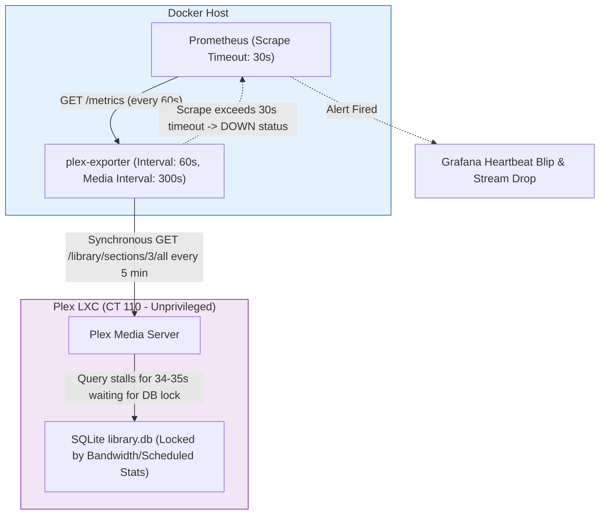

# Research: Containerized Diagnostic Sidecars vs. In-Container Monitoring

## Overview & Executive Summary
With Proxmox hypervisor host modifications ruled out by best-practice isolation principles, diagnostic watchdog deployment must occur within containerized boundaries. Our deep analysis of the repository's Prometheus monitoring architecture revealed a critical finding: **the 07:00 EDT blip is directly exacerbated by synchronous Prometheus media scraping from `plex-exporter` colliding with SQLite database maintenance**. This report evaluates two clean, container-safe runtime deployment models for capturing root-cause diagnostic dumps without touching the Proxmox host OS.

## The Exporter-Collision Failure Model



## Critical Discovery: The `plex-exporter` Scrape Collision
* Examination of [ansible/roles/docker_host/templates/prometheus.yml.j2](file:///home/user/Work/homelab/ansible/roles/docker_host/templates/prometheus.yml.j2#L62-L85) uncovers the exact trigger mechanism behind the massive 34-second query hangs observed in `Plex Media Server.log`:
  ```
  The exporter's collect_media_metrics runs SYNCHRONOUSLY inside the scrape and issues
  one /library/sections/<key>/all per section ... once every 300s (5 minutes)...
  scrape_interval: 60s
  scrape_timeout: 30s
  ```
* **Primary lock holder (verified)**: The exclusive SQLite lock is first acquired by a Plex internal background thread writing bandwidth statistics (`StatisticsBandwidth.cpp:110` / `SqliteDB.h:100`). This is evidenced by `WARN - Took too long (0.120000 seconds) to start a transaction` log lines beginning at `06:58:11` — before any plex-exporter scrape lands.
* **plex-exporter enters a Scrape Retry Storm**: When the exporter's synchronous `GET /library/sections/3/all` query fires at `06:57:16` and blocks for ~29.7s, total collection time across all sections exceeds Prometheus's `scrape_timeout: 30s`. Because the scrape aborts before completion, `plex-exporter` re-attempts the full synchronous library sweep on the very next 60-second Prometheus scrape interval (`06:58:17`, hanging for 35.9s, and again at `06:59:19`, hanging for 34.4s). This automated retry storm continuously holds SQLite read locks and exhausts server worker threads for 3 minutes, directly causing the 180s streaming session drop at `07:00:10`. Bumping `scrape_timeout: 50s` and interval to `1800s` is critical to break this destructive feedback loop.


## Deployment Trade-Offs: Where to Run the Diagnostic Watchdog

| Architectural Feature | Option A: In-Container Watchdog (Inside LXC CT 110) | Option B: Dedicated Docker Sidecar (on Docker Host) | Recommended Approach |
| :--- | :--- | :--- | :--- |
| **Host OS Isolation** | **Complete (100%)**. Runs entirely inside the unprivileged Plex LXC container; zero Proxmox host impact. | **Complete (100%)**. Runs on the Docker VM/CT alongside Prometheus; zero Proxmox host impact. | **Tie (Both safe)** |
| **Access to SQLite DB Locks** | **Direct & Native**. Can execute `lsof`, `fuser`, or `sqlite3` lock probes directly against `/var/lib/plexmediaserver/Library/.../library.db` because it runs as user `plex` in CT 110. | **Limited / Remote**. Cannot easily inspect file lock structures or container thread states without exposing sensitive NFS/bind mounts over the network. | **Option A (In-Container)** |
| **Access to Real-Time Logs** | **Instant (Local filesystem)**. Can use `inotify` / file tailing on local log directory without network filesystem buffering. | **Requires Remote Mount**. Needs read-only export of `/tmp/plex-logs` or log bind mount into Docker host. | **Option A (In-Container)** |
| **Infrastructure Integration** | Easily provisioned as a systemd timer/service via the existing Ansible Plex role ([ansible/roles/plex/tasks/main.yml](file:///home/user/Work/homelab/ansible/roles/plex/tasks/main.yml)). | Provisioned via Docker Compose template ([compose.yml.j2](file:///home/user/Work/homelab/ansible/roles/docker_host/templates/compose.yml.j2)). | **Option A (In-Container)** |

## Recommended Architecture: In-Container (LXC CT 110) Systemd Watchdog
1. **Zero Proxmox Host Touch**: Deploy the lightweight event-driven log monitoring script and diagnostic capture tool directly inside **LXC CT 110** as an unprivileged service operated by the existing Ansible role.
2. **Direct Lock Inspection**: When the watchdog detects a `Took too long to start a transaction` or `SLOW QUERY` event in local logs, it executes instant lock probing on `com.plexapp.plugins.library.db` and captures local thread state (`pidstat`) without needing high-privilege hypervisor access.
3. **Scrape Timeout Remediation**: In addition to capturing diagnostics, the eventual implementation plan should address the synchronous `plex-exporter` collision by evaluating optimization of SQLite (WAL mode check) or tuning the `METRICS_MEDIA_COLLECTING_INTERVAL_SECONDS` and Prometheus scrape timing.

## References
* [Prometheus Plex Exporter Configuration Template](file:///home/user/Work/homelab/ansible/roles/docker_host/templates/prometheus.yml.j2#L62-L85)
* [Ansible Plex LXC Role Initialization](file:///home/user/Work/homelab/ansible/roles/plex/tasks/main.yml)
* [Docker Compose plex-exporter Service Definition](file:///home/user/Work/homelab/ansible/roles/docker_host/templates/compose.yml.j2#L242-L269)
