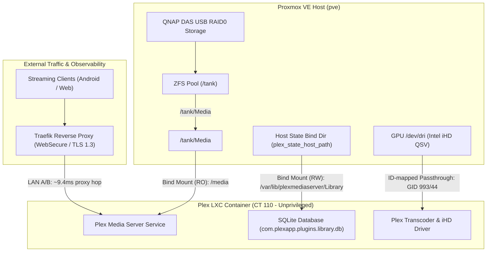

# Research: Current Homelab Architecture & Plex Deployment

## Overview & Executive Summary
This document captures the architectural deployment of Plex Media Server within the homelab ecosystem based on analysis of the infrastructure-as-code repository (Ansible and OpenTofu) and internal runbooks. Understanding the boundary between the Proxmox hypervisor, the LXC container, and the storage backend is critical for placing diagnostic watchdogs with zero runtime overhead.

## Architectural Model & Component Relationships

## Key Deployment Specs & Findings
1. **Containerization & Permissions (Unprivileged LXC CT 110)**:
   * Plex runs within an unprivileged Proxmox LXC container (`CT 110`).
   * To enable hardware transcoding via Intel QSV without elevating container privileges, OpenTofu and Ansible perform an ID-mapped passthrough for `/dev/dri`, mapping host GID `993` (`render`) and GID `44` (`video`) straight through to the container ([ansible/roles/plex/tasks/main.yml](file:///home/user/Work/homelab/ansible/roles/plex/tasks/main.yml#L237-L267)).
2. **Storage Architecture & I/O Pathways**:
   * **Media Files (`/media`)**: Hosted on a QNAP DAS enclosure attached via USB to the Proxmox host, formatted as a single-vdev ZFS pool (`/tank/Media`), bind-mounted read-only into CT 110 ([docs/runbooks/das-zfs-migration.md](file:///home/user/Work/homelab/docs/runbooks/das-zfs-migration.md#L136-L152)).
   * **State & Database (`plex_state_dir`)**: Bind-mounted read-write from the host. This directory stores the critical SQLite database files (`com.plexapp.plugins.library.db`). Any host-level I/O contention on this bind mount directly degrades database transaction speeds.
3. **Network & Routing**:
   * External streaming requests traverse Traefik over HTTP/2 with TLS 1.3 negotiated directly ([docs/plex-remote-latency-audit.md](file:///home/user/Work/homelab/docs/plex-remote-latency-audit.md#L42-L58)). Previous audits demonstrate that Traefik introduces minimal overhead (~10ms), confirming that timeouts during blips stem from internal server lockups rather than routing layers.

## References
* [Ansible Plex Role Tasks](file:///home/user/Work/homelab/ansible/roles/plex/tasks/main.yml)
* [DAS to ZFS Migration Runbook](file:///home/user/Work/homelab/docs/runbooks/das-zfs-migration.md)
* [Remote Latency Audit](file:///home/user/Work/homelab/docs/plex-remote-latency-audit.md)
* [Proxmox LXC ID Mapping Documentation](https://pve.proxmox.com/wiki/Unprivileged_LXC_containers)
