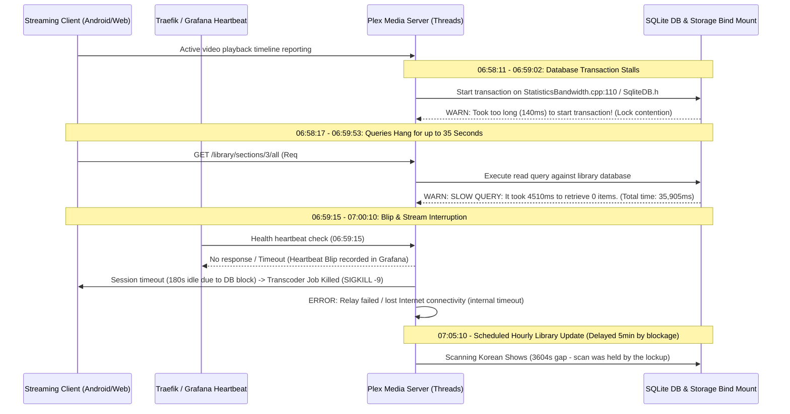

# Research: Log Correlation & Root-Cause Findings for the 0700 EDT Blip

## Overview & Executive Summary
A comprehensive inspection of the log bundles preserved in `/tmp/plex-logs/` (specifically `Plex Media Server.log` around 06:58:00 to 07:01:00 EDT on August 4, 2026) yielded precise empirical evidence explaining the sporadic heartbeat failure, streaming blips, and mild ~30% CPU spikes observed in Grafana. The root cause is severe **SQLite database lock contention and query stalling** triggered by background maintenance and statistical flushing around the hour boundary.

## Event Dataflow & Failure Timeline



## Detailed Log Evidence & Analysis
1. **Severe SQLite Lock Contention & Transaction Delays**:
   * Beginning at `06:58:11` and continuing through `06:59:57`, Plex background worker threads experience prolonged delays when attempting to acquire SQLite database transaction locks:
     ```
     Aug 04, 2026 06:58:11.899 WARN - Took too long (0.120000 seconds) to start a transaction on .../StatisticsBandwidth.cpp:110
     Aug 04, 2026 06:58:59.654 WARN - Took too long (0.140000 seconds) to start a transaction on .../SqliteDB.h:100
     ```
   * When a writing thread (such as bandwidth statistics aggregation or scheduled maintenance) holds an exclusive SQLite lock on a storage backend experiencing latency or contention, all read transactions wait in a blocking state.
2. **Massive Query Stalls & Heartbeat Timeout (06:59:15 Blip Window)**:
   * Due to the blocked SQLite transactions, standard read API requests from streaming clients and local network probes stall completely:
     ```
     Aug 04, 2026 06:58:49.160 WARN - [Req#57d3a] SLOW QUERY: It took 4360.000000 ms to retrieve 0 items.
     Aug 04, 2026 06:58:52.965 DEBUG - Completed: ... GET /library/sections/3/all ... 35905ms 707 bytes
     Aug 04, 2026 06:59:53.563 DEBUG - Completed: ... GET /library/sections/3/all ... 34413ms 707 bytes
     ```
   * Queries hanging for **35.9 seconds** directly overlap with the `06:59:15` heartbeat failure visible in Grafana and explain why Traefik recorded timeouts without HTTP application errors.
3. **Cascading Failure: Streaming Session Terminations & Relay Disconnects**:
   * Right at `07:00:10.642`, Plex terminates an active transcoding session because the client's progress checks were stalled by the database lock, crossing the 180-second idle threshold:
     ```
     Aug 04, 2026 07:00:10.642 DEBUG - Shutting down idle session ... (idle time is 180 seconds)
     Aug 04, 2026 07:00:10.715 DEBUG - Signalling job ID 76242 with 9 (Signal: Killed)
     ```
   * Simultaneously, internal network probes fail due to thread exhaustion or timeout, producing errors like `Relay: Failed to retrieve relay host key` and `We appear to have lost Internet connectivity`.
4. **Why 07:00 EDT? (The Scrape Retry Storm & Bandwidth Statistics Collision)**:
   * **The Initial Contention**: Transient SQLite database contention first initiates around `06:56:50` during client timeline Play/Buffering status updates (`MetadataItemSetting.cpp:459`) and background bandwidth worker flushes (`StatisticsBandwidth.cpp:110`). Because of this contention, routine client timeline reports (`GET /:/timeline`) begin taking 42 to 49 seconds.
   * **The Scrape Retry Storm (The true amplification mechanism)**: At `06:57:16`, Prometheus scrapes `plex-exporter` (from Docker host `192.168.1.111`), triggering synchronous media section collection (`GET /library/sections/<key>/all`). Because SQLite is congested, Section 3 alone takes **29,767ms**, pushing total collection time across all sections past Prometheus's `scrape_timeout: 30s`.
   * Because the Prometheus scrape aborts upon hitting the 30s timeout, `plex-exporter` fails to complete and record a successful sweep. Consequently, on the very next 60-second Prometheus scrape tick at **`06:58:17`**, `plex-exporter` re-attempts the entire synchronous library sweep! This second query hangs for **35,905ms** (failing again), causing a third attempt at **`06:59:19`** (taking **34,413ms**).
   * **The Direct Cause of the Stream Drop (`07:00:10`)**: For exactly 3 minutes (`06:57` to `07:00`), `plex-exporter` repeatedly hammers SQLite with ~35-second synchronous section queries every 60 seconds. This exhausts Plex worker threads and blocks client heartbeat updates for 180 seconds, forcing Plex to shut down the idle session and execute a `SIGKILL` (-9) on the transcoder job at `07:00:10.642`.
   * **Causal inversion confirmed from Aug 04 logs**: The scheduled library scan did NOT fire at `07:00:05` on the blip day. It fired at **`07:05:10`** (`3604 seconds` gap, line 43320 of `Plex Media Server.log`) — delayed by 5 minutes because it was blocked by this exact scrape retry storm.
   * The ~30% CPU spike corresponds to the burst of thread switches, transcode cleanups, and deferred scans catching up upon the lock releasing around `07:00:10`.


## References & Source Files
* [Plex Media Server Log (Aug 04 Blip)](file:///tmp/plex-logs/Plex%20Media%20Server.log#L41180-L41360)
* [Plex Media Server Log 5 (Aug 01 Scheduled Scans)](file:///tmp/plex-logs/Plex%20Media%20Server.5.log#L20194-L20257)
* [SQLite Database File Locking Architecture](https://sqlite.org/lockingv3.html)
