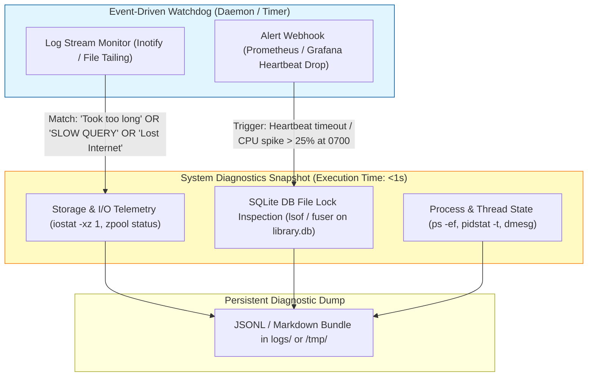

# Research: Low-Overhead Diagnostic Triggers & Watchdog Patterns

## Overview & Executive Summary
To track and capture deeper root-cause telemetry on future occurrences of sporadic database locks and streaming blips without inducing CPU overhead or interfering with real-time hardware transcoding (Intel QSV), we investigated low-overhead monitoring patterns. Relying on heavy, active polling scripts or intrusive kernel tracers would introduce storage latency and cpu jitter. Instead, a lightweight event-driven log monitoring and automated snapshot architecture provides high fidelity at negligible system cost.

## Proposed Zero-Overhead Observability Architecture

## Evaluation of Monitoring Patterns & Performance Trade-offs

| Pattern / Technique | Runtime Overhead | Transcoding Impact | Diagnostic Fidelity | Recommendation & Rationale |
| :--- | :--- | :--- | :--- | :--- |
| **Event-Driven Log Watcher (`inotify` / file tail)** | **Zero (passive)** | **None** | High (triggers within milliseconds of Plex log warning) | **RECOMMENDED (Primary)**. A lightweight script (or custom FluentBit/Go/Python service) waits passively on filesystem events for `Plex Media Server.log`. Upon encountering target regex (`SLOW QUERY`, `Took too long`, `StatisticsBandwidth`), it fires diagnostic execution instantly. |
| **Prometheus / Grafana Alert Webhooks** | **Zero (already running)** | **None** | Medium (slight delay due to scrape intervals, e.g., 15s) | **RECOMMENDED (Secondary)**. Leveragingexisting Grafana heartbeat monitors or CPU utilization alerts to trigger a webhook handler that snapshots host I/O and database locks. |
| **Active Polling Script (e.g., cron every 10s)** | Medium (CPU & Process creation) | Low-Medium (can induce jitter during QSV encode) | Low (often misses transient 15-second lock windows) | **AVOID**. Polling disk status and running system stat commands continuously consumes unnecessary CPU cycles and risks adding storage contention to USB ZFS pools. |
| **eBPF / `bpftrace` Kernel Profilers** | Low-Medium (depending on probes) | Low (kernel tracepoint overhead) | Very High (captures exact syscall latency) | **OPTIONAL IN-DEPTH HINT**. Useful only if file lock inspection cannot pinpoint which process or thread is stalling disk write operations on `/tank` or the state directory bind mount. |

## Recommended Implementation Strategy for Debugging Pipeline
1. **Automated Watchdog Daemon**:
   * Deploy a lightweight event-driven monitoring script or service that continuously monitors `Plex Media Server.log` using asynchronous filesystem tailing (zero CPU idle consumption).
   * **Trigger Conditions**: Match strings such as `WARN - Took too long`, `SLOW QUERY`, or database lock warnings.
   * **Instant Diagnostic Snapshot Action**: Upon trigger, immediately execute an automated diagnostic snapshot consisting of:
     1. SQLite DB file lock inspection (`fuser -v` and `lsof` on `com.plexapp.plugins.library.db*`) to identify the exact PID and thread holding the exclusive write lock.
     2. Process and thread state capture (`pidstat -t 1 1` via `sysstat` and `ps -aux -T`) to identify blocked vs. running threads.
     3. Container-local open file descriptor counts (reading `/proc/<pid>/fd/`) to correlate I/O pressure.

   > **⚠️ Note**: `zpool status`, `zpool iostat`, and host-level `dmesg` commands are **unavailable inside unprivileged LXC CT 110**. ZFS and USB storage diagnostics require host-level access and must be captured separately on the Proxmox host by the operator at the time of a live incident, or via the `pve-exporter` Prometheus metrics.
2. **Offline Log Correlation Tool**:
   * Develop an analytical utility script that automatically parses historical Plex logs in `/tmp/plex-logs/` (or production log mounts), correlates timestamped slow query warnings with scheduled cron/library tasks, and formats the result as a structured JSONL or Markdown audit summary.

## References
* [Plex Remote Latency Audit (Zero-buffering verification)](file:///home/user/Work/homelab/docs/plex-remote-latency-audit.md)
* [Linux Inotify API for Zero-Polling Monitoring](https://man7.org/linux/man-pages/man7/inotify.7.html)
* [SQLite Database Tuning & Observability](https://sqlite.org/wal.html)
