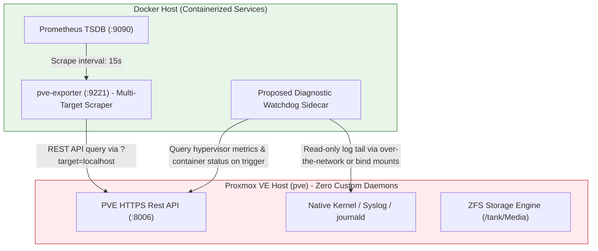

# Research: Proxmox VE Host-Isolation Best Practices & Native Telemetry

## Overview & Executive Summary
Proxmox Virtual Environment (PVE) operational best practices strongly discourage installing third-party daemons, Python virtual environments, or custom diagnostic background scripts directly on the bare-metal hypervisor host (`pve`). Introducing host-level dependencies increases upgrade risk, pollutes system configuration, and breaks clean recovery boundaries. This research evaluates how to harvest high-fidelity hypervisor and ZFS storage telemetry natively using externalized, containerized tooling without violating host isolation.

## Proxmox Isolation & Telemetry Architecture

## Host Isolation Best Practices & Technical Justification
1. **The Hypervisor Hygiene Invariant**:
   * Proxmox VE manages systemd system network configurations, storage abstraction layers, and cluster states through specialized Debian packages (`pve-manager`, `proxmox-ve`). Installing third-party diagnostic tooling or long-running Python watchers directly on `pve` introduces dependency drift and risks conflicting with apt system upgrades.
   * Furthermore, custom host-level scripts are not cleanly versioned or captured by standard container/VM backup strategies (`vzdump`), violating reproducible infrastructure-as-code principles.
2. **Native PVE API & Containerized Telemetry**:
   * Inspection of the repository's monitoring template ([ansible/roles/docker_host/templates/prometheus.yml.j2](file:///home/user/Work/homelab/ansible/roles/docker_host/templates/prometheus.yml.j2#L31-L61)) demonstrates the proven best-practice pattern: the Proxmox host is monitored without installing local exporters by deploying a **multi-target `pve-exporter` Docker container**.
   * The containerized exporter queries the Proxmox VE HTTPS REST API directly (`docker_host_pve_api_host:8006`), collecting CPU, storage, ZFS pool, and LXC container lifecycle metrics cleanly over the network.
3. **Implications for Diagnostic Watchdog Placement**:
   * To track sporadic streaming blips and database lock contention without violating hypervisor hygiene, diagnostic watchdogs must be placed entirely within unprivileged containerized runtime environments—either as a dedicated sidecar service on the Docker host or embedded directly inside the target unprivileged LXC container (`CT 110`).

## References
* [Prometheus Configuration Template (Proxmox API Scraper)](file:///home/user/Work/homelab/ansible/roles/docker_host/templates/prometheus.yml.j2#L31-L61)
* [Proxmox VE Administration Guide: Host Bootstrapping & Best Practices](https://pve.proxmox.com/pve-docs/pve-admin-guide.html)
