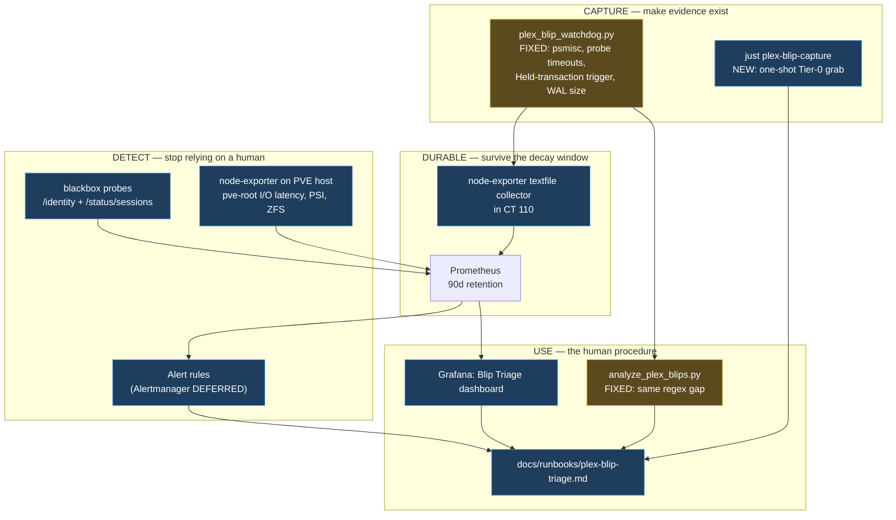
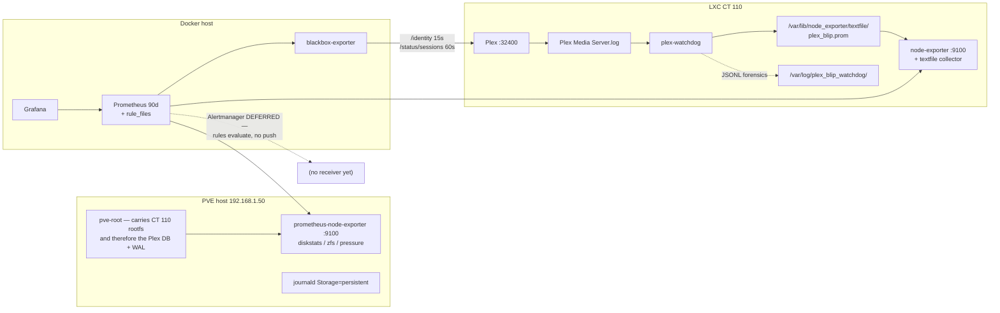
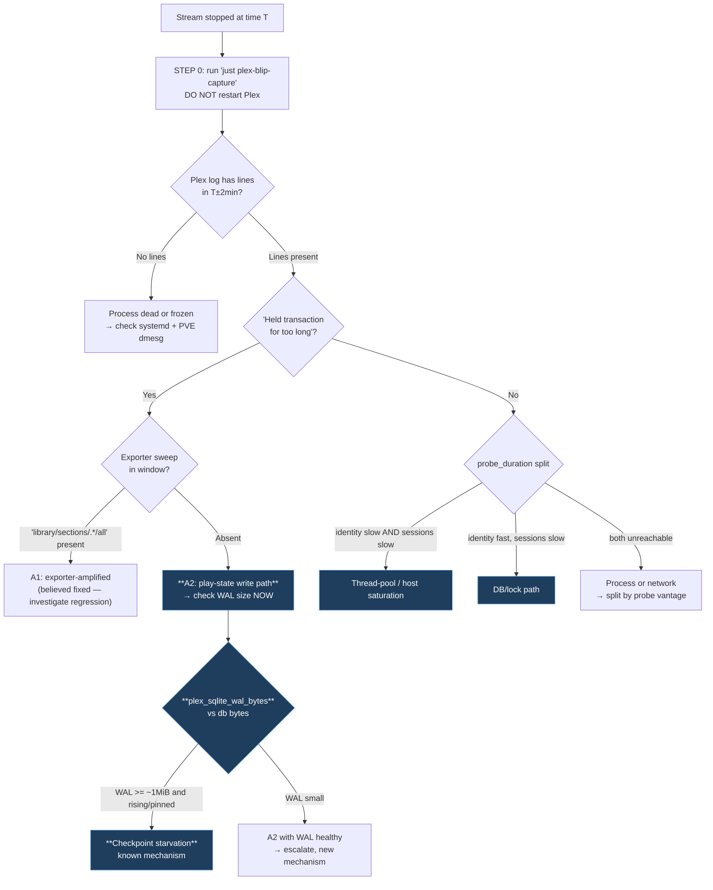

# Detailed Design — Manual Triage of a Mid-Stream Plex Blip, and the Instrumentation to Support It

**Status:** draft for review · **Date:** 2026-08-07 · **Project:** `2026-08-07-plex-blip-manual-triage`

This document is standalone. It restates everything needed to act on it, so it can
be read without opening the research notes — though those are cited throughout for
evidence.

---

## 1. Overview

### 1.1 The problem

Plex in this homelab suffers sporadic mid-stream blips: playback stalls, the server
becomes slow or unreachable for one to five minutes, and it recovers on its own. It
has happened repeatedly. A previous project (`2026-08-04-debug-plex-blip`) shipped a
diagnosis and remediation; **a worse blip occurred three days later**, and the
investigation behind this design established that the earlier work had identified an
*amplifier* rather than the *trigger*.

Two things are therefore needed, and this design covers both:

1. **A manual triage procedure** — what a human does, in what order, when a stream
   drops, using what exists today.
2. **An instrumentation plan** — what to fix and add so the next blip is diagnosable
   without guesswork.

### 1.2 What the investigation found

Four findings drive every design decision below.

**The existing watchdog's lock-holder probes have never worked.** Across 34
snapshots, `fuser` failed 34/34 (`psmisc` is not installed; the role installs
`sysstat`, `lsof`, `procps`, `sqlite3`). `lsof` succeeded in all 22 healthy snapshots
and **timed out in all 12 in-blip snapshots** against a hard `timeout=0.5`. The tool
captures lock-holder data exclusively when nothing is wrong.

**The SQLite WAL is pinned at 43× its checkpoint threshold.** `journal_mode=wal` is
correctly set, but `-wal` is **41.71 MiB** against a 40.9 MiB database, `freelist_count=0`,
and the file has been byte-for-byte identical across 42.5 hours of snapshots spanning
both blips. Plex has not been restarted in the entire retained log window.

**A guard exists that passes green while the fault is live.** The 2026-08-04 audit
asserts `journal_mode == 'wal'`. That assertion is *true*. It checks the wrong
property.

**Nothing tells anyone a blip happened.** No `rule_files`, no `alerting:` block, no
Alertmanager. Detection is a human noticing a paused stream — which is why every
investigation so far has started hours late, in the window where most evidence has
already decayed.

### 1.3 Design principles

| # | Principle | Why |
|---|---|---|
| P1 | **Fix what exists before adding what doesn't** | Two probes have never functioned; new exporters would not have helped |
| P2 | **Price every addition by load on Plex** | Monitoring caused the 2026-08-04 outage; the observer effect is real here |
| P3 | **Order by decay, not by importance** | Live lock state dies in seconds; dashboards keep for 15 days |
| P4 | **Convert perishable evidence into durable evidence** | So that arriving late stops being fatal |
| P5 | **A guard must assert the property that matters** | A green check over a live fault is worse than no check |
| P6 | **Never restart Plex to "fix" a blip before capturing** | tmpfs transcode dir, and a restart also resets the WAL state under investigation |

---

## 2. Detailed Requirements

Consolidated from [idea-honing.md](../idea-honing.md). Each traces to evidence
rather than to stated preference, because the honing phase was replaced by a live
investigation.

### 2.1 Functional — triage procedure

- **R1** Provide a manual procedure for a human when a stream drops mid-playback,
  using only telemetry that exists today.
- **R3** Order the procedure by **evidence decay**. Tier-0 state (lock holders,
  session list, thread states, kernel ring buffer) dies in seconds to minutes.
- **R4** Must not require restarting Plex as a first step (P6).
- **R5** Must distinguish *Plex was down* from *the exporter timed out* from *the
  proxy failed* — today's dashboard conflates all three under one `plex_up` panel.
- **R6** Must include the **banner-vs-restart** discriminator: a Plex version banner
  marks log rotation, not a restart. Confirm by checking whether request, thread and
  session IDs continue across the boundary.
- **R7** Must state that `dmesg` inside CT 110 returns **empty by design** (unprivileged
  LXC has no kernel ring buffer) and that kernel evidence comes from the PVE host. A
  blank result must not be read as "no errors".
- **R14** Must give different entry points for *during*, *minutes after*, *same day*,
  and *days later*.

### 2.2 Functional — instrumentation

- **R2** Deliver a gap analysis and instrumentation plan.
- **R9** Fix existing tools first (P1).
- **R10** Health probes must alert on **duration**, not only success — `/identity`
  returned HTTP 200 on every probe throughout a five-minute outage, worst case 1,761 ms,
  while `/status/sessions` reached 101,394 ms.
- **R11** Guards must assert the property that matters (P5).
- **R12** **WAL size** must become a first-class monitored signal — it is the leading
  indicator, and 42.5 hours of evidence for it already exist accidentally.
- **R13** Detection must not depend on a human noticing.
- **R15** The watchdog must capture **holder attribution**. `Held transaction for too
  long (<site>): N seconds` names the offending code site in plain text and is
  currently discarded by both tools. With `fuser` and `lsof` both failing, this log
  line is the **only working source of attribution**.

### 2.3 Non-functional

- **R8** Every addition priced by load imposed on Plex (P2).
- **R16** All read paths against the live database must be `sqlite3 -readonly`.
- **R17** New collection must survive an unprivileged LXC — no privileged operations,
  no host kernel access from inside CT 110.
- **R18** Changes must be expressed in the existing IaC (`ansible/`), not applied by
  hand, and must follow repo conventions (`just` targets, `docs/runbooks/`, shape tests).

### 2.4 Explicitly out of scope

Confirmed with the operator at design review:

- **Client-side / player-side evidence — out.** No Tautulli, no session history, no
  termination-reason tracking. Class G stays blind by decision, not by oversight. The
  runbook must therefore say plainly that "was another client affected at the same
  time?" is answerable only by asking a human.
- **Alertmanager and notification delivery — deferred.** See §4.7: alert *rules* still
  ship, so they evaluate and are visible in the Prometheus and Grafana UIs; only the
  push path is deferred.
- Fixing the root cause of the WAL pathology beyond the checkpoint experiment. This
  design makes the fault **visible and diagnosable**; a permanent fix depends on what
  the experiment shows.
- DAS redundancy. `DASPool` is a single USB vdev with no redundancy and a scrub that
  took 2 d 13 h. A real availability risk, but a separate project.
- A `zpool status` / SMART textfile script. The collector and directory are
  provisioned (C10); populating them waits until there is a reason — the DAS shows
  zero errors and no ZFS events since Jul 17.

---

## 3. Architecture Overview

### 3.1 Two deliverables, one evidence chain



Amber = repair of something that already exists and is broken. Blue = new.
The ordering is deliberate: **capture is fixed before detection is added**, because
an alert that fires into a broken capture path buys nothing.

### 3.2 Signal flow after the change



### 3.3 The triage decision tree

This is the logic the runbook encodes. Bold nodes are newly decidable as a result of
this design.



---

## 4. Components and Interfaces

### 4.1 C1 — Watchdog repair (`ansible/roles/plex/files/plex_blip_watchdog.py`)

The highest-value component, because it is already deployed and already running and
its two most important probes have never functioned.

**C1.1 — Install the missing dependency.** Add `psmisc` to the package list in
`ansible/roles/plex/tasks/main.yml:237-245`. This alone converts 34/34 `fuser`
failures into working captures.

**C1.2 — Make probes fail loudly and usefully.** Current behaviour swallows a missing
binary into a string and swallows a timeout into `[probe timeout exceeded]`, discarding
the one number that mattered. New contract for `_run_cmd`:

```python
def _run_cmd(cmd, timeout=2.0) -> dict:
    """Run a probe. ALWAYS returns status + elapsed_ms, never a bare string."""
    # -> {"status": "ok"|"timeout"|"missing"|"error",
    #     "elapsed_ms": float, "output": str|None, "error": str|None}
```

Three changes, each evidence-driven:

- **Default timeout 0.5 s → 2.0 s**, per-probe overridable. `lsof` exceeded 500 ms in
  12/12 in-blip snapshots; the probe was tuned for the healthy case.
- **Record `elapsed_ms` even on timeout.** `lsof` on the DB files crossing a threshold
  is itself a contention signal — currently thrown away.
- **Distinguish `missing` from `error`.** A missing binary is a deployment defect and
  must be visible as one, not as a runtime hiccup.

**C1.3 — Add the `TX_HELD` trigger.** `check_trigger` gains:

```python
# Holder-side: names the offending code site in its own text.
if "Held transaction for too long" in line_stripped:
    m = re.search(r"Held transaction for too long \(([^)]+)\):\s*([0-9.]+)\s+seconds", line_stripped)
    site = m.group(1) if m else None
    return {"event_type": "TX_HELD",
            "delay_ms": float(m.group(2)) * 1000.0 if m else None,
            "hold_site": site.rsplit("/", 1)[-1] if site else None,   # "StatisticsManager.cpp:288"
            "line": line_stripped}
```

Note carefully what this buys and what it does not. **It does not make the watchdog
fire earlier** — the `Completed: ≥500 ms` rule already fired 52 ms after the first
slow completion on 2026-08-07. It buys *attribution*: the event is classified as a
lock-hold rather than a generic `SLOW_QUERY`, and the holding site is recorded. With
`fuser` and `lsof` both failing during stalls, this line is the only working source of
holder identity.

**C1.4 — Capture SQLite WAL state in every snapshot.** Cheap (`os.stat`, no database
connection, no lock) and directly measures the leading indicator:

```python
def _wal_state(db_path) -> dict:
    # {"db_bytes":…, "wal_bytes":…, "shm_bytes":…, "wal_ratio": wal/db}
```

This turns an accidental discovery — the WAL size was only visible because `lsof`
happened to print the fd — into an intentional measurement.

**C1.5 — Extract the live-connection count.** Every `Request:`/`Completed:` line
carries `(N live)`. On 2026-08-07 it traced 5 → 10 → 11 → 12 → **13** → 7 → 3, a clean
saturation curve. Parse and record it; zero collection cost.

**C1.6 — Emit Prometheus textfile metrics.** See §5.2 for the schema. Atomic
write-to-temp-and-rename into the node-exporter textfile directory.

### 4.2 C2 — Analyzer repair (`scripts/analyze_plex_blips.py`)

`parse_log_line` has the identical regex gap at line 67. Mirror C1.3 and C1.5:

- Add `TX_HELD` as an event type with `hold_site`.
- Extract `(N live)`.
- Report **holders and waiters separately** in the summary. The current report shows
  "Total Lock Delay Duration 9450 ms" against requests that stalled 108,832 ms — an
  order-of-magnitude mismatch that reads as a contradiction until you realise it is
  measuring the ripple, not the stone. Reporting hold-time separately fixes that.
- Add a **WAL/session context header** when a matching watchdog JSONL is supplied.

### 4.3 C3 — Tier-0 capture (`scripts/plex_blip_capture.sh`, `just plex-blip-capture`)

Today a Tier-0 grab is roughly a dozen commands across two SSH hops, which in practice
means it never happens and the perishable evidence is always lost. One command, run
from the workstation, targeting both hosts:

| Group | What | Host | Why it is Tier 0 |
|---|---|---|---|
| Sessions | `GET /status/sessions`, `/activities` | CT 110 | in-memory, gone in seconds |
| Locks | `fuser -v`, `lsof` on `*.db*` | CT 110 | instantaneous state |
| Threads | `pidstat -tl`, `ps -eLo stat,wchan,comm` (D-state) | CT 110 | instantaneous |
| WAL | `ls -l` on `library.db*`, `sqlite3 -readonly PRAGMA` | CT 110 | changes continuously |
| Kernel | `dmesg -T` | **PVE host** | ring buffer, reboot-cleared (R7) |
| Storage | `zpool status`, `zpool events` | **PVE host** | ring-buffered |
| Logs | tail + rotated bundle | CT 110 | rotates under load |

Output: a timestamped directory the analyzer can consume directly.

```
/tmp/plex-blip-<UTC-ISO>/
├── manifest.json          # what ran, exit codes, elapsed_ms per command
├── ct110/{sessions.json,locks.txt,threads.txt,wal.txt,plex.log.tail}
└── pve/{dmesg.txt,zpool.txt}
```

**Interface contract:** read-only throughout; every `sqlite3` invocation uses
`-readonly` (R16); non-zero exits are recorded in `manifest.json` and never abort the
run — a partial capture is far better than none.

### 4.4 C4 — WAL health guard (Ansible)

Replace the existing audit, which asserts a true-but-irrelevant property (R11):

```yaml
- name: Audit Plex SQLite journal mode AND WAL size
  # journal_mode == wal  AND  wal_bytes < wal_max_bytes
  # Default plex_wal_max_bytes: 8388608 (8 MiB) — ~8x SQLite's 1 MiB
  # autocheckpoint default, generous enough not to flap, tight enough that
  # today's 41.71 MiB fails loudly.
```

The current runbook `docs/runbooks/plex-sqlite-maintenance.md` also needs correcting:
it states that WAL mode exists "to prevent transaction lock stalls (`TX_STALL`)". We
have now measured WAL mode enabled *and* TX_STALLs occurring. The claim must be
strengthened to "WAL mode is necessary but not sufficient; an unchecked WAL is itself
a stall mechanism."

### 4.5 C5 — node-exporter inside CT 110

Needed as the delivery mechanism for the textfile collector (C1.6), and independently
valuable: it closes the class-C blind spot (load average, D-state count, per-process,
disk I/O latency) with a time series and a baseline, rather than the watchdog's single
instant at trigger time.

Deployed by Ansible as a systemd unit with `Nice=10` / `CPUSchedulingPolicy=idle`,
mirroring the watchdog unit. Collectors that are meaningless in an unprivileged LXC are
disabled rather than fought (R17). New Prometheus job at 15 s.

### 4.6 C6 — blackbox-exporter probes

Two probes, because one is provably insufficient (R10):

| Probe | Target | Interval | Alert on |
|---|---|---|---|
| `plex-identity` | `http://192.168.1.110:32400/identity` | 15 s | `probe_duration_seconds > 0.5` for 1m, **and** `probe_success == 0` for 30s |
| `plex-sessions` | `http://192.168.1.110:32400/status/sessions` | 60 s | `probe_duration_seconds > 5` for 1m |
| `plex-proxied` | `https://plex.{{ domain }}/identity` | 15 s | differential vs `plex-identity` |

`/identity` is unauthenticated (it is Plex's own container healthcheck endpoint) and
does no database work, so 15 s polling costs Plex essentially nothing (R8).
`/status/sessions` does touch session state and **requires a token** — sourced from the
existing vault entry, never inlined.

The **differential** is the diagnosis:

| `identity` | `sessions` | `proxied` | Reading |
|---|---|---|---|
| fast | slow | fast | database / lock path — the A2 signature |
| slow | slow | slow | thread-pool or host saturation |
| fast | fast | slow/down | Traefik, TLS, or the tunnel |
| down | down | down | process or network |

**Stated limitation:** probes from the Docker host are not real LAN-client
measurements — `.111 → .110` is a virtual-bridge hop. These measure *reachability and
path differentiation*, not client-experienced latency, and must not be presented as
the latter.

### 4.7 C7 — Alert rules (Alertmanager deferred)

**Operator decision at review: defer Alertmanager.** The design splits accordingly:

| Ships now | Deferred |
|---|---|
| `rule_files:` in `prometheus.yml.j2` | `alerting:` block |
| The rule definitions in §5.3 | Alertmanager service in `compose.yml.j2` |
| Rules visible/firing in Prometheus → Alerts, and in Grafana's alert list | Receiver choice, routing, silences |

This split is deliberate rather than a consolation. The rules still **evaluate**, so
`PlexSqliteWalOversized` firing against today's 41.71 MiB WAL is exactly the
validation the §7.3 experiment needs — and that works with no receiver at all. What
is deferred is *push delivery*, which is what needs the operator decision (Telegram
is unwired in this repo; ntfy, webhook, email, and the existing uptime-kuma push
endpoint are the candidates).

**Consequence to state honestly:** until Alertmanager lands, **R13 is only partly
met.** Detection improves from "a human noticed a paused stream" to "a human who
opens Prometheus or Grafana sees a firing rule" — better, but still pull rather than
push. The runbook must say so, and adding the receiver later is a small, isolated
change against rules that are already proven to fire.

### 4.8 C8 — Grafana "Blip Triage" dashboard

Panels laid out in decision-tree order so the runbook can say "open this, read top to
bottom":

1. `up{job=~"plex-exporter|blackbox.*"}` **beside** `plex_up` — resolves the R5
   ambiguity that the current single-panel "heartbeat" hides
2. `probe_duration_seconds` for all three probes on one axis — the differential of §4.6
3. **`plex_sqlite_wal_bytes` and `wal/db` ratio** — the leading indicator (R12)
4. `plex_watchdog_events_total` by `event_type`, including `TX_HELD`
5. `plex_watchdog_hold_seconds_max` by `hold_site`
6. `plex_live_connections` — the saturation curve
7. Traefik rate/latency re-windowed from `[5m]` to `[1m]` — a 34 s stall inside a 5 m
   window is diluted roughly tenfold
8. CT 110 load average and D-state count (new from C5)

### 4.9 C10 — PVE host telemetry

Researched separately in
[pve-host-telemetry-options.md](../research/pve-host-telemetry-options.md); the
findings that decided it:

- Proxmox staff explicitly endorse `node_exporter` on the host.
- Proxmox's own External Metric Server supports Graphite / InfluxDB / OpenTelemetry
  — **not Prometheus** — and carries no signal `pve-exporter` doesn't already give us.
- `pve-exporter`'s complete collector set contains **no ZFS health, no SMART, and no
  disk I/O latency**. The gap cannot be closed by reconfiguration.
- **The Plex database is on `pve-root`, not the DAS.** With `FSYNCS/SECOND: 385`
  against a 42,000-frame checkpoint, `pve-root` I/O latency is a live suspect in the
  open root cause — not a speculative gap.

**C10.1 — `node_exporter` via the Debian package.** *Operator decision at review:*
`prometheus-node-exporter` from **Debian main** rather than a pinned static binary.
The trade, recorded plainly: the package receives security updates automatically,
which the static binary would not; in exchange it enters the host's apt dependency
graph and upgrades on Debian's schedule rather than ours. Debian main is not a
third-party repository, so the dependency-conflict warnings that circulate about
Proxmox host customisation largely do not apply. `apt-mark hold` is available if
version control is ever wanted back.

Configuration is unchanged by the packaging choice — a restricted collector set,
consistent with **P2**:

```
--collector.disable-defaults
--collector.diskstats     # node_disk_*_time_seconds_total  ← the WAL/fsync series
--collector.zfs           # DASPool
--collector.filesystem
--collector.pressure      # PSI — cleanest I/O-starvation signal
--collector.loadavg --collector.meminfo --collector.cpu
--collector.textfile --collector.textfile.directory=/var/lib/node_exporter/textfile
--web.listen-address=192.168.1.50:9100
```

Deployed by a new `ansible/roles/pve_host/` role. Bound to the LAN IP and restricted
to `192.168.1.111` in the PVE firewall. Note the Debian package ships its own
`prometheus-node-exporter.service`; the role overrides `ARGS` via
`/etc/default/prometheus-node-exporter` rather than replacing the unit, so package
upgrades do not clobber our configuration.

**C10.2 — Persistent journald.** `Storage=persistent` in
`/etc/systemd/journald.conf` on the PVE host. A config toggle, no package, no daemon.
Makes `journalctl -k` survive reboots, closing the ring-buffer decay hazard that
currently makes OOM kills and USB/SCSI errors undecidable more than an hour after the
fact (R7). Cheapest single item in this design.

**C10.3 — Prometheus job** for the new target at 15 s.

### 4.10 C9 — The runbook (`docs/runbooks/plex-blip-triage.md`)

The human-facing deliverable. Structure:

- **§0 Stop.** Do not restart Plex. Run `just plex-blip-capture` first (P6, R4).
- **§1 Bound the window.** From the Plex log, not from `plex_up` — the latter is
  sampled at 60 s and can miss a sub-minute blip entirely.
- **§2 Establish the event is real.** The `up` vs `plex_up` vs probe 2×2 (R5).
- **§3 Walk the decision tree** (§3.3 above).
- **§4 Traps.** Banner ≠ restart (R6); empty `dmesg` in CT 110 ≠ no errors (R7); a
  `STREAM_DROP` at exactly 180 s idle is a normal timeout, not a fault; Traefik cannot
  see direct `:32400` connections.
- **§5 Arrival-time entry points** (R14) — during / +minutes / same-day / days-later,
  with an honest statement of what is already undecidable at each.
- **§6 Escalation.** What to capture when the tree terminates in "unknown".

---

## 5. Data Models

### 5.1 Watchdog JSONL (extended)

Existing keys retained for backward compatibility with the current 448 KB of captures;
new keys additive.

```jsonc
{
  "timestamp": "2026-08-07T06:37:25.389",
  "trigger_event": "TX_HELD",           // + TX_STALL | SLOW_QUERY | STREAM_DROP | CONNECTIVITY_DROP
  "delay_ms": 540.0,
  "hold_site": "StatisticsManager.cpp:288",   // NEW — holder attribution (C1.3)
  "trigger_line": "...",
  "live_connections": 10,                      // NEW (C1.5)
  "sqlite": {                                  // NEW (C1.4)
    "db_bytes": 42834944, "wal_bytes": 43735168,
    "shm_bytes": 360448,  "wal_ratio": 1.02
  },
  "lock_holders": {                            // CHANGED — structured, not bare strings
    "fuser":  {"status": "ok",      "elapsed_ms": 31.2,   "output": "..."},
    "lsof":   {"status": "timeout", "elapsed_ms": 2000.0, "output": null}
  },
  "process_traces": { "pidstat": {"status": "ok", "elapsed_ms": 118.7, "output": "..."} },
  "sysstat_metrics": { "fd_count": 129 },
  "dry_run": false
}
```

The `lock_holders` shape change is the important one: `{"status", "elapsed_ms",
"output"}` makes "the probe timed out after 2 s" a *measurement* rather than a lost
observation.

### 5.2 Prometheus textfile metrics (`plex_blip.prom`)

```
# HELP plex_sqlite_wal_bytes Size of the SQLite WAL file.
# TYPE plex_sqlite_wal_bytes gauge
plex_sqlite_wal_bytes 43735168
plex_sqlite_db_bytes 42834944
plex_sqlite_shm_bytes 360448

# HELP plex_watchdog_events_total Watchdog trigger events by type since start.
# TYPE plex_watchdog_events_total counter
plex_watchdog_events_total{event_type="TX_HELD"} 42
plex_watchdog_events_total{event_type="TX_STALL"} 32
plex_watchdog_events_total{event_type="SLOW_QUERY"} 49
plex_watchdog_events_total{event_type="STREAM_DROP"} 8

# HELP plex_watchdog_hold_seconds_max Longest transaction hold observed, by site.
# TYPE plex_watchdog_hold_seconds_max gauge
plex_watchdog_hold_seconds_max{hold_site="MetadataItemSetting.cpp:459"} 2.51

# HELP plex_watchdog_probe_duration_seconds Duration of the last diagnostic probe.
# TYPE plex_watchdog_probe_duration_seconds gauge
plex_watchdog_probe_duration_seconds{probe="lsof"} 2.0
plex_watchdog_probe_status{probe="fuser"} 1          # 1=ok 0=missing/error/timeout

plex_live_connections 13
```

`plex_watchdog_probe_status{probe="fuser"} == 0` would have surfaced the missing-`psmisc`
defect on day one instead of at 34 failures.

### 5.3 Alert rules

```yaml
groups:
  - name: plex-blip
    rules:
      - alert: PlexProbeSlow                     # catches what probe_success misses (R10)
        expr: probe_duration_seconds{job="blackbox-plex-identity"} > 0.5
        for: 1m
      - alert: PlexSessionsProbeStalled
        expr: probe_duration_seconds{job="blackbox-plex-sessions"} > 5
        for: 1m
      - alert: PlexUnreachable
        expr: probe_success{job=~"blackbox-plex.*"} == 0
        for: 30s
      - alert: PlexExporterScrapeFailing          # explicitly NOT "Plex is down" (R5)
        expr: up{job="plex-exporter"} == 0
        for: 2m
      - alert: PlexSqliteWalOversized             # the leading indicator (R12)
        expr: plex_sqlite_wal_bytes > 8388608
        for: 15m
      - alert: PlexTransactionHoldStorm
        expr: increase(plex_watchdog_events_total{event_type="TX_HELD"}[5m]) > 3
      - alert: PlexWatchdogProbeBroken            # the meta-guard (P5)
        expr: plex_watchdog_probe_status == 0
        for: 10m
```

`PlexWatchdogProbeBroken` is deliberate: the whole reason this project exists in its
current shape is that a diagnostic tool failed silently for days. The monitoring must
monitor itself.

### 5.4 Capture bundle

`manifest.json` per §4.3, with `{command, host, exit_code, elapsed_ms, output_file}`
per entry — so a partial capture is self-describing.

---

## 6. Error Handling

| Condition | Behaviour | Rationale |
|---|---|---|
| Probe binary missing | `status:"missing"`, `plex_watchdog_probe_status 0`, alert after 10m | The 34/34 `fuser` failure must never recur silently |
| Probe times out | `status:"timeout"` **with `elapsed_ms` recorded**; snapshot still written | The duration is itself the signal |
| SQLite file absent / unreadable | `sqlite` block omitted, snapshot still written | Never let a nice-to-have abort the capture |
| Plex log rotated mid-tail | Existing inotify rotation handling retained (already correct) | Works today |
| Textfile write fails | Log to journald, continue; JSONL is the source of truth | Metrics are derived, not primary |
| Capture: one host unreachable | Record in `manifest.json`, continue with the other | Half a Tier-0 capture beats none |
| WAL guard fails in Ansible | **Fail the play** with current vs threshold bytes | R11 — a guard that warns is a guard that gets ignored |
| Blackbox probe times out | `probe_success 0` + `probe_duration_seconds` at timeout | Both facts matter |
| Alertmanager receiver unset | Play fails at config validation | Better than alerts into a void |

**Explicit non-goal:** the watchdog must never attempt remediation. It observes and
records. Given that a monitoring component caused the 2026-08-04 outage, a watchdog
that acts is a strictly worse object than one that reports.

---

## 7. Testing Strategy

The repo's convention is pytest shape tests beside the scripts
(`scripts/test_*.py`), and this design keeps to it (R18).

### 7.1 The decisive advantage: real fixtures

We hold **92 MB of real logs across both blip windows** and **448 KB of real watchdog
snapshots**. Every parser change can be tested against data that actually produced the
fault, rather than against invented strings.

| Test | Fixture | Asserts |
|---|---|---|
| `TX_HELD` matches | real 06:37:33.273 line | event type, `delay_ms == 540.0`, `hold_site == "StatisticsManager.cpp:288"` |
| Regression: old triggers | real `Took too long` line | still `TX_STALL`, unchanged |
| Live-connection parse | real `(13 live)` line | `live_connections == 13` |
| Analyzer holder/waiter split | 08-07 log slice | holders and waiters reported separately |
| WAL state | tmp files of known size | `wal_ratio` arithmetic |
| Probe timeout | a `sleep 5` command, `timeout=2` | `status=="timeout"` **and** `elapsed_ms ≈ 2000` |
| Probe missing | a nonexistent binary | `status=="missing"`, distinct from `"error"` |
| Textfile format | golden file | valid exposition format; parses with `prometheus_client` |
| WAL guard fails loudly | 41.71 MiB WAL | Ansible task **fails**, message names both numbers |
| WAL guard passes | 2 MiB WAL | task succeeds |

The WAL-guard pair is the one that encodes the lesson: **assert that today's known-bad
value fails the check.** A guard is only proven by watching it go red.

### 7.2 Integration

- `just test` runs the suites; `just play` deploys; the WAL guard runs in-play (R18).
- **Idempotence:** a second `just play` must report no changes.
- **Capture smoke test:** `just plex-blip-capture` against a healthy system must
  produce a complete bundle with all exit codes zero — which would have caught the
  missing `psmisc` immediately.

### 7.3 The end-to-end validation

The design is validated by the checkpoint experiment, not by unit tests:

1. Deploy C1–C4. Confirm `plex_sqlite_wal_bytes ≈ 43,735,168` and
   `PlexSqliteWalOversized` **fires** — proving the alert works against a known-live fault.
2. Checkpoint the WAL (`PRAGMA wal_checkpoint(TRUNCATE)` or a clean Plex restart).
3. Confirm `plex_sqlite_wal_bytes` drops to near zero and the alert clears.
4. Stream for an evening. Count `TX_HELD` events.

**Zero `TX_HELD` events confirms the mechanism.** A recurrence with a small WAL means
the WAL was a symptom of something further upstream — most likely a long-lived reader
preventing checkpoint reset, which `PRAGMA wal_checkpoint(PASSIVE)` return values would
then expose.

Either outcome is informative, which is the property a good experiment needs.

---

## 8. Implementation Sequencing (summary — detail in `implementation/plan.md`)

Ordered so each step is independently demoable and the cheapest high-value work lands
first.

| Step | Delivers | Demo |
|---|---|---|
| 1 | `psmisc` + probe contract (C1.1, C1.2) | `fuser` output appears in a live snapshot for the first time |
| 2 | `TX_HELD` + live-connections, watchdog and analyzer (C1.3, C1.5, C2) | Re-analysing the 08-07 log names `StatisticsManager.cpp:288` |
| 3 | WAL capture + guard + runbook correction (C1.4, C4) | Guard **fails** against today's 41.71 MiB WAL |
| 4 | node-exporter in CT 110 + textfile metrics (C5, C1.6) | `plex_sqlite_wal_bytes` graphed in Grafana |
| 5 | blackbox probes + retention (C6) | `/identity` vs `/status/sessions` differential visible |
| 6 | PVE host: journald + node-exporter (C10) | `node_disk_*` for `pve-root` graphed; `journalctl -k` survives a reboot |
| 7 | Alert rules, no Alertmanager (C7) | `PlexSqliteWalOversized` shows **firing** in Prometheus → Alerts |
| 8 | Capture script + `just` target (C3) | One command produces a full bundle |
| 9 | Blip Triage dashboard + runbook (C8, C9) | Walk the tree end-to-end against the 08-07 event |
| 10 | Checkpoint experiment (§7.3) | WAL drops; `TX_HELD` rate measured before/after |

Steps 1–3 need no new infrastructure and would each have materially changed the
2026-08-07 investigation.

Step 6 is sequenced after the Plex-side work deliberately: it is the only step that
modifies the hypervisor, and it should land once the cheaper in-container signals
have been observed — so that if `pve-root` latency turns out to be uninteresting, the
host change can be reverted having cost nothing else.

---

## 9. Appendices

### 9.1 Technology choices

| Choice | Alternatives | Why |
|---|---|---|
| **node-exporter textfile collector** for watchdog metrics | pushgateway; custom exporter; statsd | No new network surface, no daemon in CT 110 beyond node-exporter, atomic file semantics, and node-exporter is wanted anyway for class C |
| **blackbox-exporter** | extend `plex-exporter`; uptime-kuma only | `plex-exporter` already caused an outage by doing work inside a scrape (P2). blackbox is purpose-built, multi-target, and does nothing but probe |
| **`/identity` + `/status/sessions` pair** | `/identity` alone | Measured: `/identity` returned 200 throughout a 5-minute outage. One probe is provably insufficient (R10) |
| **Alertmanager** | Grafana alerting; uptime-kuma notifications | Prometheus already holds the data; Grafana alerting would couple detection to the dashboard layer |
| **`sqlite3 -readonly`** | plain `sqlite3`; Python `sqlite3` | We are investigating lock contention; adding a writer would be self-defeating (R16) |
| **Keep JSONL as forensic store** | ship everything to Prometheus | High-cardinality text (`lsof` output) does not belong in a TSDB. Counters index; JSONL details |
| **Defer Loki** | deploy now | Makes existing signals convenient but decides no new failure class. Make signals exist first |
| **Defer Tautulli** | deploy now | Closes the client-side blind spot but adds a second continuous API poller to a server with demonstrated contention (R8) |

### 9.2 Research findings that determined the design

| Finding | Design consequence |
|---|---|
| `fuser` failed 34/34 — `psmisc` not installed | C1.1, and `PlexWatchdogProbeBroken` so it cannot recur silently |
| `lsof` timed out 12/12 in-blip, 0/22 healthy | C1.2 — raise timeout, record `elapsed_ms`; the duration is a signal |
| WAL 41.71 MiB vs 40.9 MiB DB, frozen 42.5 h | C1.4, C4, `PlexSqliteWalOversized`, §7.3 experiment |
| `freelist_count = 0` | DB is not bloated — VACUUM is not the answer; the WAL is |
| WAL audit asserts mode, passes green | C4 rewrite; runbook correction (R11) |
| `/identity` 200 throughout a 5-min outage | C6 two-probe design; alert on duration (R10) |
| Exporter sweep absent from the 08-07 window | Class A split A1/A2; A1 remediation confirmed working |
| `Held transaction` matched by neither tool | C1.3, C2 — the only working attribution source |
| Watchdog fired in 52 ms, not 49 s late | The `TX_HELD` value is attribution, not latency — stated plainly so nobody re-derives the wrong justification |
| Items 377/378 structurally identical | Item hypothesis retired; the escalating variable is time/WAL |
| `dmesg` empty inside CT 110 | Capture must target the PVE host (R7); runbook trap |
| `(N live)` 5→13→3, never extracted | C1.5 — free leading indicator |
| Traefik has no `accessLog`, and LAN clients bypass it anyway | Access log demoted below probes; its limitation stated rather than hidden |
| `FSYNCS/SECOND: 385` on pve-root | Contributing factor to checkpoint starvation; noted, not acted on |
| `DASPool` single USB vdev, 2 d 13 h scrub | Out of scope; raised as a separate availability risk |

### 9.3 Alternative approaches considered and rejected

**Restart Plex on a schedule to keep the WAL small.** Would likely suppress the
symptom. Rejected: it destroys evidence (P6), masks the mechanism, and treats a
diagnosable fault as a cron job. Revisit only if §7.3 shows the WAL regrows and no
upstream cause is findable.

**`VACUUM` the database.** `freelist_count = 0` — there is nothing to reclaim. This
would have been the intuitive move and the measurement says it is pointless.

**Replay item 377 then 378 to isolate an item-scoped fault.** Proposed during research,
retired once the database showed the two items are structurally identical. Recorded
because the reasoning that killed it is reusable.

**Blame the watchdog as the new amplifier.** The leading hypothesis for a while, and a
tempting narrative given 2026-08-04. Refuted by a natural experiment in the logs: item
377 played 2 h 17 min *after* the watchdog deployed, 1,617 timeline requests, zero
`Held transaction` events.

**Deploy Loki/Promtail first.** Rejected on ordering (P1): it would have made the
broken `fuser` output beautifully queryable without making it exist.

**Ship alerting before fixing capture.** Rejected on ordering: an alert firing into a
capture path where the two most important probes fail produces a page and no evidence.

### 9.4 Key constraints

- **Unprivileged LXC:** no kernel ring buffer, no privileged operations from inside
  CT 110 (R17). Kernel and storage evidence come from the PVE host.
- **Avoid bare-metal hypervisor modification** (established by prior work). Persistent
  journald on the PVE host is a config toggle and in bounds; installing node-exporter
  there needs an explicit operator decision.
- **Probes from `.111` are not LAN-client measurements** — `.111 → .110` is a
  virtual-bridge hop.
- **Prometheus retention is 15 d today** (no flag set). Sporadic-fault correlation
  needs more; 90 d proposed.
- **Traefik never sees direct `:32400` connections**, which is how the affected client
  connected on 2026-08-07.
- **The notification receiver is unresolved** and is the one genuine operator decision
  blocking C7.

---

## 10. Review Decisions

All five open questions were resolved at design review on 2026-08-07.

| # | Question | Decision | Effect |
|---|---|---|---|
| 1 | Alertmanager receiver? | **Defer Alertmanager.** Ship `rule_files` only | §4.7 split; R13 partly met and said so |
| 2 | node-exporter on the PVE host? | **Yes — Debian package** (`prometheus-node-exporter`), after further research | C10; research in [pve-host-telemetry-options.md](../research/pve-host-telemetry-options.md) |
| 3 | Checkpoint the WAL now or after? | **After** C1–C4 land | §7.3 experiment stands as written; alert validated against a live fault |
| 4 | WAL threshold 8 MiB? | **Confirmed** | `plex_wal_max_bytes: 8388608` |
| 5 | Pull anything back into scope? | **No — client-side stays out** | §2.4; class G blind by decision |

### Remaining open items (not blocking)

- **Notification receiver**, whenever Alertmanager is picked up. Candidates unchanged:
  ntfy, generic webhook, email, uptime-kuma push. Telegram is unwired in this repo.
- **`zpool status` / SMART textfile script.** Collector and directory provisioned by
  C10; populate when there is a reason.
- **What the checkpoint experiment shows.** If `TX_HELD` recurs with a small WAL, the
  next investigation is a long-lived reader blocking checkpoint reset — visible via
  `PRAGMA wal_checkpoint(PASSIVE)` return values.
- **DAS redundancy.** Single USB vdev, 2 d 13 h scrub. Separate project.
