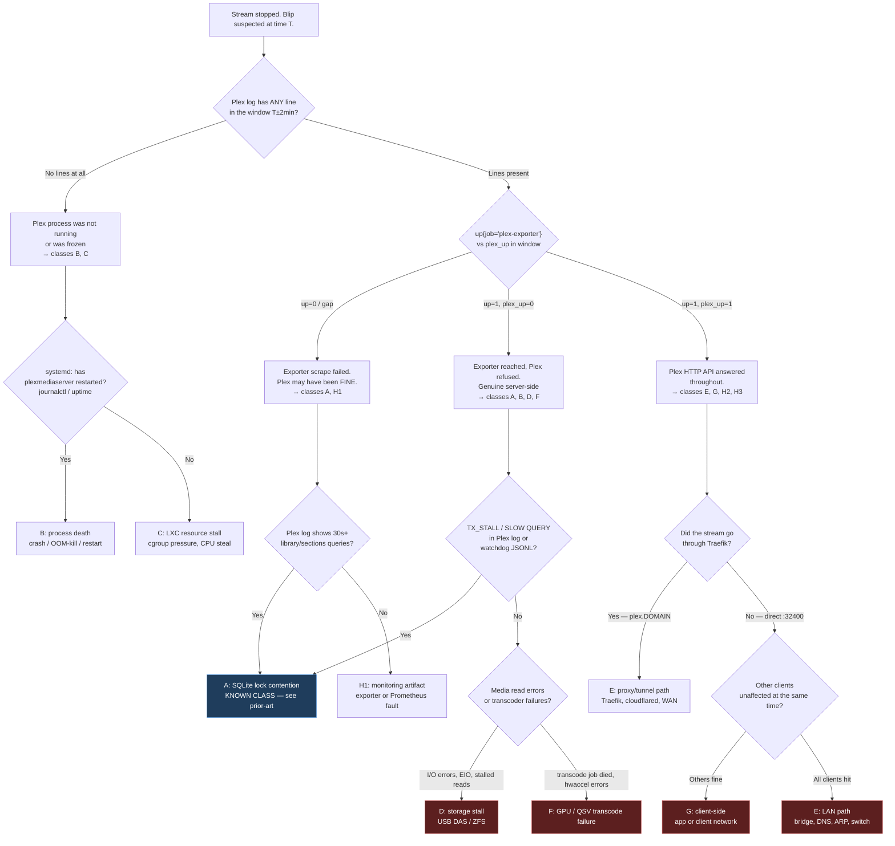
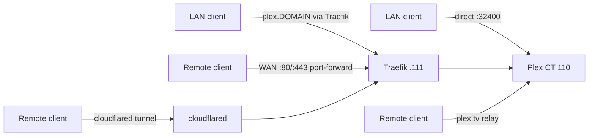

# Research: Blip Taxonomy & Discriminators

**Purpose:** enumerate the failure classes that can present as "the stream stopped
and Plex was unreachable for a bit", and for each one name the *discriminating*
observation — the single check that rules it in or out. This is the raw material
for the triage decision tree in the design.

A discriminator is only useful if the observation it needs actually exists. Each
class below is therefore tagged:

- **[decidable]** — current telemetry can settle it today.
- **[partial]** — current telemetry gives a hint, but cannot confirm.
- **[blind]** — nothing in the homelab can currently distinguish this. These drive
  [instrumentation-gaps.md](instrumentation-gaps.md).

---

## The core problem: "uptime blip" is an inference, not an observation

Nothing in this homelab observes "Plex uptime" directly. What exists is:

- `plex_up` — one exporter's opinion, sampled every 60s
- an uptime-kuma monitor — an HTTP check on its own schedule, in its own database
- a human watching a stream stop

These three can disagree, and each can be wrong in a different direction. The first
job of triage is therefore not "why did Plex go down" but **"did Plex go down, and
over what interval"** — establishing that the event is real and bounding it in time.
Only then does cause-hunting make sense. Classes **H1–H3** below exist precisely
because that first step often fails.

---

## Decision tree

Classes in red are ones the current telemetry **cannot presently reach a verdict
on**. Note how much of the tree that is: the entire right-hand branch past
"Plex answered fine" terminates in blind or partial classes.

---

## Class A — SQLite lock contention

> **Split into A1 / A2 on 2026-08-07.** A fresh blip that day recurred *with the
> exporter sweep provably absent*, which means the class as originally written
> conflated an amplifier with a trigger. See
> [live-blip-2026-08-07-case-study.md](live-blip-2026-08-07-case-study.md).
>
> - **A1 — exporter-amplified contention.** The 2026-08-04 mechanism. The
>   `METRICS_MEDIA_COLLECTING_INTERVAL_SECONDS=1800` remediation **is working**:
>   sweeps now run on a clean 31-minute cadence and none occurred in the
>   2026-08-07 window. Treat A1 as closed unless a sweep is observed in-window.
> - **A2 — play-state write path stalls on its own.** *Live and unexplained.*
>   Ordinary timeline/play-progress writes at
>   `Library/MetadataItemSetting.cpp:409/459` and
>   `Statistics/StatisticsManager.cpp:288` held transactions for up to **2.51 s**
>   with a single playing client and no scheduled task running, cascading into
>   108-second request queues.
>
> **The discriminator between them is one grep:** `library/sections/.*/all` from
> the exporter's IP inside the window. Present ⇒ A1. Absent ⇒ A2.
>
> **The discriminator *for* A2 is `Held transaction for too long`** — the holder's
> view, which names the offending code site in its own text. Note that **neither
> the watchdog nor the analyzer currently matches this line**, and on 2026-08-07 it
> preceded the first matched line by **49 seconds**.

**[decidable]** — this is the one class the homelab is fully instrumented for,
because it is the class that was already chased down.

**Mechanism** (established 2026-08-04): a writer holds an exclusive SQLite lock on
`com.plexapp.plugins.library.db`; reads queue behind it; `plex-exporter`'s
synchronous `GET /library/sections/<key>/all` sweep piles on; client timeline
updates stall past Plex's 180s idle threshold; Plex terminates the session and
`SIGKILL`s the transcoder job.

**Discriminators, in order of strength:**

1. Plex log contains `Took too long (N seconds) to start a transaction` in the
   window → lock contention is present.
2. Plex log contains `SLOW QUERY: It took N ms` or `Completed: ... GET
   /library/sections/<key>/all ... N ms` with N ≫ 1000 → reads are queued.
3. A `plex_blip_diagnostics_*.jsonl` snapshot exists for the window, and its
   `fuser`/`lsof` output names more than one process holding the `.db` file.
4. `Shutting down idle session ... (idle time is 180 seconds)` followed by
   `Signalling job ID N with 9` → confirms the stream death is *downstream* of the
   stall, not an independent event.

**Ruling it out:** absence of `TX_STALL` *and* absence of any `Completed:` line
over ~1s in the window. If the log is quiet, this class is out.

**Caveat:** the 2026-08-04 remediation (`METRICS_MEDIA_COLLECTING_INTERVAL_SECONDS=1800`,
`scrape_interval: 60s` / `scrape_timeout: 50s`, WAL audit) was designed to break
the amplification loop, not the underlying contention. A recurrence *after* that
remediation is a genuinely new datapoint and should be treated as such — it means
the sweep was the amplifier, not the trigger.

---

## Class B — Plex process death or restart

**[partial]** — decidable by SSH, not by any dashboard.

**Mechanism:** the `Plex Media Server` process crashes, is OOM-killed by the LXC's
memory cgroup, or is restarted (by an update, by Ansible, by systemd).

**Discriminators:**

1. `systemctl show plexmediaserver -p ActiveEnterTimestamp` — a start timestamp
   inside the blip window is conclusive.
2. `journalctl -u plexmediaserver --since ...` — look for the unit's stop/start
   pair and any `Main process exited` line.
3. `dmesg` / `journalctl -k` for `Out of memory: Killed process ... Plex Media
   Server` — an OOM kill inside an unprivileged LXC is logged on the **PVE host**,
   not necessarily inside the container, so check both.
4. The Plex log itself: a fresh startup banner (`Starting Plex Media Server`) in
   the window.
5. Corroborating metric: `pve_memory_usage_bytes{id="lxc/110"}` approaching
   `pve_memory_size_bytes{id="lxc/110"}` immediately before T — at 15s resolution
   this is fast enough to catch a memory ramp.

**Why it's only [partial]:** there is no metric for "Plex process start time". A
restart is invisible in Grafana; `plex_up` may not even register a 0 if the restart
completes inside the 60s scrape gap. **`plex_info`'s presence/absence is the closest
proxy and is not currently panelled.**

---

## Class C — LXC-level resource stall

**[partial]**

**Mechanism:** CT 110 is starved — CPU steal from a noisy neighbour on the PVE
node, cgroup CPU throttling, memory pressure causing reclaim stalls, or blocked I/O
pinning the container's tasks in `D` state. Plex is running but not being scheduled.

**Discriminators:**

1. `pve_cpu_usage_ratio{id="lxc/110"}` at 15s — but note the 2026-08-04 event
   showed only a *mild* rise to ~30%, so a low CPU number does **not** rule this
   out. High CPU on the PVE node overall (`pve_cpu_usage_ratio` for the node id)
   with low CT 110 CPU is the more telling shape: the container wanted CPU and
   didn't get it.
2. `pve_memory_usage_bytes{id="lxc/110"}` at 15s.
3. In-container load average and `D`-state process count — **not collected**. This
   is the specific hole that makes the class only partial: the classic signature
   (load average spiking while CPU stays low) is exactly what no current metric can
   show.
4. Watchdog `pidstat -tl` snapshot, *if* a trigger fired — gives per-thread state at
   one instant.

---

## Class D — Media storage stall (USB DAS / ZFS)

**[blind]**

**Mechanism:** the media bind mounts (USB-attached DAS, ZFS — see
`docs/runbooks/{das-zfs-migration,usb-media-mounts}.md`) hiccup. A USB reset, a ZFS
scrub, a disk retrying a bad sector. Reads stall; the transcoder starves; Plex's
own DB may also stall if it shares the path.

**Why blind:** there is no storage telemetry for the media path at all.
`node-exporter` runs on the Docker host (`.111`), which does not have these mounts.
`pve-exporter` reports guest disk *usage*, not I/O latency or error counts. Nothing
watches ZFS pool state, USB resets, or SCSI errors.

**Best available proxies today:**

1. `dmesg` on the **PVE host** for `usb ... reset`, `I/O error`, `blk_update_request`.
2. `zpool status` / `zpool events` on the PVE host.
3. Plex log for read failures or transcoder input errors in the window.
4. A `TX_STALL` with a *low* delay but a *long* `Completed:` time is weakly
   suggestive of storage rather than lock contention — the transaction started
   fine, the read didn't finish.

All four are manual, host-side, and none are retained. **Nothing here survives a
reboot or is queryable after the fact.**

---

## Class E — Network path

**[partial]** for the proxied path, **[blind]** for the direct and relay paths.

There are at least four distinct paths a Plex stream can take here, and they fail
independently:

**Discriminators:**

1. **Did it go through Traefik at all?** `traefik_service_requests_total{service="plex@file"}`
   continuing to increment through the window proves the proxy path was alive. If
   the affected stream was direct-to-`:32400`, Traefik metrics are irrelevant to it
   — a common and expensive mistake in triage.
2. Plex log: `We appear to have lost Internet connectivity` or `Failed to retrieve
   relay host key` → Plex's own view of its outbound connectivity failed. Note the
   2026-08-04 finding that these lines were a *consequence* of thread exhaustion,
   not a cause — so they are suggestive, never conclusive.
3. `rate(pve_network_receive_bytes_total{id="lxc/110"}[1m])` dropping to zero at 15s
   resolution → traffic genuinely stopped reaching the container.
4. Traefik status-code breakdown — a burst of `5xx` (especially `502`/`504`) at the
   edge means Traefik reached for Plex and failed; *no* new status codes at all
   means requests were hanging, not failing.

**Why partial/blind:** no access log means no per-request forensics (§3 of the
inventory). No synthetic probe means no independent measurement of any path's
reachability. The relay path is entirely outside our observation. And the LAN
direct path — statistically the most-used one for a home server — is completely
uninstrumented.

**Prior finding worth carrying forward:** a "LAN" vantage measured from the dev box
is not a LAN client. `.60 → .110` is 0.046 ms of virtual bridge; real LAN client
behaviour must be captured from an actual wifi client. The same caution applies to
any probe we add.

---

## Class F — GPU / QSV transcode failure

**[blind]**

**Mechanism:** Intel QSV (iHD) hardware transcoding via `/dev/dri` passthrough into
the unprivileged LXC fails — driver fault, device permission/ID-mapping regression,
GPU hang. The transcode dies; the stream stops. Plex's HTTP API stays perfectly
healthy throughout, which is why this class sits on the "Plex answered fine" branch
of the tree and is easily misattributed to the network.

**Discriminators:**

1. `plex_video_transcode_sessions_count` dropping while `plex_sessions_count`
   holds, or both dropping together with `plex_up=1` — at 60s, so only for blips
   longer than a minute.
2. Plex transcoder logs on CT 110 for hwaccel initialisation errors.
3. `scripts/verify_plex_ihd_cvt.py` exists in-repo and verifies the iHD/QSV path —
   useful as an *after the fact* "is it working now" check, not as a record of what
   happened at T.
4. `ls -l /dev/dri` inside CT 110 for the ID-mapped device nodes.

**Why blind:** no GPU telemetry whatsoever. No `intel_gpu_top` exporter, no
per-transcode success/failure counter. A direct-play stream and a failed-transcode
stream look identical in every metric we keep.

---

## Class G — Client-side

**[blind]**

**Mechanism:** the client app crashed, its own network dropped, it switched
networks, or it decided to give up. The server is blameless.

**Discriminator (the only strong one):** *was any other client affected at the same
time?* If a second concurrent stream continued through the window, the server is
substantially exonerated.

**Why blind:** `plex_sessions_count` is labelled by username and state, so in
principle a per-user drop is visible — but at 60s resolution, and Grafana's panels
`sum()` the labels away. There is no session history, no per-session lifetime, no
termination reason. Once a session ends, the only record that it existed is in the
Plex log. **Tautulli, which exists precisely to keep this history, is not deployed.**

---

## Class H — The blip was an observability artifact

These deserve first-class status in the tree because they are common and because
every minute spent on them is a minute not spent on a real fault.

### H1 — Exporter or scrape fault
**[decidable]**

`plex_up` gaps because `plex-exporter` timed out, crashed, restarted, or lost its
`PLEX_TOKEN`. **Discriminator:** `up{job="plex-exporter"} == 0` with the Plex log
showing normal service throughout the window. Check Prometheus → Status → Targets
for the last scrape error string. Note that a 401 from a rotated/expired token
would present as `plex_up=0` with `up=1` — indistinguishable from a real outage on
the dashboard, and worth checking whenever `plex_up` is 0 for a *long, clean* span.

### H2 — uptime-kuma false positive
**[partial]**

Kuma's check is on its own interval, from the Docker host, possibly against a
different URL/path than the exporter uses. A transient DNS or TLS failure inside
the Docker network trips it without Plex being involved. **Discriminator:** compare
kuma's heartbeat log against `plex_up` and against the Plex log. Disagreement
between kuma and `plex_up` is itself informative. **Why only partial:** kuma's
monitor configuration is not in IaC, so what it actually checks must be read out of
the UI, and its history cannot be overlaid on Grafana.

### H3 — There was no blip; the stream ended for a normal reason
**[partial]**

Plex terminates idle sessions at 180s by design. A paused stream left alone, a
client that backgrounded itself, or a completed item all produce "the stream
stopped". **Discriminator:** `Shutting down idle session ... (idle time is 180
seconds)` *without* any preceding stall evidence is a normal timeout, not a fault.
The watchdog classifies this line as `STREAM_DROP`, so **a watchdog snapshot alone
does not establish that anything went wrong.**

---

## Summary: coverage by class

| Class | Verdict reachable today? | The missing observation |
|---|---|---|
| A — SQLite contention | **Yes** | — |
| B — process death | Partial | process-start metric; OOM visibility |
| C — LXC resource stall | Partial | in-container load avg, D-state, cgroup pressure |
| D — storage stall | **No** | ZFS/USB/disk-I/O telemetry on the PVE host |
| E — network path | Partial | Traefik access log; synthetic probes per path |
| F — GPU/QSV | **No** | transcode success/failure signal; GPU telemetry |
| G — client-side | **No** | session history w/ termination reason (Tautulli) |
| H1 — exporter fault | **Yes** | (needs an `up{}` panel to be *convenient*) |
| H2 — kuma false positive | Partial | kuma history in Prometheus; kuma config in IaC |
| H3 — normal timeout | Partial | session lifetime record |

**Six of ten classes cannot currently be settled.** That ratio, not any single
missing exporter, is the argument for the instrumentation work.

---

## References

- Repo prior art: `.agents/planning/2026-08-04-debug-plex-blip/research/log-correlation-patterns.md`
  (the Class A timeline and the scrape-retry-storm mechanism).
- `docs/runbooks/{das-zfs-migration,usb-media-mounts,plex-sqlite-maintenance}.md`
- [Plex Support — Troubleshooting Remote Access](https://support.plex.tv/articles/200931138-troubleshooting-remote-access/)
- [Plex Support — Why can't the Plex app find or connect to my Plex Media Server?](https://support.plex.tv/articles/204604227-why-can-t-the-plex-app-find-or-connect-to-my-plex-media-server/)
- [Plex forum — Players randomly unable to connect to server](https://forums.plex.tv/t/players-randomly-unable-to-connect-to-server/931919)
