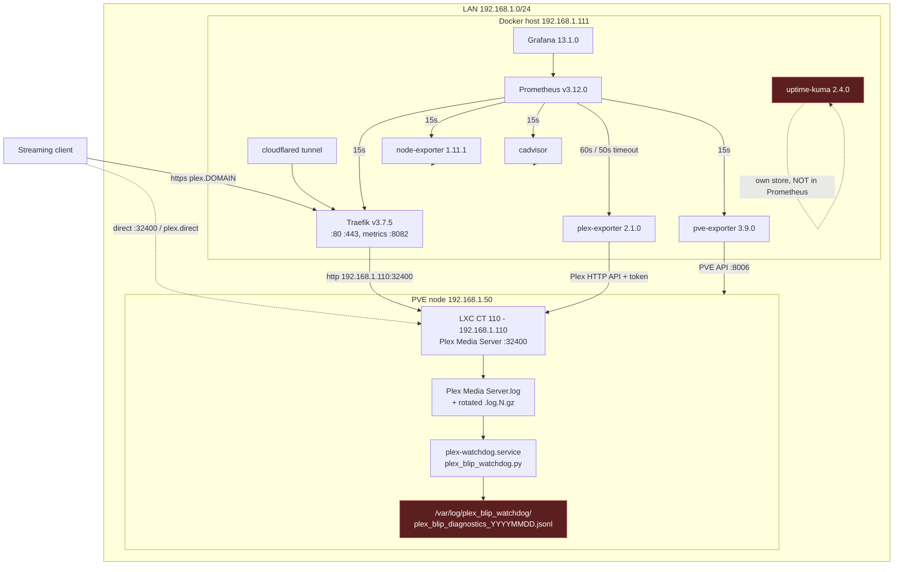

# Research: Current Telemetry Inventory

**Scope:** every signal that exists *today* in this homelab which could bear on a
mid-stream Plex blip, with the exact way to reach it and the resolution limit
that determines whether a blip is even visible in it.

**Method:** read of the IaC under `ansible/` and `scripts/` at commit `5c9a830`.
No live system was queried (per the research-plan decision to stay repo-grounded).
Anything below marked **[unverified-live]** is what the IaC declares, not what was
confirmed running.

---

## 1. Signal-flow map

Red nodes are signals that exist but are **stranded** — they are never joined to
the Prometheus timeline, so correlating them with a blip is a manual, by-hand
timestamp-matching exercise.

---

## 2. Metrics: what Prometheus actually holds

Source: `ansible/roles/docker_host/templates/prometheus.yml.j2`.
Global `scrape_interval: 15s`, `evaluation_interval: 15s`.

| Job | Target | Interval | Timeout | Series that matter for a blip |
|---|---|---|---|---|
| `prometheus` | `localhost:9090` | 15s | 10s (default) | `prometheus_tsdb_*`, self-health |
| `node-exporter` | `node-exporter:9100` | 15s | 10s | Docker-host CPU/mem/disk/net **only** |
| `cadvisor` | `cadvisor:8080` | 15s | 10s | per-container CPU/mem on the Docker host |
| `traefik` | `traefik:8082` | 15s | 10s | `traefik_service_request_duration_seconds_bucket`, `traefik_service_requests_total`, `traefik_entrypoint_*` |
| `pve-exporter` | `/pve?target=192.168.1.50` | 15s | 10s | `pve_up{id="lxc/110"}`, `pve_cpu_usage_ratio`, `pve_memory_usage_bytes`, `pve_network_{transmit,receive}_bytes_total` |
| `plex-exporter` | `plex-exporter:9594` | **60s** | **50s** | `plex_up`, `plex_sessions_count`, `plex_video_transcode_sessions_count`, `plex_media_count`, `plex_info` |

### 2.1 The two "up" signals are not the same thing, and the difference is the single most useful discriminator you have

- `up{job="plex-exporter"}` — **Prometheus'** verdict on the scrape. `0` means the
  HTTP GET to `plex-exporter:9594` failed, was refused, or exceeded the 50s
  `scrape_timeout`. It says nothing directly about Plex.
- `plex_up` — **the exporter's** verdict on Plex. `1` = the exporter reached Plex,
  `0` = it did not ([axsuul/plex-media-server-exporter][axsuul]).

The joint reading is a 2×2 that immediately narrows the failure class:

| `up{job="plex-exporter"}` | `plex_up` | Reading |
|---|---|---|
| 1 | 1 | Exporter fine, Plex answered. Blip (if real) was **not** in the Plex HTTP API — look at network path or client. |
| 1 | 0 | Exporter ran, Plex refused/failed. Genuine Plex-side unreachability. |
| 0 | *stale / absent* | **The exporter itself** stalled or timed out. This is the 2026-08-04 signature: the synchronous library sweep held the scrape past its timeout. Not proof Plex was down. |
| 1 | 1, but `plex_sessions_count` dropped to 0 | Plex was up and answering while sessions vanished — a client/session-layer event. |

This distinction is not currently drawn anywhere in the Grafana dashboard, which
plots `plex_up` alone as "Plex server heartbeat". A stat panel reading 0 there is
ambiguous between "Plex was down" and "the exporter timed out", and the 2026-08-04
investigation showed the second case does happen.

### 2.2 The 60s scrape interval is the binding constraint on blip visibility

`plex-exporter` is scraped once per 60s. Therefore:

- A blip **shorter than 60s can fall entirely between two samples** and leave
  `plex_up` flat at 1 for its whole duration. The 2026-08-04 event stalled queries
  for 34–36s — right in the invisible band.
- Conversely a single `plex_up=0` sample means "at some point in a 60s window",
  never a precise start time. **`plex_up` cannot timestamp a blip.** Only the Plex
  log can.
- Prometheus staleness: when a series stops being reported, it is marked stale and
  drops out of range queries. A gap in `plex_up` on a graph therefore looks
  identical to a downed exporter and to a downed Plex.

Everything else (`traefik`, `pve-exporter`, `node-exporter`) is at 15s, so the
PVE-side CPU/memory/network view of CT 110 has 4× the temporal resolution of the
Plex-side view. This is why the 2026-08-04 write-up could see the "mild CPU spike"
but not pin the outage boundary.

### 2.3 Retention

`prometheus` service in `compose.yml.j2` runs with only
`--config.file=/etc/prometheus/prometheus.yml`. **No `--storage.tsdb.retention.time`
flag is set**, so Prometheus falls back to its default of **15 days**. A blip older
than ~15d has no metric record at all, only whatever survives in the logs.

---

## 3. Traefik: histograms yes, per-request records no

`ansible/roles/docker_host/templates/traefik.yml.j2`:

- `metrics.prometheus` is enabled on the internal `metrics` entrypoint (`:8082`)
  with `addEntryPointsLabels: true` and `addServicesLabels: true`.
  **`addRoutersLabels` is not set**, so there are no per-router series.
- Custom histogram buckets, deliberately calibrated (comments at lines 65–104):
  `0.00025, 0.0005, 0.001, 0.0025, 0.005, 0.01, 0.025, 0.05, 0.1, 0.25, 1.0, 5.0, 30.0`.
  The top three (`1.0`, `5.0`, `30.0`) are the streaming tail. A stalled request
  that takes 34s lands in the `+Inf` bucket — visible as a count, invisible as a value.
- **`log: level: INFO` at line 106–107, and there is no `accessLog:` block anywhere
  in the file.**

That last point resolves an open question from the previous investigation. The
2026-08-04 `rough-idea.md` records "Traefik logs don't show anything" — that was
never a negative finding. Traefik was never configured to write access logs, so
there was nothing to find. The only per-request evidence at the edge is the
aggregated histogram, which cannot tell you *which* request hung, from *which*
client, to *which* path, with *what* status.

Note also the routing topology: `dynamic.yml.j2` routes `plex.{{ domain }}` through
Traefik to `http://192.168.1.110:32400`. But Plex clients frequently connect
**directly** to `192.168.1.110:32400` or via a `*.plex.direct` hostname, entirely
bypassing Traefik. **A blip on a direct-connected stream leaves no Traefik trace at
all**, regardless of access-log configuration.

---

## 4. Logs

| Log | Location | Reachable how | Rotation |
|---|---|---|---|
| Plex Media Server | `{{ plex_state_dir }}/Library/Application Support/Plex Media Server/Logs/Plex Media Server.log` (+ `.log.1..N`, `.gz`) | SSH `root@192.168.1.110` | Plex-internal, size-based; rotates fast under load |
| Plex watchdog snapshots | `/var/log/plex_blip_watchdog/plex_blip_diagnostics_YYYYMMDD.jsonl` on CT 110 | SSH `root@192.168.1.110` | **none configured** — see §6 |
| plex-watchdog service | journald on CT 110, unit `plex-watchdog` | `journalctl -u plex-watchdog` | journald defaults |
| Traefik app log | container stdout, `level: INFO` | `docker logs traefik` on `.111` | Docker json-file defaults |
| Traefik access log | **does not exist** | — | — |
| Plex Media Scanner / transcoder | Plex `Logs/` subdirectories on CT 110 | SSH | Plex-internal |
| uptime-kuma heartbeats | SQLite inside the `uptime-kuma-data` Docker volume | web UI at `uptime.{{ domain }}` | kuma-internal |

None of these are shipped anywhere. There is no Loki, no Promtail, no syslog
forwarding. **Every log-based triage step begins with an SSH session**, and the
tooling (`scripts/analyze_plex_blips.py`) is an offline analyzer that expects the
logs to have already been copied to the workstation.

---

## 5. The watchdog: what it catches and what it writes

`ansible/roles/plex/files/plex_blip_watchdog.py`, deployed to
`/usr/local/bin/plex_blip_watchdog.py` on CT 110 as `plex-watchdog.service`
(`Restart=on-failure`, `RestartSec=5`, `Nice=10`, `CPUSchedulingPolicy=idle`).

**Triggers** (`check_trigger`, threshold default 500 ms, debounce default 30 s):

| Event type | Matched on |
|---|---|
| `TX_STALL` | `Took too long (N seconds) to start a transaction` |
| `SLOW_QUERY` | `SLOW QUERY: It took N ms`, or `Completed: ... Nms` where N ≥ 500 |
| `CONNECTIVITY_DROP` | `We appear to have lost Internet connectivity`, `Failed to retrieve relay host key` |
| `STREAM_DROP` | `Shutting down idle session (idle time is N seconds)`, `Terminated session`, `Stopping transcode session`, `Killing job`, `signal: Killed` |

**Snapshot** on trigger (`capture_snapshot`, target < 500 ms):
`fuser -v <db glob>`, `lsof <db glob>`, `pidstat -tl`, and a count of open file
descriptors held by Plex processes — serialized as one JSON object per line.

**What this means for triage:** the watchdog is a *log-driven* trigger. It fires on
things Plex itself decided to write down. A blip whose cause never produces one of
those four log signatures — a network-path failure, a host-side stall, an OOM kill
of the Plex process itself — produces **no watchdog snapshot at all**. Absence of a
snapshot is therefore not evidence of absence of a blip.

**Second limitation:** the JSONL is written to CT 110's local disk and is never
scraped. `node-exporter` runs on the Docker host, not in CT 110, so there is no
textfile collector to pick it up. Watchdog findings and Prometheus series can only
be joined by a human reading timestamps side by side.

---

## 6. Data-survival hazards visible in the IaC

- No logrotate config is installed for `/var/log/plex_blip_watchdog/` — files
  accumulate one per day, unbounded, on CT 110's rootfs. Growth is bounded in
  practice by the 30s debounce, but nothing prunes them. **[unverified-live]**
- Plex's own log rotation is size-driven, and the failure mode itself is verbose
  (the 2026-08-04 event generated thousands of `SLOW QUERY` and `Completed:` lines).
  A busy blip can rotate its own evidence out of `Plex Media Server.log` and into
  `.log.N.gz` within hours. `analyze_plex_blips.py` does handle `.log.gz` bundles,
  which is exactly why that support was built.
- Prometheus: 15 days (default, §2.3).
- uptime-kuma retention is a UI setting inside the Docker volume, not in IaC.
  **[unverified-live]**

---

## 7. Grafana: the Plex Health dashboard

`ansible/roles/docker_host/files/grafana-plex-health-dashboard.json` — 11 panels:

| Panel | Expression | Blip usefulness |
|---|---|---|
| Plex server heartbeat | `plex_up` | Ambiguous (see §2.1); 60s resolution |
| Streams playing now | `sum(plex_sessions_count{state="playing"})` | 60s; a dropped stream shows as a step down |
| Video transcodes now | `sum(plex_video_transcode_sessions_count{state="playing"})` | 60s; transcoder kill shows here |
| Library titles | `sum(plex_media_count{type!="show_episode"})` | not blip-relevant |
| Plex request latency through Traefik | `histogram_quantile(0.50/0.90/0.99, ...{service="plex@file"}[5m])` | **only proxied traffic**; `[5m]` rate window smears a 30s event |
| Plex request rate by status code | `sum by (code) (rate(traefik_service_requests_total{service="plex@file"}[5m]))` | same caveats; a stall produces *no* status code until it completes or times out |
| Streams by player state | `sum by (state) (plex_sessions_count)` | `buffering` state is the closest thing to a client-visible symptom |
| Transcoding streams by kind | audio/video transcode counts | 60s |
| CT 110 CPU utilisation | `pve_cpu_usage_ratio{id="lxc/110"}` | 15s — best resolution available for CT 110 |
| CT 110 memory | `pve_memory_usage_bytes` / `pve_memory_size_bytes` | 15s |
| CT 110 network throughput | `rate(pve_network_{transmit,receive}_bytes_total[5m])` | 15s sampled, `[5m]` smoothed |

Two structural gaps in the dashboard for triage purposes:

1. **No `up{job=...}` panel.** The exporter-health-vs-Plex-health distinction of
   §2.1 cannot be made from this dashboard; you must go to Prometheus directly or
   to Status → Targets.
2. **The `[5m]` rate windows are wider than the event.** A 34s stall inside a 5m
   window is diluted to roughly a tenth of its true amplitude. For triage you want
   `[1m]` (or raw `_sum`/`_count` deltas) on the same series.

---

## 8. What is measurably *absent*

Consolidated for the gap analysis in [instrumentation-gaps.md](instrumentation-gaps.md):

- No alerting: `prometheus.yml.j2` has no `rule_files:` and no `alerting:` block;
  there is no Alertmanager service in `compose.yml.j2`. **Nothing tells you a blip
  happened.** Detection is "a human noticed playback paused."
- No Traefik access log (§3).
- No synthetic probe — nothing independently, cheaply, and frequently asks Plex
  "are you alive?" The only such signal is `plex_up` at 60s, and it is entangled
  with the exporter's expensive library sweep.
- No in-CT-110 host metrics — no node-exporter inside the container, so no load
  average, no per-process, no disk-I/O latency, no fd/thread counts over time. The
  watchdog captures those *only at trigger time*, as a single instant, with no
  before/after baseline.
- No storage-layer telemetry for the media bind mounts (ZFS/USB DAS on the PVE
  host) — a media-read stall is currently undetectable.
- No client-side or session-history evidence — no Tautulli, no session log. When a
  stream dies you cannot tell whether the client gave up, the server terminated it,
  or the network dropped.
- No log aggregation — Loki/Promtail absent; all log access is manual SSH.
- Watchdog output is stranded (§5).
- uptime-kuma's monitor definitions and history are not in IaC and not in
  Prometheus, so the "uptime blip" that starts the whole investigation lives in a
  system disconnected from every other signal.

---

## References

- [axsuul/plex-media-server-exporter][axsuul] — metric definitions, `plex_up`
  semantics, `METRICS_MEDIA_COLLECTING_INTERVAL_SECONDS` throttle.
- [Traefik — Logs and Access Logs reference][traefik-al] — `accessLog` options and
  field names.
- Repo, at `5c9a830`: `ansible/roles/docker_host/templates/{prometheus.yml.j2,
  traefik.yml.j2, compose.yml.j2, dynamic.yml.j2}`,
  `ansible/roles/docker_host/defaults/main.yml`,
  `ansible/roles/docker_host/files/grafana-plex-health-dashboard.json`,
  `ansible/roles/plex/{files/plex_blip_watchdog.py,tasks/main.yml}`,
  `scripts/analyze_plex_blips.py`, `ansible/inventory/hosts.yml`.

[axsuul]: https://github.com/axsuul/plex-media-server-exporter
[traefik-al]: https://doc.traefik.io/traefik/reference/install-configuration/observability/logs-and-accesslogs/
