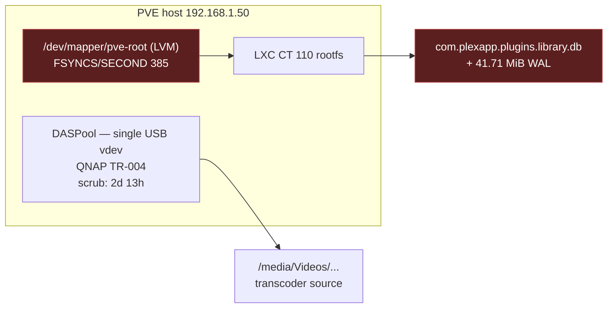

# Research: PVE Host Telemetry — Options, Best Practice, and a Recommendation

**Question:** should we put `node_exporter` on the Proxmox VE host to close the
class-D (storage) blind spot, and if so how — or is there a better route?

**Why it matters now:** the root-cause investigation
([live-blip-2026-08-07-case-study.md](live-blip-2026-08-07-case-study.md) §9.3)
landed on a SQLite WAL pinned at 43× its checkpoint threshold, with
`FSYNCS/SECOND: 385` on `pve-root` as a plausible contributing factor to checkpoint
starvation. Storage latency under the database path has gone from "a blind class we
should probably cover" to **a live suspect in the open root cause**. That changes
the cost/benefit.

---

## 1. Where the relevant data actually lives

A point that determines the whole answer:



**The database is on `pve-root`, not on the DAS.** The DAS carries media only. So
the storage question that bears on the WAL fault is about **`pve-root` I/O latency**,
which is a PVE-host block device. Nothing inside CT 110 measures it, and
`pve-exporter` does not expose it (§3).

The DAS remains worth watching for its own reasons — single vdev, no redundancy, a
2 d 13 h scrub — but it is not implicated in the lock contention.

---

## 2. What Proxmox officially says

**Running `node_exporter` on the host is endorsed by Proxmox staff.** In the
Proxmox Support Forum thread [*Can I run prometheus node-exporter on proxmox VE
(host)*][forum-ne], Proxmox staff member Hannes Laimer answers plainly that
"just installing it as you would on any other system should work," and points at a
standard Debian installation guide. No Proxmox-specific procedure, no warning
attached.

That is as close to an official position as exists. There is no Proxmox
documentation forbidding it, and none blessing a Prometheus-specific path either.

**The general community caution is real but is about something narrower.** The
widely-repeated warning ([XDA][xda], various forum threads) concerns *third-party
apt repositories* and heavy host customisation, where `apt dist-upgrade` pulls
community packages alongside PVE's own and produces dependency conflicts, or where
patches to core PVE software break the web UI on upgrade. The recommended
alternative in those discussions is to run monitoring **in containers/VMs rather
than on the host** — which is exactly what this homelab already does for everything
that *can* live there.

The distinction that matters: **that risk attaches to the packaging method, not to
node_exporter.** §5 exploits this.

---

## 3. The Proxmox-blessed path does not solve our problem

Proxmox ships an **[External Metric Server][ems]** feature: `pvestatd` pushes host,
guest and storage stats to a configured backend every ~10 s, configured in
`/etc/pve/status.cfg` or under Datacenter → Metric Server.

Two disqualifying facts:

1. **Prometheus is not a supported target.** The supported backends are **Graphite**,
   **InfluxDB** (UDP line protocol or the 2.x HTTP API), and **OpenTelemetry** on
   recent releases. Adopting it means standing up InfluxDB or an OTel collector — a
   second time-series store, a second Grafana datasource, and dashboards split
   across both.
2. **It carries no new signal.** `pvestatd` exports the same class of data the PVE
   API already gives us, which `pve-exporter` is already scraping into Prometheus:
   CPU, memory, disk *usage*, network, uptime. **No per-disk I/O latency, no ZFS pool
   health, no SMART.**

So the blessed path costs a whole new storage backend and closes none of the gap.
**Rejected.**

---

## 4. Correcting a claim: `pve-exporter` does not cover this

A secondary source asserted that `prometheus-pve-exporter` "includes Node, VM, LXC,
Storage, ZFS, and Hardware Sensor metrics" and "fetches disk SMART health". Checked
against the upstream project ([prometheus-pve/prometheus-pve-exporter][pve-exp]),
that is **wrong**. Its complete collector set is:

| Scope | Collectors |
|---|---|
| Cluster (`cluster=1`) | `status`, `version`, `node`, `cluster`, `resources`, `backup-info`, `qdevice`, `subscription` |
| Node (`node=1`) | `config`, `replication` |
| Self | `pve-api-metrics`, `target-metrics` |

Everything is `pve_`-prefixed and sourced from the PVE REST API: CPU, memory, disk
usage, network, uptime, storage, HA and lock state. **No ZFS pool health, no SMART,
no disk I/O latency.**

Our deployment runs `--no-collector.config`
(`compose.yml.j2`), which is unrelated to any of this.

**The gap is real and cannot be closed by reconfiguring what we already run.**

---

## 5. Options

| # | Option | Closes the gap? | Touches the host? | Verdict |
|---|---|---|---|---|
| A1 | `node_exporter` on PVE via **Debian package** (`prometheus-node-exporter`) | Yes | apt graph | Viable |
| A2 | `node_exporter` on PVE via **pinned static binary + systemd unit** | Yes | filesystem only | **Recommended** |
| B | PVE External Metric Server → InfluxDB/OTel | **No** (§3) | no | Rejected |
| C | Specialised exporters (`zfs_exporter`, `smartctl_exporter`) | Partly | same problem ×N | Rejected as primary |
| D | Cron script → Pushgateway on `.111` | Partly | script only | Rejected (§5.3) |
| E | Accept class-D blindness | No | no | Rejected — storage is now a live suspect |

### 5.1 What node_exporter actually gives us

Both `diskstats` and `zfs` collectors are **enabled by default**
([node_exporter collector docs][ne-collectors]):

- `node_disk_io_time_seconds_total`, `node_disk_read_time_seconds_total`,
  `node_disk_write_time_seconds_total`, `node_disk_io_now` — **the `pve-root`
  latency series that bears directly on the WAL/fsync hypothesis**
- `node_zfs_*` — ARC and pool statistics for `DASPool`
- `node_pressure_*` (PSI) — the cleanest signal for I/O starvation
- `node_filesystem_*`, `node_load*`, `node_md_*`
- **the textfile collector** — the landing zone for `zpool status` and SMART, which
  covers most of what option C would have provided

### 5.2 Why the static binary (A2) over the Debian package (A1)

`prometheus-node-exporter` is in Debian main, so A1 needs no third-party apt repo
and is materially safer than the scenario the community warnings describe. But A2 is
strictly better here, for three reasons:

1. **It eliminates the actual documented risk.** The concrete failure mode people
   report is `apt dist-upgrade` entangling community packages with PVE's. A binary in
   `/usr/local/bin` with its own unit file is **not in the apt dependency graph at
   all**, so that risk goes to zero rather than being reduced.
2. **It matches this repo's conventions.** Every image here is version-pinned in
   `defaults/main.yml` (`traefik:v3.7.5`, `grafana:13.1.0`, `prom/node-exporter:v1.11.1`).
   A pinned binary is the same discipline; an apt package upgrades on the host's
   schedule, not ours.
3. **It is trivially reversible.** Stop the unit, delete two files. That matters for
   anything installed on a hypervisor.

Cost: we own the upgrade path, and must check the pinned version periodically. On a
homelab hypervisor that is the right trade.

### 5.3 Why not Pushgateway (D)

Tempting — a cron script and `curl`, no daemon on the host. Rejected because
Pushgateway is explicitly the wrong tool for machine metrics: it is designed for
ephemeral batch jobs, its staleness semantics are wrong for a long-lived host (metrics
persist after the source dies, so a dead host looks healthy), and we would be
hand-rolling `/proc/diskstats` delta arithmetic that node_exporter already does
correctly. It trades a small, well-understood install for a permanent source of
misleading data.

### 5.4 The free win, independent of all of the above

**Persistent journald on the PVE host.** `Storage=persistent` in
`/etc/systemd/journald.conf` — a config toggle, no package, no daemon. It makes
`journalctl -k` survive reboots and closes the `dmesg` ring-buffer decay hazard
identified in
[triage-window-and-data-survival.md](triage-window-and-data-survival.md), which is
currently the *only* witness for OOM kills and USB/SCSI errors. This should be done
whatever is decided about node_exporter.

---

## 6. Recommendation

**Adopt A2 — a version-pinned `node_exporter` static binary on the PVE host,
deployed by Ansible as a systemd unit, with a restricted collector set — plus
persistent journald (§5.4).**

Rationale, in order of weight:

1. Storage latency under `pve-root` is a **live suspect in the open root cause**, not
   a speculative gap. `FSYNCS/SECOND: 385` against a 42,000-frame checkpoint is
   exactly the shape that would explain checkpoint starvation, and we currently
   cannot see it over time.
2. Proxmox staff explicitly endorse node_exporter on the host.
3. The static-binary method sidesteps the one concrete risk the community warnings
   actually describe.
4. The blessed alternative (§3) costs a second TSDB and closes nothing.
5. `pve-exporter` cannot be reconfigured to cover it (§4).

### Proposed shape

```yaml
# ansible/roles/pve_host/defaults/main.yml
pve_host_node_exporter_version: "1.11.1"     # match the container image already pinned
pve_host_node_exporter_listen: "192.168.1.50:9100"
```

```ini
# /etc/systemd/system/node-exporter.service
[Service]
User=node-exporter                  # unprivileged; diskstats/zfs need no root
ExecStart=/usr/local/bin/node_exporter \
  --collector.disable-defaults \
  --collector.diskstats \
  --collector.zfs \
  --collector.filesystem \
  --collector.pressure \
  --collector.loadavg \
  --collector.meminfo \
  --collector.cpu \
  --collector.textfile \
  --collector.textfile.directory=/var/lib/node_exporter/textfile \
  --web.listen-address={{ pve_host_node_exporter_listen }}
Nice=10
CPUSchedulingPolicy=idle
ProtectSystem=strict
PrivateTmp=true
```

`--collector.disable-defaults` plus an explicit allow-list keeps the surface and the
scrape cost minimal — consistent with **P2 (price every addition by load)**, which
exists in this project precisely because a monitoring component caused the 2026-08-04
outage.

**Deliberately deferred:** a `zpool status` / `smartctl` textfile script. The
directory and collector are provisioned now; populating them is a follow-up once the
`node_disk_*` series have been observed. Ship the plumbing, then decide what to pour
through it.

### Risks and mitigations

| Risk | Mitigation |
|---|---|
| Third-party software on a hypervisor | Static binary, no apt involvement; two files; removable in one task |
| Version drift / stale binary | Pinned in `defaults/main.yml` like every other component here |
| Metrics endpoint exposed on the LAN | Bind to the LAN IP; restrict `:9100` to `192.168.1.111` in the PVE firewall |
| Scrape cost on the hypervisor | `--collector.disable-defaults`, `Nice=10`, `CPUSchedulingPolicy=idle` |
| Sets a precedent for host modification | Documented in a runbook as a deliberate, bounded exception with a stated removal procedure |

### Open sub-decision for the operator

Whether to also run the **textfile script for `zpool status` / SMART**. Recommendation
is *not yet* — the DAS shows zero errors and no ZFS events since Jul 17, so it is not
implicated in the current fault. Provision the collector, revisit when there is a
reason.

---

## References

- [Proxmox Support Forum — *Can I run prometheus node-exporter on proxmox VE (host)*][forum-ne] — Proxmox staff endorsement
- [Proxmox VE Wiki — External Metric Server][ems] — Graphite / InfluxDB / OpenTelemetry; **Prometheus not supported**
- [Proxmox VE Wiki — Third Party Integration Options](https://pve.proxmox.com/wiki/Third_Party_Integration_Options)
- [prometheus-pve/prometheus-pve-exporter][pve-exp] — complete collector list; no ZFS/SMART/disk-latency
- [prometheus/node_exporter — collectors][ne-collectors] — `diskstats` and `zfs` default-enabled; `--collector.disable-defaults`
- [prometheus-node-exporter(1), Debian manpages](https://manpages.debian.org/testing/prometheus-node-exporter/prometheus-node-exporter.1.en.html)
- [XDA — *I customized my Proxmox node so much that updates became terrifying*][xda] — the dependency-hell failure mode, in context

[forum-ne]: https://forum.proxmox.com/threads/can-i-run-prometheus-node-exporter-on-proxmox-ve-host.89908/
[ems]: https://pve.proxmox.com/wiki/External_Metric_Server
[pve-exp]: https://github.com/prometheus-pve/prometheus-pve-exporter
[ne-collectors]: https://deepwiki.com/prometheus/node_exporter/3-collectors
[xda]: https://www.xda-developers.com/i-customized-my-proxmox-install-so-much-that-updates-became-terrifying/
