# Research: Triage Window & Data Survival

**Purpose:** for a blip at time **T**, determine what evidence still exists at
T+5min, T+1h, T+1d, T+15d — and therefore what the operator must capture *first*,
before it is gone. This is what makes the manual runbook ordered rather than a
checklist: the sequence is driven by decay, not by importance.

---

## The decay table

| Evidence | Lives where | Half-life | Still there at T+5m | T+1h | T+1d | T+15d |
|---|---|---|---|---|---|---|
| Live process state (fd counts, thread states, lock holders, `D`-state tasks) | CT 110 kernel, nowhere else | **seconds** | ✗ | ✗ | ✗ | ✗ |
| Active session list (`/status/sessions`) | Plex, in-memory | **seconds–minutes** | ✗ | ✗ | ✗ | ✗ |
| Transcoder temp dirs / partial segments | CT 110 transcode dir (ramdisk — see `docs/runbooks/plex-ramdisk.md`) | **minutes**, and a **tmpfs wipe on reboot** | ~ | ✗ | ✗ | ✗ |
| Watchdog JSONL snapshot | `/var/log/plex_blip_watchdog/*.jsonl` on CT 110 | indefinite (no rotation configured) | ✓ | ✓ | ✓ | ✓ |
| `Plex Media Server.log` (current) | CT 110 | **hours under load** — rotates by size | ✓ | ✓ | ~ | ✗ |
| Rotated `Plex Media Server.log.N` / `.gz` | CT 110 | days–weeks, N-bounded | ✓ | ✓ | ✓ | ~ |
| journald on CT 110 (`plexmediaserver`, `plex-watchdog`) | CT 110 | journald defaults (size-capped) | ✓ | ✓ | ✓ | ~ |
| `dmesg` / kernel ring (USB resets, OOM, I/O errors) | **PVE host** + CT 110 | ring buffer — **overwritten by volume, lost on reboot** | ✓ | ~ | ✗ | ✗ |
| ZFS `zpool events` | PVE host | ring-buffered, cleared on reboot | ✓ | ~ | ✗ | ✗ |
| Traefik container stdout (`level: INFO`) | Docker json-file on `.111` | Docker defaults, **lost if container recreated** | ✓ | ✓ | ~ | ✗ |
| Prometheus TSDB | `prometheus-data` volume | **15d** (no `--storage.tsdb.retention.time` set → default) | ✓ | ✓ | ✓ | ~ |
| uptime-kuma heartbeats | `uptime-kuma-data` volume | kuma retention setting **[unverified-live]** | ✓ | ✓ | ✓ | ~ |
| Grafana dashboard state | — | not evidence; it renders Prometheus | ✓ | ✓ | ✓ | ~ |
| Client-side app state / error toast | the client device | **the moment you close the app** | ~ | ✗ | ✗ | ✗ |

Legend: ✓ present · ~ probably, degraded or partial · ✗ gone.

---

## What this implies: three tiers of urgency

```mermaid
flowchart LR
    subgraph T0["TIER 0 — seconds to minutes<br/>PERISHABLE"]
        A1["Plex session list<br/>/status/sessions"]
        A2["Live process/lock state<br/>fuser, lsof, pidstat, ps D-state"]
        A3["Client-side symptom<br/>screenshot / exact wording"]
        A4["dmesg on PVE host + CT 110"]
    end
    subgraph T1["TIER 1 — same hour<br/>ROTATING"]
        B1["Plex Media Server.log<br/>copy it off"]
        B2["Traefik container stdout"]
        B3["zpool status / events"]
    end
    subgraph T2["TIER 2 — days<br/>DURABLE"]
        C1["Watchdog JSONL"]
        C2["Prometheus 15d"]
        C3["Rotated .log.N.gz"]
        C4["uptime-kuma history"]
    end
    T0 --> T1 --> T2
```

**The ordering principle for the runbook:** capture Tier 0 *before* you start
thinking. Every minute spent reading a Grafana dashboard is a minute of Tier 0
decay. Dashboards are Tier 2 evidence — they will still be there in an hour.

This is the strongest argument for a **single-command Tier-0 capture** the operator
fires immediately, before any diagnosis (see the design's proposed
`just plex-blip-capture`). Today, that capture is roughly a dozen commands across
two SSH hops (`.110` for the container, `.50` for the PVE host), which realistically
means it does not happen and Tier 0 is always lost.

---

## Specific decay hazards worth calling out

### The ramdisk wipes transcoder evidence on reboot
Plex's transcode directory is a tmpfs (`docs/runbooks/plex-ramdisk.md`,
`scripts/test_plex_ramdisk_bind_mount_shape.py`). Partial segments, transcoder
logs written there, and any in-flight state vanish on container restart — which is
also the most common *response* to a blip. **Restarting Plex to "fix" the blip
destroys the evidence for why it happened.** The runbook must say this explicitly.

### The blip rotates its own logs away
Class A blips are extremely verbose: the 2026-08-04 event produced thousands of
`SLOW QUERY` and `Completed:` lines in a few minutes. Under Plex's size-based
rotation, a severe blip accelerates the loss of its own record. This is precisely
why `analyze_plex_blips.py` grew `.log.gz` bundle support — but rotation depth `N`
is finite, so a blip that happens during a heavy scan can still be pushed off the
end within a day.

### `dmesg` is the only witness for whole classes of fault, and it is a ring buffer
Classes **D** (storage) and **B** (OOM) are largely diagnosed from the kernel ring
buffer. It is volume-overwritten and reboot-cleared, and for an unprivileged LXC
the relevant lines may be on the **PVE host** rather than inside the container. If
nobody runs `dmesg` within the hour, those classes become permanently undecidable
for that event. Persisting kernel logs (`journalctl -k` with persistent storage, or
simply capturing `dmesg -T` in the Tier-0 grab) is cheap and closes this.

### Prometheus 15 days sets the horizon on pattern-finding
The blips are *sporadic* — that is the whole problem. Establishing periodicity
("always near the top of the hour", "always Sunday") requires comparing events
weeks apart. A 15-day window holds roughly two weekly cycles. Recall also from
`[[plex-monitoring]]` prior work that there was a **two-week Prometheus outage**,
which at 15d retention means that gap swallowed essentially all history from before
it. Raising retention to 90d is a one-flag change and directly enables the
cross-event correlation this project exists to support.

### The watchdog JSONL grows without bound
No logrotate config is installed for `/var/log/plex_blip_watchdog/`
(`ansible/roles/plex/tasks/main.yml` creates the directory only). One file per day,
never pruned, on CT 110's rootfs. Bounded in practice by the 30s debounce, but it
is an unmanaged growth path on a container whose rootfs filling would itself cause
a blip. Worth a rotation policy — with a **long** retention, since this is the
highest-value durable evidence we have.

---

## The "how long ago was it?" branch

The runbook needs different entry points depending on when the operator arrives:

| Arrival | Realistic goal | What to do first |
|---|---|---|
| **During** the blip (stream still stuck) | Full Tier 0 + causal certainty | Fire the capture immediately. Do **not** restart Plex. Then try a direct `curl` to `:32400/identity` from the LAN and from the Docker host — this alone splits classes E/G from A/B/C/D. |
| **Minutes after** | Tier 0 mostly lost; Tier 1 intact | Grab `dmesg` on both hosts and copy the Plex log off *before* anything else. Then bound the window from the log. |
| **Same day** | Tier 1 + 2 | Bound the window from `plex_up` / kuma, then pull `analyze_plex_blips.py` over the log for that window. |
| **Days later** | Tier 2 only | Prometheus + watchdog JSONL + rotated logs. Classes D, F, G are already undecidable. Aim for pattern-matching against prior events, not root cause for this one. |

The honest conclusion: **for anything past T+1h, the current telemetry can only
confirm or exclude Class A and H1.** Everything else has already decayed. That is
the case for the durable-signal additions in
[instrumentation-gaps.md](instrumentation-gaps.md) — their real value is converting
Tier-0 perishable evidence into Tier-2 durable evidence, so that arriving late is
no longer fatal to the investigation.

---

## References

- Repo at `5c9a830`: `ansible/roles/plex/tasks/main.yml` (watchdog output dir, no
  rotation), `ansible/roles/docker_host/templates/compose.yml.j2` (Prometheus flags),
  `docs/runbooks/plex-ramdisk.md`, `scripts/analyze_plex_blips.py` (`.log.gz` support).
- [Prometheus storage — retention flags](https://prometheus.io/docs/prometheus/latest/storage/)
